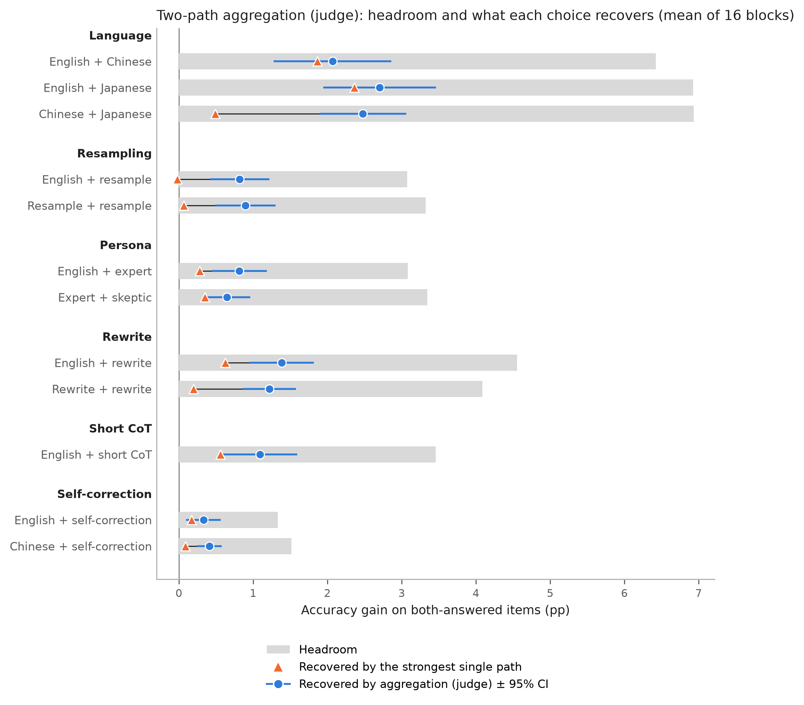
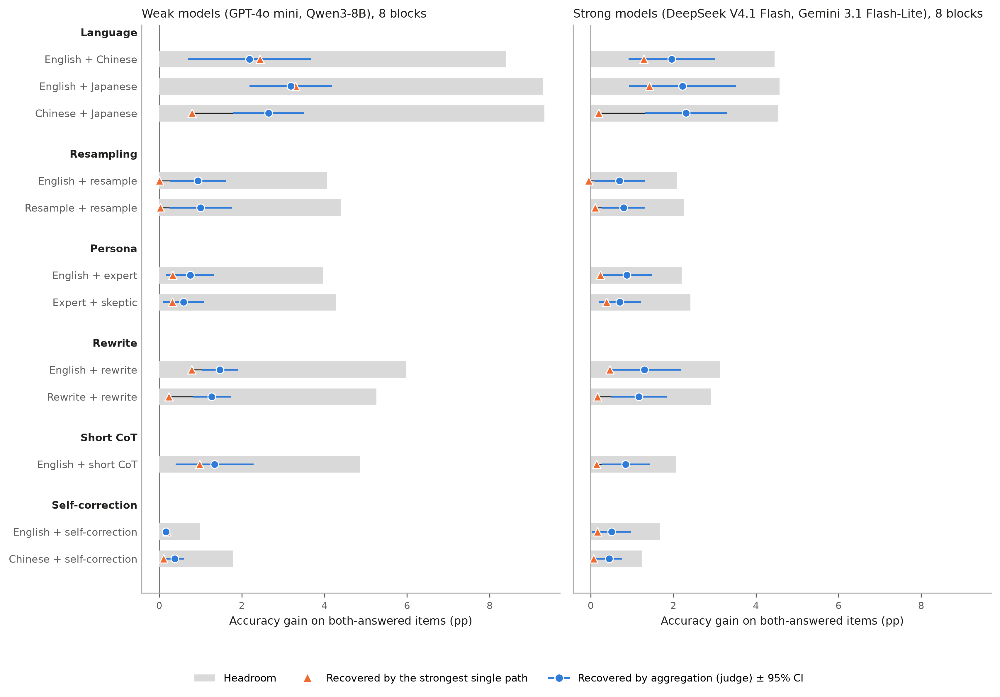
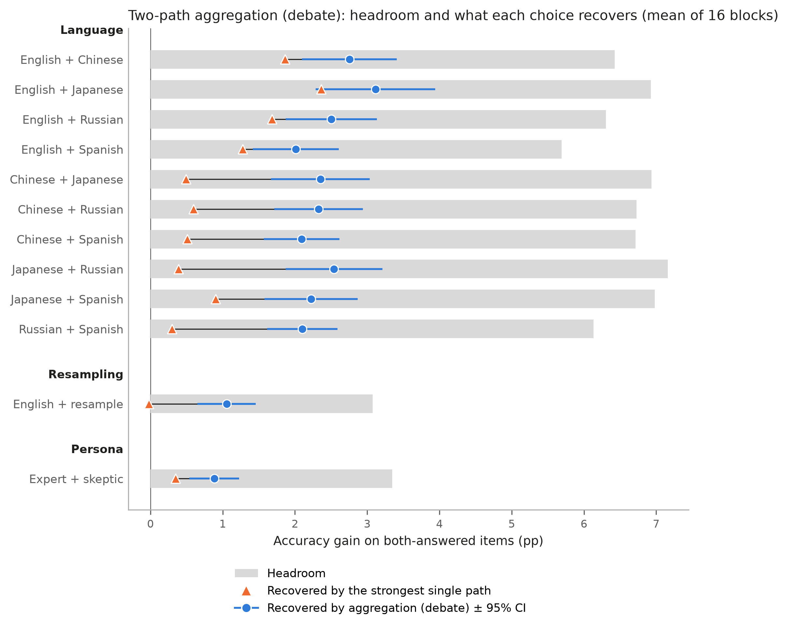

# 12 組配對的分解總表與圖

產生時間：2026-10-06 04:26 CST；程式：`scripts/analysis_decomposition/pair_tables.py`。整理現有結果：不呼叫 API，不重跑任何東西，不修改現有檔案；沒有判定，也不依門檻分類。

## (1) 讀了哪些檔案與欄位

- `result/analysis/aggregation_cells.csv`：四個新模型（gpt4omini、qwen、deepseek4.1flash、gemini3.1flashlite；不含舊的 deepseek、gemini）、`subset = both_answered`、`aggregator` 為 judge 或 debate 的列。欄位：`model`、`dataset`、`pair`、`arm_a`、`arm_b`、`symmetric`、`n_english`、`n`、`d`、`c`、`m`、`recovery_H2`、`recovery_blind_H2`、`acc_final`、`acc_a`。
- `result/analysis/items/paths.csv.gz`、`aggregations.csv.gz`（與 CSV 同一次 run_analysis 產生的逐題匯出）：只用於第 9 項。CSV 只有配對內兩條 path 的正確率，不含 L:en 的配對沒有 L:en 的數字，所以第 9 項一律在該配對的 both_answered 題目上，用逐題的聚合正確率減 L:en 正確率。
- `result/aggregations/{4 模型}/*/judge__*.json` 的檔頭：192 個主網格 Judge 檔的 `prompt_version` 都是 `choice-v1`（開始前已核對）。
- headroom = 100·d·(c − m)（d、c、m 是 both_answered 全部題目的值）；recovery、recovery_blind 用另一半題目上評估的 `recovery_H2`、`recovery_blind_H2`。區間都是 `Analysis.blockStats.summarize` 的 95% t 區間（16 個區塊自由度 15；強弱分開時各 8 個區塊，自由度 7）。

## (2) 第三節的核對

| 項目                                    | 算出     | 四捨五入   | 現況文件   | 一致   |
|:--------------------------------------|:-------|:-------|:-------|:-----|
| EN+ZH headroom_pp                     | 6.4252 | 6.4    | 6.4    | True |
| EN+ZH recovery                        | 0.3498 | 0.35   | 0.35   | True |
| EN+ZH recovery_blind                  | 0.2606 | 0.26   | 0.26   | True |
| EN+ZH excess_pp                       | 0.2056 | 0.21   | 0.21   | True |
| EN+S1 headroom_pp                     | 3.0742 | 3.1    | 3.1    | True |
| EN+S1 recovery                        | 0.2503 | 0.25   | 0.25   | True |
| EN+S1 recovery_blind                  | 0.0036 | 0.00   | 0.00   | True |
| EN+S1 excess_pp                       | 0.8402 | 0.84   | 0.84   | True |
| EN+SR-EN d                            | 0.0354 | 0.035  | 0.035  | True |
| EN+S1 d                               | 0.0811 | 0.081  | 0.081  | True |
| 語言 的平均 recovery（EN+ZH, EN+JA, ZH+JA）  | 0.3809 | 0.38   | 0.38   | True |
| 採樣 的平均 recovery（EN+S1, S1+S2）         | 0.2591 | 0.26   | 0.26   | True |
| persona 的平均 recovery（EN+P1, P1+P2）    | 0.2430 | 0.24   | 0.24   | True |
| 改寫 的平均 recovery（EN+W1, W1+W2）         | 0.3195 | 0.32   | 0.32   | True |
| 簡短 CoT 的平均 recovery（EN+R）             | 0.3184 | 0.32   | 0.32   | True |
| 自我修正 的平均 recovery（EN+SR-EN, ZH+SR-ZH） | 0.2673 | 0.27   | 0.27   | True |

全部一致。另外，含 L:en 的配對上，逐題算的「聚合 − L:en」與 CSV 的 100·(acc_final − acc_a) 最大差 2.2e-14。

不在核對清單內、只回報：現況文件結果 6 的 EN+S1「比單用英文高」是 Judge +0.64pp（0.22 到 1.06，13/16）、Debate +0.87pp；本表第 9 項是 Judge +0.69pp（0.29 到 1.09）、Debate +0.92pp。EN+ZH（Judge +0.31、Debate +1.00）與 ZH+JA（−1.58，結果 8）都與現況文件一致；EN+S1 用配對自己的 both_answered、EN/ZH/S1 共同子集、全部題目、H2 平均四種算法都得不到 +0.64，原因未查。

## (3) 三張表

每格 = 16 個區塊（強弱分開時各 8 個）的平均（SE）[95% t 區間]。完整數字在同名的 .csv；逐區塊的值在 `cells_long.csv`（區塊 × 配對 × 聚合器一列，共 384 列）。

> 第 6 到 8 項都是每個區塊先算 headroom × recovery（或 recovery_blind），再對區塊平均；不是平均後的 headroom 乘平均後的 recovery。以 Judge 的 EN+ZH 為例：逐區塊先乘再平均，聚合拿回 2.07pp、Excess 0.21pp；先平均再乘（6.43 × 0.350）會得到 2.25pp，Excess 變成 6.43 × (0.350 − 0.261) = 0.57pp。兩種算法的差，等於 headroom 與 recovery（或 recovery − recovery_blind）在 16 個區塊間的共變異數（分母 16）：聚合拿回 -0.18pp、Excess -0.37pp。

### 表 1：Judge 的 12 組配對（`pair_table_judge`）

| 來源      | 名稱                        | 英文 path 數   | 對稱   | d                          | c                          | m                          | headroom（pp）           |
|:--------|:--------------------------|:------------|:-----|:---------------------------|:---------------------------|:---------------------------|:-----------------------|
| 語言      | English + Chinese         | 1           | 否    | 0.160（0.019）[0.120, 0.200] | 0.805（0.013）[0.778, 0.832] | 0.403（0.006）[0.389, 0.416] | 6.43（0.76）[4.81, 8.04] |
| 語言      | English + Japanese        | 1           | 否    | 0.172（0.020）[0.129, 0.214] | 0.805（0.011）[0.782, 0.828] | 0.402（0.005）[0.391, 0.414] | 6.92（0.82）[5.18, 8.67] |
| 語言      | Chinese + Japanese        | 0           | 是    | 0.179（0.022）[0.132, 0.225] | 0.789（0.012）[0.763, 0.814] | 0.394（0.006）[0.381, 0.407] | 6.93（0.81）[5.22, 8.65] |
| 採樣      | English + resample        | 2           | 否    | 0.081（0.010）[0.060, 0.102] | 0.775（0.018）[0.735, 0.814] | 0.387（0.009）[0.368, 0.407] | 3.07（0.34）[2.34, 3.80] |
| 採樣      | Resample + resample       | 2           | 是    | 0.089（0.011）[0.065, 0.112] | 0.774（0.021）[0.729, 0.818] | 0.387（0.010）[0.365, 0.409] | 3.33（0.36）[2.56, 4.09] |
| persona | English + expert          | 2           | 否    | 0.081（0.009）[0.062, 0.100] | 0.775（0.015）[0.743, 0.806] | 0.387（0.007）[0.371, 0.403] | 3.08（0.31）[2.43, 3.74] |
| persona | Expert + skeptic          | 2           | 是    | 0.085（0.009）[0.065, 0.104] | 0.794（0.017）[0.757, 0.830] | 0.397（0.009）[0.378, 0.415] | 3.35（0.35）[2.60, 4.10] |
| 改寫      | English + rewrite         | 2           | 否    | 0.116（0.014）[0.087, 0.145] | 0.794（0.013）[0.766, 0.822] | 0.397（0.007）[0.383, 0.411] | 4.56（0.53）[3.43, 5.68] |
| 改寫      | Rewrite + rewrite         | 2           | 是    | 0.106（0.013）[0.079, 0.133] | 0.782（0.019）[0.741, 0.822] | 0.391（0.009）[0.371, 0.411] | 4.09（0.48）[3.06, 5.12] |
| 簡短 CoT  | English + short CoT       | 2           | 否    | 0.091（0.013）[0.064, 0.118] | 0.770（0.018）[0.733, 0.808] | 0.385（0.009）[0.366, 0.404] | 3.46（0.46）[2.48, 4.44] |
| 自我修正    | English + self-correction | 2           | 否    | 0.035（0.007）[0.020, 0.051] | 0.756（0.028）[0.695, 0.817] | 0.378（0.014）[0.348, 0.408] | 1.33（0.28）[0.73, 1.93] |
| 自我修正    | Chinese + self-correction | 0           | 否    | 0.041（0.005）[0.030, 0.052] | 0.749（0.030）[0.686, 0.813] | 0.375（0.015）[0.343, 0.406] | 1.52（0.18）[1.13, 1.90] |

| 來源      | 名稱                        | recovery                   | recovery_blind              | 單一最強拿回（pp）               | 聚合拿回（pp）               | Excess（pp）              | 聚合 − L:en（pp）             | Excess 為正的區塊   |
|:--------|:--------------------------|:---------------------------|:----------------------------|:-------------------------|:-----------------------|:------------------------|:--------------------------|:---------------|
| 語言      | English + Chinese         | 0.350（0.044）[0.255, 0.444] | 0.261（0.049）[0.156, 0.365]  | 1.86（0.47）[0.86, 2.87]   | 2.07（0.37）[1.28, 2.86] | 0.21（0.27）[-0.38, 0.79] | 0.31（0.34）[-0.42, 1.04]   | 10/16          |
| 語言      | English + Japanese        | 0.395（0.030）[0.331, 0.460] | 0.318（0.030）[0.254, 0.383]  | 2.36（0.41）[1.48, 3.24]   | 2.70（0.36）[1.95, 3.46] | 0.34（0.31）[-0.32, 1.01] | 0.38（0.34）[-0.35, 1.11]   | 11/16          |
| 語言      | Chinese + Japanese        | 0.398（0.038）[0.317, 0.479] | 0.081（0.031）[0.016, 0.146]  | 0.49（0.26）[-0.05, 1.04]  | 2.48（0.27）[1.89, 3.06] | 1.99（0.42）[1.09, 2.88]  | -1.58（0.77）[-3.23, 0.06]  | 14/16          |
| 採樣      | English + resample        | 0.250（0.050）[0.143, 0.358] | 0.004（0.029）[-0.058, 0.065] | -0.02（0.07）[-0.17, 0.13] | 0.82（0.19）[0.42, 1.22] | 0.84（0.20）[0.41, 1.27]  | 0.69（0.19）[0.29, 1.09]    | 14/16          |
| 採樣      | Resample + resample       | 0.268（0.036）[0.192, 0.344] | 0.046（0.030）[-0.019, 0.111] | 0.07（0.07）[-0.09, 0.23]  | 0.90（0.19）[0.49, 1.30] | 0.83（0.22）[0.37, 1.29]  | 0.73（0.23）[0.23, 1.23]    | 14/16          |
| persona | English + expert          | 0.274（0.054）[0.159, 0.389] | 0.075（0.047）[-0.025, 0.174] | 0.28（0.16）[-0.06, 0.62]  | 0.81（0.17）[0.44, 1.18] | 0.53（0.15）[0.21, 0.86]  | 1.18（0.29）[0.56, 1.81]    | 14/16          |
| persona | Expert + skeptic          | 0.212（0.048）[0.110, 0.313] | 0.102（0.042）[0.012, 0.191]  | 0.35（0.14）[0.05, 0.65]   | 0.65（0.15）[0.33, 0.96] | 0.30（0.18）[-0.09, 0.69] | 1.71（0.48）[0.68, 2.73]    | 12/16          |
| 改寫      | English + rewrite         | 0.317（0.042）[0.227, 0.407] | 0.098（0.035）[0.023, 0.173]  | 0.63（0.20）[0.21, 1.05]   | 1.38（0.20）[0.95, 1.82] | 0.76（0.21）[0.30, 1.21]  | 1.15（0.33）[0.45, 1.85]    | 15/16          |
| 改寫      | Rewrite + rewrite         | 0.322（0.034）[0.250, 0.394] | 0.040（0.035）[-0.035, 0.115] | 0.20（0.14）[-0.10, 0.50]  | 1.22（0.17）[0.86, 1.58] | 1.02（0.21）[0.58, 1.47]  | 0.42（0.46）[-0.56, 1.40]   | 14/16          |
| 簡短 CoT  | English + short CoT       | 0.318（0.049）[0.214, 0.423] | 0.123（0.038）[0.041, 0.205]  | 0.56（0.24）[0.05, 1.07]   | 1.09（0.24）[0.59, 1.59] | 0.53（0.16）[0.19, 0.87]  | 0.42（0.14）[0.14, 0.71]    | 13/16          |
| 自我修正    | English + self-correction | 0.254（0.055）[0.137, 0.371] | 0.147（0.073）[-0.010, 0.303] | 0.17（0.08）[-0.01, 0.35]  | 0.33（0.11）[0.10, 0.57] | 0.16（0.08）[-0.01, 0.33] | 0.54（0.18）[0.15, 0.93]    | 11/16          |
| 自我修正    | Chinese + self-correction | 0.280（0.050）[0.173, 0.388] | 0.039（0.038）[-0.041, 0.119] | 0.09（0.06）[-0.04, 0.22]  | 0.41（0.08）[0.24, 0.58] | 0.32（0.08）[0.16, 0.49]  | -3.04（1.02）[-5.21, -0.87] | 13/16          |

### 表 2：Debate 的 12 組配對（`pair_table_debate`）

Judge 與 Debate 只有 5 組共同配對（EN+ZH、EN+JA、ZH+JA、EN+S1、P1+P2），兩張表分開列，不合併平均。

| 來源      | 名稱                 | 英文 path 數   | 對稱   | d                          | c                          | m                          | headroom（pp）           |
|:--------|:-------------------|:------------|:-----|:---------------------------|:---------------------------|:---------------------------|:-----------------------|
| 語言      | English + Chinese  | 1           | 否    | 0.160（0.019）[0.120, 0.200] | 0.805（0.013）[0.778, 0.832] | 0.403（0.006）[0.389, 0.416] | 6.43（0.76）[4.81, 8.04] |
| 語言      | English + Japanese | 1           | 否    | 0.172（0.020）[0.129, 0.214] | 0.805（0.011）[0.782, 0.828] | 0.402（0.005）[0.391, 0.414] | 6.92（0.82）[5.18, 8.67] |
| 語言      | English + Russian  | 1           | 否    | 0.157（0.020）[0.115, 0.198] | 0.810（0.016）[0.776, 0.844] | 0.405（0.008）[0.388, 0.422] | 6.30（0.78）[4.64, 7.97] |
| 語言      | English + Spanish  | 1           | 否    | 0.142（0.017）[0.105, 0.178] | 0.811（0.014）[0.781, 0.840] | 0.405（0.007）[0.390, 0.420] | 5.69（0.68）[4.25, 7.14] |
| 語言      | Chinese + Japanese | 0           | 是    | 0.179（0.022）[0.132, 0.225] | 0.789（0.012）[0.763, 0.814] | 0.394（0.006）[0.381, 0.407] | 6.93（0.81）[5.22, 8.65] |
| 語言      | Chinese + Russian  | 0           | 是    | 0.175（0.022）[0.128, 0.221] | 0.774（0.013）[0.748, 0.801] | 0.387（0.006）[0.374, 0.400] | 6.73（0.83）[4.96, 8.50] |
| 語言      | Chinese + Spanish  | 0           | 是    | 0.171（0.022）[0.125, 0.218] | 0.792（0.012）[0.766, 0.818] | 0.396（0.006）[0.383, 0.409] | 6.72（0.83）[4.96, 8.48] |
| 語言      | Japanese + Russian | 0           | 是    | 0.184（0.023）[0.136, 0.232] | 0.786（0.011）[0.762, 0.810] | 0.393（0.006）[0.381, 0.405] | 7.16（0.86）[5.32, 9.00] |
| 語言      | Japanese + Spanish | 0           | 是    | 0.178（0.022）[0.131, 0.225] | 0.791（0.015）[0.759, 0.823] | 0.395（0.007）[0.380, 0.411] | 6.98（0.86）[5.14, 8.82] |
| 語言      | Russian + Spanish  | 0           | 是    | 0.158（0.020）[0.114, 0.201] | 0.786（0.018）[0.749, 0.824] | 0.393（0.009）[0.374, 0.412] | 6.13（0.78）[4.47, 7.80] |
| 採樣      | English + resample | 2           | 否    | 0.081（0.010）[0.060, 0.102] | 0.775（0.018）[0.735, 0.814] | 0.387（0.009）[0.368, 0.407] | 3.07（0.34）[2.34, 3.80] |
| persona | Expert + skeptic   | 2           | 是    | 0.085（0.009）[0.065, 0.104] | 0.794（0.017）[0.757, 0.830] | 0.397（0.009）[0.378, 0.415] | 3.35（0.35）[2.60, 4.10] |

| 來源      | 名稱                 | recovery                   | recovery_blind              | 單一最強拿回（pp）               | 聚合拿回（pp）               | Excess（pp）              | 聚合 − L:en（pp）            | Excess 為正的區塊   |
|:--------|:-------------------|:---------------------------|:----------------------------|:-------------------------|:-----------------------|:------------------------|:-------------------------|:---------------|
| 語言      | English + Chinese  | 0.447（0.025）[0.392, 0.501] | 0.261（0.049）[0.156, 0.365]  | 1.86（0.47）[0.86, 2.87]   | 2.75（0.31）[2.10, 3.41] | 0.89（0.37）[0.10, 1.68]  | 1.00（0.45）[0.04, 1.96]   | 14/16          |
| 語言      | English + Japanese | 0.463（0.033）[0.392, 0.534] | 0.318（0.030）[0.254, 0.383]  | 2.36（0.41）[1.48, 3.24]   | 3.11（0.39）[2.29, 3.94] | 0.75（0.36）[-0.02, 1.52] | 0.79（0.39）[-0.04, 1.61]  | 13/16          |
| 語言      | English + Russian  | 0.419（0.029）[0.356, 0.481] | 0.230（0.046）[0.132, 0.329]  | 1.68（0.44）[0.74, 2.63]   | 2.50（0.30）[1.87, 3.14] | 0.82（0.45）[-0.14, 1.78] | 0.72（0.41）[-0.17, 1.60]  | 12/16          |
| 語言      | English + Spanish  | 0.356（0.030）[0.292, 0.420] | 0.198（0.037）[0.118, 0.278]  | 1.28（0.36）[0.51, 2.04]   | 2.01（0.28）[1.42, 2.61] | 0.73（0.33）[0.03, 1.44]  | 0.73（0.36）[-0.05, 1.51]  | 12/16          |
| 語言      | Chinese + Japanese | 0.376（0.045）[0.280, 0.473] | 0.081（0.031）[0.016, 0.146]  | 0.49（0.26）[-0.05, 1.04]  | 2.35（0.32）[1.67, 3.03] | 1.86（0.40）[1.01, 2.71]  | -1.72（0.93）[-3.70, 0.26] | 15/16          |
| 語言      | Chinese + Russian  | 0.385（0.038）[0.304, 0.466] | 0.103（0.026）[0.048, 0.159]  | 0.60（0.18）[0.22, 0.98]   | 2.33（0.29）[1.72, 2.94] | 1.73（0.31）[1.07, 2.39]  | -1.20（0.89）[-3.10, 0.70] | 16/16          |
| 語言      | Chinese + Spanish  | 0.365（0.042）[0.275, 0.455] | 0.065（0.028）[0.006, 0.124]  | 0.51（0.21）[0.05, 0.96]   | 2.09（0.25）[1.57, 2.62] | 1.58（0.27）[1.00, 2.17]  | -0.93（0.87）[-2.79, 0.94] | 15/16          |
| 語言      | Japanese + Russian | 0.402（0.042）[0.313, 0.492] | 0.050（0.023）[0.001, 0.100]  | 0.39（0.19）[-0.02, 0.80]  | 2.54（0.31）[1.87, 3.21] | 2.15（0.28）[1.56, 2.74]  | -1.53（0.85）[-3.34, 0.29] | 16/16          |
| 語言      | Japanese + Spanish | 0.358（0.038）[0.278, 0.439] | 0.114（0.020）[0.071, 0.157]  | 0.90（0.19）[0.49, 1.32]   | 2.22（0.30）[1.58, 2.87] | 1.32（0.30）[0.69, 1.95]  | -1.37（0.75）[-2.97, 0.22] | 14/16          |
| 語言      | Russian + Spanish  | 0.390（0.035）[0.316, 0.464] | 0.039（0.025）[-0.015, 0.092] | 0.30（0.13）[0.02, 0.58]   | 2.10（0.23）[1.61, 2.59] | 1.80（0.27）[1.22, 2.38]  | -0.93（0.79）[-2.60, 0.75] | 16/16          |
| 採樣      | English + resample | 0.352（0.043）[0.260, 0.444] | 0.004（0.029）[-0.058, 0.065] | -0.02（0.07）[-0.17, 0.13] | 1.05（0.19）[0.65, 1.46] | 1.07（0.22）[0.62, 1.53]  | 0.92（0.20）[0.50, 1.34]   | 16/16          |
| persona | Expert + skeptic   | 0.294（0.044）[0.200, 0.388] | 0.102（0.042）[0.012, 0.191]  | 0.35（0.14）[0.05, 0.65]   | 0.88（0.16）[0.54, 1.23] | 0.53（0.20）[0.11, 0.96]  | 1.93（0.48）[0.91, 2.95]   | 13/16          |

### 表 3：Judge，依模型強弱分開（`pair_table_judge_by_strength`，只當描述）

| 來源      | 名稱                        | 模型                                     | 英文 path 數   | 對稱   | d                          | c                          | m                          | headroom（pp）            |
|:--------|:--------------------------|:---------------------------------------|:------------|:-----|:---------------------------|:---------------------------|:---------------------------|:------------------------|
| 語言      | English + Chinese         | 弱（gpt4omini、qwen）                      | 1           | 否    | 0.214（0.013）[0.185, 0.244] | 0.781（0.018）[0.740, 0.823] | 0.391（0.009）[0.370, 0.411] | 8.40（0.59）[7.00, 9.80]  |
| 語言      | English + Chinese         | 強（deepseek4.1flash、gemini3.1flashlite） | 1           | 否    | 0.105（0.023）[0.052, 0.159] | 0.829（0.015）[0.793, 0.865] | 0.414（0.008）[0.396, 0.432] | 4.45（1.00）[2.09, 6.81]  |
| 語言      | English + Japanese        | 弱（gpt4omini、qwen）                      | 1           | 否    | 0.233（0.013）[0.203, 0.262] | 0.795（0.017）[0.755, 0.834] | 0.397（0.008）[0.378, 0.417] | 9.28（0.60）[7.86, 10.70] |
| 語言      | English + Japanese        | 強（deepseek4.1flash、gemini3.1flashlite） | 1           | 否    | 0.111（0.022）[0.058, 0.163] | 0.815（0.014）[0.781, 0.849] | 0.407（0.007）[0.390, 0.424] | 4.57（0.96）[2.30, 6.84]  |
| 語言      | Chinese + Japanese        | 弱（gpt4omini、qwen）                      | 0           | 是    | 0.245（0.015）[0.211, 0.280] | 0.760（0.008）[0.741, 0.778] | 0.380（0.004）[0.371, 0.389] | 9.33（0.57）[7.99, 10.67] |
| 語言      | Chinese + Japanese        | 強（deepseek4.1flash、gemini3.1flashlite） | 0           | 是    | 0.112（0.023）[0.058, 0.165] | 0.817（0.018）[0.775, 0.860] | 0.409（0.009）[0.387, 0.430] | 4.54（0.91）[2.40, 6.69]  |
| 採樣      | English + resample        | 弱（gpt4omini、qwen）                      | 2           | 否    | 0.110（0.008）[0.091, 0.130] | 0.743（0.023）[0.689, 0.798] | 0.372（0.011）[0.345, 0.399] | 4.06（0.26）[3.44, 4.68]  |
| 採樣      | English + resample        | 強（deepseek4.1flash、gemini3.1flashlite） | 2           | 否    | 0.052（0.010）[0.028, 0.076] | 0.806（0.025）[0.746, 0.866] | 0.403（0.013）[0.373, 0.433] | 2.09（0.40）[1.15, 3.02]  |
| 採樣      | Resample + resample       | 弱（gpt4omini、qwen）                      | 2           | 是    | 0.123（0.009）[0.101, 0.145] | 0.731（0.034）[0.652, 0.811] | 0.366（0.017）[0.326, 0.406] | 4.40（0.23）[3.85, 4.95]  |
| 採樣      | Resample + resample       | 強（deepseek4.1flash、gemini3.1flashlite） | 2           | 是    | 0.055（0.010）[0.031, 0.079] | 0.816（0.015）[0.782, 0.851] | 0.408（0.007）[0.391, 0.426] | 2.25（0.42）[1.26, 3.23]  |
| persona | English + expert          | 弱（gpt4omini、qwen）                      | 2           | 否    | 0.108（0.009）[0.087, 0.128] | 0.746（0.021）[0.696, 0.796] | 0.373（0.011）[0.348, 0.398] | 3.97（0.23）[3.42, 4.52]  |
| persona | English + expert          | 強（deepseek4.1flash、gemini3.1flashlite） | 2           | 否    | 0.054（0.009）[0.034, 0.075] | 0.803（0.017）[0.762, 0.843] | 0.401（0.009）[0.381, 0.421] | 2.20（0.36）[1.34, 3.06]  |
| persona | Expert + skeptic          | 弱（gpt4omini、qwen）                      | 2           | 是    | 0.112（0.008）[0.094, 0.130] | 0.768（0.018）[0.726, 0.810] | 0.384（0.009）[0.363, 0.405] | 4.28（0.29）[3.61, 4.96]  |
| persona | Expert + skeptic          | 強（deepseek4.1flash、gemini3.1flashlite） | 2           | 是    | 0.058（0.010）[0.034, 0.081] | 0.819（0.028）[0.752, 0.885] | 0.409（0.014）[0.376, 0.443] | 2.41（0.45）[1.36, 3.46]  |
| 改寫      | English + rewrite         | 弱（gpt4omini、qwen）                      | 2           | 否    | 0.155（0.009）[0.135, 0.176] | 0.774（0.022）[0.722, 0.826] | 0.387（0.011）[0.361, 0.413] | 5.98（0.34）[5.18, 6.78]  |
| 改寫      | English + rewrite         | 強（deepseek4.1flash、gemini3.1flashlite） | 2           | 否    | 0.076（0.017）[0.036, 0.116] | 0.814（0.012）[0.785, 0.843] | 0.407（0.006）[0.392, 0.422] | 3.13（0.71）[1.45, 4.82]  |
| 改寫      | Rewrite + rewrite         | 弱（gpt4omini、qwen）                      | 2           | 是    | 0.141（0.009）[0.120, 0.163] | 0.741（0.025）[0.682, 0.801] | 0.371（0.013）[0.341, 0.401] | 5.26（0.46）[4.18, 6.34]  |
| 改寫      | Rewrite + rewrite         | 強（deepseek4.1flash、gemini3.1flashlite） | 2           | 是    | 0.071（0.016）[0.034, 0.108] | 0.822（0.021）[0.773, 0.872] | 0.411（0.010）[0.386, 0.436] | 2.92（0.63）[1.42, 4.42]  |
| 簡短 CoT  | English + short CoT       | 弱（gpt4omini、qwen）                      | 2           | 否    | 0.130（0.014）[0.096, 0.164] | 0.758（0.026）[0.695, 0.820] | 0.379（0.013）[0.348, 0.410] | 4.86（0.52）[3.63, 6.09]  |
| 簡短 CoT  | English + short CoT       | 強（deepseek4.1flash、gemini3.1flashlite） | 2           | 否    | 0.053（0.007）[0.036, 0.070] | 0.783（0.024）[0.726, 0.840] | 0.391（0.012）[0.363, 0.420] | 2.06（0.27）[1.41, 2.70]  |
| 自我修正    | English + self-correction | 弱（gpt4omini、qwen）                      | 2           | 否    | 0.030（0.007）[0.014, 0.047] | 0.681（0.031）[0.608, 0.753] | 0.340（0.015）[0.304, 0.377] | 0.99（0.21）[0.50, 1.49]  |
| 自我修正    | English + self-correction | 強（deepseek4.1flash、gemini3.1flashlite） | 2           | 否    | 0.041（0.013）[0.010, 0.071] | 0.831（0.031）[0.759, 0.903] | 0.415（0.015）[0.379, 0.451] | 1.67（0.52）[0.45, 2.89]  |
| 自我修正    | Chinese + self-correction | 弱（gpt4omini、qwen）                      | 0           | 否    | 0.051（0.007）[0.034, 0.068] | 0.713（0.034）[0.632, 0.795] | 0.357（0.017）[0.316, 0.397] | 1.78（0.25）[1.19, 2.38]  |
| 自我修正    | Chinese + self-correction | 強（deepseek4.1flash、gemini3.1flashlite） | 0           | 否    | 0.032（0.006）[0.018, 0.046] | 0.785（0.047）[0.674, 0.897] | 0.393（0.024）[0.337, 0.448] | 1.25（0.23）[0.70, 1.80]  |

| 來源      | 名稱                        | 模型                                     | recovery                   | recovery_blind              | 單一最強拿回（pp）               | 聚合拿回（pp）               | Excess（pp）               | 聚合 − L:en（pp）             | Excess 為正的區塊   |
|:--------|:--------------------------|:---------------------------------------|:---------------------------|:----------------------------|:-------------------------|:-----------------------|:-------------------------|:--------------------------|:---------------|
| 語言      | English + Chinese         | 弱（gpt4omini、qwen）                      | 0.253（0.072）[0.083, 0.424] | 0.269（0.077）[0.088, 0.451]  | 2.44（0.79）[0.58, 4.31]   | 2.18（0.63）[0.70, 3.67] | -0.26（0.45）[-1.31, 0.80] | -0.26（0.45）[-1.32, 0.80]  | 2/8            |
| 語言      | English + Chinese         | 強（deepseek4.1flash、gemini3.1flashlite） | 0.446（0.023）[0.391, 0.501] | 0.252（0.066）[0.096, 0.407]  | 1.29（0.49）[0.13, 2.45]   | 1.96（0.44）[0.91, 3.00] | 0.67（0.25）[0.09, 1.25]   | 0.88（0.46）[-0.21, 1.98]   | 8/8            |
| 語言      | English + Japanese        | 弱（gpt4omini、qwen）                      | 0.340（0.042）[0.242, 0.439] | 0.346（0.034）[0.265, 0.428]  | 3.30（0.50）[2.13, 4.48]   | 3.19（0.42）[2.18, 4.19] | -0.12（0.42）[-1.11, 0.88] | -0.13（0.42）[-1.12, 0.87]  | 3/8            |
| 語言      | English + Japanese        | 強（deepseek4.1flash、gemini3.1flashlite） | 0.450（0.037）[0.363, 0.536] | 0.290（0.050）[0.172, 0.408]  | 1.42（0.48）[0.28, 2.56]   | 2.22（0.55）[0.93, 3.51] | 0.80（0.42）[-0.20, 1.80]  | 0.88（0.50）[-0.29, 2.06]   | 8/8            |
| 語言      | Chinese + Japanese        | 弱（gpt4omini、qwen）                      | 0.285（0.040）[0.191, 0.378] | 0.090（0.052）[-0.034, 0.213] | 0.79（0.48）[-0.34, 1.93]  | 2.65（0.37）[1.78, 3.51] | 1.86（0.71）[0.18, 3.54]   | -3.12（1.06）[-5.63, -0.61] | 6/8            |
| 語言      | Chinese + Japanese        | 強（deepseek4.1flash、gemini3.1flashlite） | 0.511（0.031）[0.437, 0.585] | 0.073（0.035）[-0.011, 0.157] | 0.19（0.15）[-0.17, 0.55]  | 2.31（0.42）[1.31, 3.31] | 2.12（0.49）[0.95, 3.28]   | -0.05（0.87）[-2.10, 2.00]  | 8/8            |
| 採樣      | English + resample        | 弱（gpt4omini、qwen）                      | 0.211（0.054）[0.082, 0.339] | 0.004（0.029）[-0.064, 0.071] | 0.01（0.12）[-0.27, 0.29]  | 0.94（0.28）[0.27, 1.61] | 0.93（0.29）[0.25, 1.61]   | 0.67（0.26）[0.05, 1.30]    | 8/8            |
| 採樣      | English + resample        | 強（deepseek4.1flash、gemini3.1flashlite） | 0.290（0.087）[0.085, 0.495] | 0.003（0.053）[-0.121, 0.128] | -0.05（0.08）[-0.23, 0.13] | 0.70（0.26）[0.09, 1.30] | 0.75（0.30）[0.05, 1.45]   | 0.71（0.29）[0.03, 1.38]    | 6/8            |
| 採樣      | Resample + resample       | 弱（gpt4omini、qwen）                      | 0.208（0.055）[0.078, 0.338] | 0.006（0.032）[-0.069, 0.082] | 0.03（0.13）[-0.29, 0.34]  | 1.00（0.32）[0.25, 1.76] | 0.97（0.34）[0.16, 1.79]   | 0.51（0.39）[-0.41, 1.42]   | 7/8            |
| 採樣      | Resample + resample       | 強（deepseek4.1flash、gemini3.1flashlite） | 0.327（0.037）[0.239, 0.416] | 0.085（0.050）[-0.033, 0.203] | 0.10（0.08）[-0.07, 0.28]  | 0.79（0.22）[0.27, 1.32] | 0.69（0.28）[0.04, 1.34]   | 0.95（0.26）[0.33, 1.57]    | 7/8            |
| persona | English + expert          | 弱（gpt4omini、qwen）                      | 0.183（0.060）[0.042, 0.325] | 0.072（0.053）[-0.053, 0.197] | 0.33（0.23）[-0.21, 0.86]  | 0.75（0.25）[0.17, 1.34] | 0.42（0.26）[-0.20, 1.05]  | 1.16（0.40）[0.22, 2.11]    | 7/8            |
| persona | English + expert          | 強（deepseek4.1flash、gemini3.1flashlite） | 0.365（0.081）[0.174, 0.556] | 0.077（0.080）[-0.113, 0.268] | 0.23（0.24）[-0.34, 0.81]  | 0.87（0.26）[0.26, 1.49] | 0.64（0.16）[0.25, 1.03]   | 1.21（0.46）[0.12, 2.29]    | 7/8            |
| persona | Expert + skeptic          | 弱（gpt4omini、qwen）                      | 0.148（0.054）[0.020, 0.275] | 0.066（0.045）[-0.040, 0.173] | 0.32（0.21）[-0.18, 0.82]  | 0.59（0.21）[0.08, 1.09] | 0.27（0.34）[-0.53, 1.08]  | 1.67（0.59）[0.27, 3.08]    | 6/8            |
| persona | Expert + skeptic          | 強（deepseek4.1flash、gemini3.1flashlite） | 0.276（0.075）[0.098, 0.454] | 0.137（0.072）[-0.032, 0.307] | 0.38（0.20）[-0.09, 0.85]  | 0.71（0.22）[0.20, 1.22] | 0.32（0.16）[-0.06, 0.71]  | 1.74（0.80）[-0.14, 3.63]   | 6/8            |
| 改寫      | English + rewrite         | 弱（gpt4omini、qwen）                      | 0.258（0.038）[0.169, 0.347] | 0.124（0.041）[0.028, 0.220]  | 0.79（0.28）[0.12, 1.46]   | 1.47（0.19）[1.03, 1.91] | 0.68（0.38）[-0.21, 1.57]  | 1.27（0.48）[0.13, 2.41]    | 7/8            |
| 改寫      | English + rewrite         | 強（deepseek4.1flash、gemini3.1flashlite） | 0.376（0.072）[0.205, 0.547] | 0.072（0.059）[-0.068, 0.212] | 0.46（0.28）[-0.20, 1.13]  | 1.30（0.37）[0.41, 2.18] | 0.83（0.22）[0.30, 1.36]   | 1.03（0.47）[-0.10, 2.15]   | 8/8            |
| 改寫      | Rewrite + rewrite         | 弱（gpt4omini、qwen）                      | 0.249（0.039）[0.157, 0.341] | 0.056（0.055）[-0.075, 0.186] | 0.23（0.25）[-0.37, 0.83]  | 1.27（0.20）[0.81, 1.73] | 1.04（0.36）[0.18, 1.90]   | 0.46（0.73）[-1.26, 2.17]   | 6/8            |
| 改寫      | Rewrite + rewrite         | 強（deepseek4.1flash、gemini3.1flashlite） | 0.395（0.043）[0.294, 0.496] | 0.025（0.047）[-0.086, 0.136] | 0.16（0.14）[-0.18, 0.50]  | 1.17（0.29）[0.49, 1.85] | 1.01（0.23）[0.45, 1.56]   | 0.39（0.62）[-1.07, 1.85]   | 8/8            |
| 簡短 CoT  | English + short CoT       | 弱（gpt4omini、qwen）                      | 0.248（0.052）[0.124, 0.372] | 0.165（0.059）[0.026, 0.304]  | 0.98（0.43）[-0.05, 2.00]  | 1.34（0.40）[0.39, 2.29] | 0.36（0.18）[-0.06, 0.79]  | 0.22（0.14）[-0.11, 0.56]   | 6/8            |
| 簡短 CoT  | English + short CoT       | 強（deepseek4.1flash、gemini3.1flashlite） | 0.389（0.079）[0.202, 0.575] | 0.081（0.049）[-0.034, 0.196] | 0.15（0.09）[-0.06, 0.35]  | 0.85（0.25）[0.26, 1.43] | 0.70（0.26）[0.08, 1.32]   | 0.63（0.22）[0.12, 1.14]    | 7/8            |
| 自我修正    | English + self-correction | 弱（gpt4omini、qwen）                      | 0.224（0.051）[0.103, 0.345] | 0.229（0.121）[-0.057, 0.516] | 0.18（0.05）[0.06, 0.31]   | 0.16（0.04）[0.07, 0.26] | -0.02（0.06）[-0.17, 0.13] | 0.36（0.11）[0.11, 0.62]    | 4/8            |
| 自我修正    | English + self-correction | 強（deepseek4.1flash、gemini3.1flashlite） | 0.284（0.100）[0.047, 0.520] | 0.064（0.080）[-0.125, 0.253] | 0.16（0.17）[-0.23, 0.56]  | 0.50（0.20）[0.02, 0.98] | 0.34（0.11）[0.07, 0.61]   | 0.72（0.35）[-0.11, 1.55]   | 7/8            |
| 自我修正    | Chinese + self-correction | 弱（gpt4omini、qwen）                      | 0.188（0.059）[0.050, 0.327] | 0.055（0.048）[-0.059, 0.168] | 0.11（0.09）[-0.10, 0.31]  | 0.37（0.09）[0.15, 0.60] | 0.27（0.12）[-0.01, 0.54]  | -4.58（1.52）[-8.16, -0.99] | 6/8            |
| 自我修正    | Chinese + self-correction | 強（deepseek4.1flash、gemini3.1flashlite） | 0.372（0.071）[0.204, 0.541] | 0.024（0.061）[-0.120, 0.167] | 0.07（0.09）[-0.14, 0.28]  | 0.45（0.13）[0.13, 0.76] | 0.38（0.11）[0.13, 0.63]   | -1.51（1.20）[-4.35, 1.34]  | 7/8            |

## (4) 三張圖

灰色橫條 = headroom；橘色三角形 = 單一最強拿回的量；藍色圓點 = 聚合拿回的量（附 95% t 區間）；兩者之間的距離 = Excess，藍點在橘色左邊時聚合輸。各有 .png（300 dpi）與 .pdf。

## (5) 看到的型態（只描述數字）

- 三組語言配對的 headroom 是 6.4–6.9pp，其餘九組是 1.3–4.6pp；recovery 最高的三組是 ZH+JA、EN+JA、EN+ZH（0.35–0.40）。
- 含英文的兩組語言配對（EN+ZH、EN+JA）的 recovery_blind 是 0.26–0.32，Excess 是 0.21–0.34pp；採樣兩組的 recovery_blind 是 0.00–0.05，Excess 是 0.83–0.84pp。
- ZH+JA 的 Excess 是 12 組中最高（1.99pp）；聚合後正確率的平均低於 L:en 的有 ZH+JA（-1.58pp）、ZH+SR-ZH（-3.04pp），其餘 10 組的平均都高於 L:en（0.31–1.71pp）。
- 依模型強弱分開時，12/12 組配對強模型的 recovery 高於弱模型（例如 EN+ZH 0.45 對 0.25）；Excess 平均為負的，弱模型有 3 組（EN+ZH -0.26、EN+JA -0.12、EN+SR-EN -0.02pp），強模型有 0 組。
- Debate 的 12 組 recovery 是 0.29–0.46，Excess 是 0.53–2.15pp，12/12 組的平均為正。
