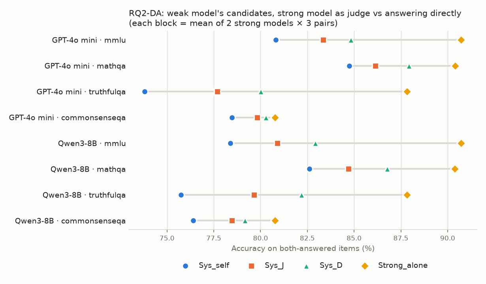

# RQ2-DA：強裁判挑選 vs 強模型直接作答

## (1) 判定標準

- `result/analysis/rq2da/rq2da_criteria.md`，sha256 `fd191613a64eef6e9ea05c7a3178cac08eda9bcc546fda2398134beaa0b197e6`
- 確認：2026-10-05 15:42 CST，使用者確認（含門檻 0.5pp；Sys_self 與 4×4 表對角線用 RQ2 實際採用的版本）
- 產生時間：2026-10-05 15:47 CST；程式：`scripts/analysis_rq2da/direct_answer.py`（逐格計算在 `Analysis/directAnswer.py`）。不呼叫 API，不重跑任何東西，不修改現有檔案。

## (2) 讀了哪些檔案

- 強裁判的選擇：`result/analysis/rq2/judge_outputs/{deepseek4.1flash,gemini3.1flashlite}/{gpt4omini,qwen}/{資料集}/judge__{配對}.json`（RQ2 交叉檔，48 個）。欄位：`final_answer`、`trace.chosen_arm`、`tokens_in`、`tokens_out`、`call.usage_in`、`call.usage_out`。
- g 自己裁決自己（Sys_self），用 RQ2 判定時實際採用的版本（`cross_cells.csv` 的 `used_in_analysis`）：
  - GPT-4o mini：`cross_rerun`，例如 `result/analysis/rq2/judge_outputs/gpt4omini/gpt4omini/mmlu/judge__L_en__L_zh.json`（12 個檔）
  - Qwen3-8B：`main_grid`，例如 `result/aggregations/qwen/mmlu/judge__L_en__L_zh.json`（12 個檔）
- §6.8 的 4×4 表另外讀其餘的 generator × 裁判組合，同樣用 RQ2 實際採用的版本。全部 192 個組合的來源：cross 144、cross_rerun 36、main_grid 12（主網格檔只取 both_answered 的不一致題）。
- `result/arms/{模型}/{資料集}/`：配對用到的 path（L_en、L_zh、S_T1.0_seed1、P_expert、P_skeptic）與四個模型的 L_en；欄位 `parsed_answer`、`parse_ok`、`gold`、`tokens_in`、`tokens_out`。
- `result/analysis/rq2/cross_cells.csv`：每格用的版本（`source`、`used_in_analysis`）與 `n_dis`（§5.2）。結果 13 的數字取自 `result/analysis/rq2/report.md` §7.2（+2.47pp，[+1.65, +3.29]，8/8 為正）。
- 載入沿用 RQ2 的 `Analysis.crossJudge.crossArrays`：核對裁判紀錄剛好涵蓋 both_answered 的不一致題，計分與 RQ2 相同。

## (3) 第 5 節三項檢查

1. 重現結果 13（Sys_J − Sys_self，8 個區塊）：平均 +2.4659pp，95% 區間 [+1.6462, +3.2856]，8/8 為正；四捨五入到小數第二位 = +2.47 [+1.65, +3.29]，與 RQ2 報告的 +2.47 [+1.65, +3.29]、8/8 一致 → 通過。
2. 48 格的不一致題數與 `cross_cells.csv` 的 `n_dis`：0 格不符 → 通過（共 11726 題）。
3. 恆等式 Sys_J − Sys_D = d × (a − b)：48 格最大誤差 9.9e-17（門檻 1e-09）→ 通過。

## (4) 總表

都在弱模型的 both_answered 題目上；每個區塊（弱模型 × 資料集）是 2 個強模型 × 3 個配對的 6 格等權平均。

| 系統           | 正確率（%，8 個區塊的平均）   |
|:-------------|:------------------|
| Weak_EN      | 78.19             |
| Sys_self     | 78.87             |
| Sys_J        | 81.34             |
| Sys_D        | 83.01             |
| Strong_alone | 87.43             |

| 量                    | 區塊數   | 平均（pp）   | SE   | 95% 區間         | 為正的區塊   |
|:---------------------|:------|:---------|:-----|:---------------|:--------|
| Sys_J − Sys_self     | 8     | +2.47    | 0.35 | [+1.65, +3.29] | 8/8     |
| Sys_D − Sys_self     | 8     | +4.14    | 0.56 | [+2.80, +5.47] | 8/8     |
| Sys_J − Sys_D        | 8     | -1.67    | 0.26 | [-2.30, -1.05] | 0/8     |
| Strong_alone − Sys_J | 8     | +6.09    | 1.20 | [+3.25, +8.93] | 8/8     |
| Strong_alone − Sys_D | 8     | +4.42    | 0.99 | [+2.08, +6.75] | 8/8     |

## (5) 判定一：Diff = Sys_J − Sys_D

- 8 個區塊：平均 -1.67pp，SE 0.26，95% 區間 [-2.30, -1.05]，0/8 為正。
- 門檻 0.5pp → **反向成立**。
- 事先寫下的讀法：裁決這一步沒有價值。結果 13 的 2.47pp 只當診斷（瓶頸在裁判），不當建議；答案不同時直接讓強模型作答比較好。

逐區塊（%、pp）：

| generator   | dataset       |   Sys_J |   Sys_D |   Diff（pp） |
|:------------|:--------------|--------:|--------:|-----------:|
| GPT-4o mini | mmlu          |   83.34 |   84.83 |      -1.48 |
| GPT-4o mini | mathqa        |   86.13 |   87.93 |      -1.80 |
| GPT-4o mini | truthfulqa    |   77.68 |   80.01 |      -2.33 |
| GPT-4o mini | commonsenseqa |   79.83 |   80.28 |      -0.46 |
| Qwen3-8B    | mmlu          |   80.90 |   82.92 |      -2.03 |
| Qwen3-8B    | mathqa        |   84.71 |   86.77 |      -2.06 |
| Qwen3-8B    | truthfulqa    |   79.65 |   82.18 |      -2.53 |
| Qwen3-8B    | commonsenseqa |   78.47 |   79.17 |      -0.70 |

## (6) 其餘只報告的量（不參與判定）

### 6.2 不一致題上的 a、b、agree、d

a = 強模型當裁判的正確率；b = 強模型自己 L:en 的正確率；agree = 裁判選出的答案與 L:en 相同（兩邊都要有答案）；d = 不一致題占 both_answered 的比例。每組是該組各格的等權平均。

整體：

| 組   |   格數 |   不一致題 |     a |     b |   agree |     d |
|:----|-----:|-------:|------:|------:|--------:|------:|
| 整體  |   48 |  11726 | 0.633 | 0.749 |   0.665 | 0.146 |

分強模型：

| 組                     |   格數 |   不一致題 |     a |     b |   agree |     d |
|:----------------------|-----:|-------:|------:|------:|--------:|------:|
| DeepSeek V4.1 Flash   |   24 |   5863 | 0.607 | 0.727 |   0.627 | 0.146 |
| Gemini 3.1 Flash-Lite |   24 |   5863 | 0.659 | 0.771 |   0.703 | 0.146 |

分弱模型：

| 組           |   格數 |   不一致題 |     a |     b |   agree |     d |
|:------------|-----:|-------:|------:|------:|--------:|------:|
| GPT-4o mini |   24 |   5538 | 0.642 | 0.753 |   0.673 | 0.138 |
| Qwen3-8B    |   24 |   6188 | 0.623 | 0.745 |   0.658 | 0.153 |

分配對：

| 組     |   格數 |   不一致題 |     a |     b |   agree |     d |
|:------|-----:|-------:|------:|------:|--------:|------:|
| EN+ZH |   16 |   5850 | 0.656 | 0.772 |   0.688 | 0.214 |
| EN+S1 |   16 |   2940 | 0.615 | 0.741 |   0.652 | 0.110 |
| P1+P2 |   16 |   2936 | 0.627 | 0.734 |   0.656 | 0.112 |

分資料集：

| 組             |   格數 |   不一致題 |     a |     b |   agree |     d |
|:--------------|-----:|-------:|------:|------:|--------:|------:|
| mmlu          |   12 |   3040 | 0.678 | 0.819 |   0.726 | 0.127 |
| mathqa        |   12 |   3476 | 0.627 | 0.761 |   0.667 | 0.145 |
| truthfulqa    |   12 |   1542 | 0.621 | 0.773 |   0.607 | 0.157 |
| commonsenseqa |   12 |   3668 | 0.605 | 0.643 |   0.661 | 0.153 |

### 6.3 依強模型自己的答案落在哪裡（題目合併）

「裁判沒有選它」包括裁判沒有給出有效選擇：共 5 題（全部不一致題中無效選擇 29 題）。

| 範圍                    | 類別                   |   題數 |    比例 |     a |     b |
|:----------------------|:---------------------|-----:|------:|------:|------:|
| 整體                    | 自己的答案 = 某個候選，裁判選了它   | 7981 | 0.681 | 0.833 | 0.833 |
| 整體                    | 自己的答案 = 某個候選，裁判沒有選它  | 1376 | 0.117 | 0.339 | 0.493 |
| 整體                    | 自己的答案和兩個候選都不同（含沒有答案） | 2369 | 0.202 | 0.169 | 0.612 |
| DeepSeek V4.1 Flash   | 自己的答案 = 某個候選，裁判選了它   | 3784 | 0.645 | 0.828 | 0.828 |
| DeepSeek V4.1 Flash   | 自己的答案 = 某個候選，裁判沒有選它  |  873 | 0.149 | 0.309 | 0.529 |
| DeepSeek V4.1 Flash   | 自己的答案和兩個候選都不同（含沒有答案） | 1206 | 0.206 | 0.171 | 0.587 |
| Gemini 3.1 Flash-Lite | 自己的答案 = 某個候選，裁判選了它   | 4197 | 0.716 | 0.838 | 0.838 |
| Gemini 3.1 Flash-Lite | 自己的答案 = 某個候選，裁判沒有選它  |  503 | 0.086 | 0.390 | 0.429 |
| Gemini 3.1 Flash-Lite | 自己的答案和兩個候選都不同（含沒有答案） | 1163 | 0.198 | 0.168 | 0.637 |

### 6.4 依候選的對錯（題目合併）

| 範圍                    | 類別       |   題數 |    比例 |     a |     b |
|:----------------------|:---------|-----:|------:|------:|------:|
| 整體                    | 兩個候選一對一錯 | 9118 | 0.778 | 0.825 | 0.804 |
| 整體                    | 兩個候選都錯   | 2608 | 0.222 | 0.000 | 0.556 |
| DeepSeek V4.1 Flash   | 兩個候選一對一錯 | 4559 | 0.778 | 0.792 | 0.789 |
| DeepSeek V4.1 Flash   | 兩個候選都錯   | 1304 | 0.222 | 0.000 | 0.543 |
| Gemini 3.1 Flash-Lite | 兩個候選一對一錯 | 4559 | 0.778 | 0.857 | 0.819 |
| Gemini 3.1 Flash-Lite | 兩個候選都錯   | 1304 | 0.222 | 0.000 | 0.568 |

### 6.5 逐題對照（不一致題，題數）

| 範圍                    |   裁判對、直接答對 |   裁判對、直接答錯 |   裁判錯、直接答對 |   兩者都錯 |
|:----------------------|-----------:|-----------:|-----------:|-------:|
| 整體                    |       6651 |        867 |       2127 |   2081 |
| DeepSeek V4.1 Flash   |       3135 |        476 |       1170 |   1082 |
| Gemini 3.1 Flash-Lite |       3516 |        391 |        957 |    999 |

### 6.6 強模型 L:en 在不一致題上沒有答案

| 範圍                                    |   不一致題 |   L:en 沒有答案 |     比例 |
|:--------------------------------------|-------:|------------:|-------:|
| 整體                                    |  11726 |         134 | 0.0114 |
| DeepSeek V4.1 Flash · mmlu            |   1520 |           0 | 0.0000 |
| DeepSeek V4.1 Flash · mathqa          |   1738 |         113 | 0.0650 |
| DeepSeek V4.1 Flash · truthfulqa      |    771 |           0 | 0.0000 |
| DeepSeek V4.1 Flash · commonsenseqa   |   1834 |           2 | 0.0011 |
| Gemini 3.1 Flash-Lite · mmlu          |   1520 |           0 | 0.0000 |
| Gemini 3.1 Flash-Lite · mathqa        |   1738 |          19 | 0.0109 |
| Gemini 3.1 Flash-Lite · truthfulqa    |    771 |           0 | 0.0000 |
| Gemini 3.1 Flash-Lite · commonsenseqa |   1834 |           0 | 0.0000 |

敏感度（排除這些題目後的 Diff，不參與判定）：8 個區塊平均 -1.72pp，95% 區間 [-2.36, -1.08]，0/8 為正。

### 6.7 呼叫強模型的成本

- 呼叫次數：Sys_J 與 Sys_D 都只在不一致題上呼叫強模型（每題 d 次，d 見下表）；Strong_alone 每題一次。
- 每次呼叫的平均 tokens，題目合併。重算 = 每題紀錄的 `tokens_in` / `tokens_out`（arm 紀錄只有重算值，兩種呼叫因此可比）；API = 裁判紀錄的 `call.usage_in` / `call.usage_out`。

| 強模型                   |   d（格平均） |   裁判呼叫數 |   裁判 input（重算） |   裁判 output（重算） |   裁判 input（API） |   裁判 output（API） |   直接作答 input（不一致題） |   直接作答 output（不一致題） |   Strong_alone 呼叫數 |   直接作答 input（全部題目） |   直接作答 output（全部題目） |
|:----------------------|---------:|--------:|---------------:|----------------:|----------------:|-----------------:|-------------------:|--------------------:|-------------------:|-------------------:|--------------------:|
| DeepSeek V4.1 Flash   |    0.146 |    5863 |          706.6 |           265.3 |           710.6 |            265.3 |              311.4 |               357.8 |              40856 |              307.7 |               183.6 |
| Gemini 3.1 Flash-Lite |    0.146 |    5863 |          756.5 |           224.3 |           757.5 |            224.3 |              330.1 |               255.5 |              40856 |              326.2 |               180.4 |

### 6.8 參考用的 4×4 表（附錄，不做判定）

列 = 產生候選的模型，欄 = 裁判的模型；每格是 4 個資料集 × 3 個配對共 12 格的等權平均。b 與 agree 用的是裁判模型自己的 L:en。對角線（自己裁決自己）：EN+ZH 與 EN+S1 中，L:en 本身就是候選之一。

a：

| 產生候選 ＼ 裁判             |   GPT-4o mini |   Qwen3-8B |   DeepSeek V4.1 Flash |   Gemini 3.1 Flash-Lite |
|:----------------------|--------------:|-----------:|----------------------:|------------------------:|
| GPT-4o mini           |         0.474 |      0.497 |                 0.611 |                   0.673 |
| Qwen3-8B              |         0.483 |      0.447 |                 0.602 |                   0.644 |
| DeepSeek V4.1 Flash   |         0.467 |      0.461 |                 0.527 |                   0.599 |
| Gemini 3.1 Flash-Lite |         0.432 |      0.473 |                 0.532 |                   0.549 |

b：

| 產生候選 ＼ 裁判             |   GPT-4o mini |   Qwen3-8B |   DeepSeek V4.1 Flash |   Gemini 3.1 Flash-Lite |
|:----------------------|--------------:|-----------:|----------------------:|------------------------:|
| GPT-4o mini           |         0.457 |      0.549 |                 0.73  |                   0.775 |
| Qwen3-8B              |         0.57  |      0.431 |                 0.724 |                   0.767 |
| DeepSeek V4.1 Flash   |         0.429 |      0.43  |                 0.429 |                   0.601 |
| Gemini 3.1 Flash-Lite |         0.355 |      0.404 |                 0.494 |                   0.45  |

agree：

| 產生候選 ＼ 裁判             |   GPT-4o mini |   Qwen3-8B |   DeepSeek V4.1 Flash |   Gemini 3.1 Flash-Lite |
|:----------------------|--------------:|-----------:|----------------------:|------------------------:|
| GPT-4o mini           |         0.554 |      0.504 |                 0.64  |                   0.705 |
| Qwen3-8B              |         0.522 |      0.551 |                 0.614 |                   0.702 |
| DeepSeek V4.1 Flash   |         0.487 |      0.432 |                 0.51  |                   0.637 |
| Gemini 3.1 Flash-Lite |         0.46  |      0.411 |                 0.501 |                   0.583 |
