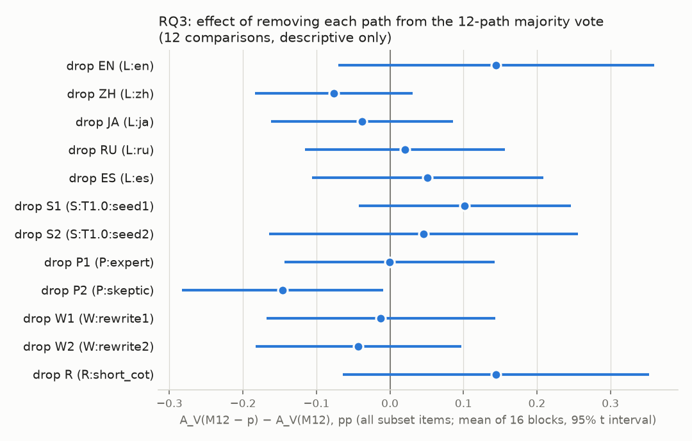
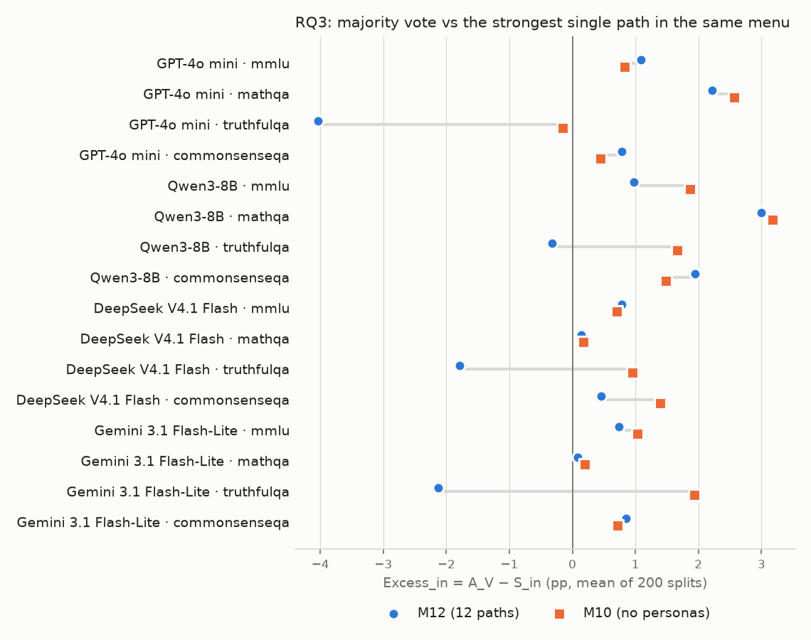

# RQ3：拿掉 path 之後的多數決

## (1) 判定標準

- `result/analysis/rq3/rq3_criteria.md`，sha256 `a635e049c0f24c582f424b081f658d79055d8e4026c633f6846ac15f2de63594`
- 確認：2026-10-05 16:10 CST，使用者確認（含門檻 0.5pp）
- 產生時間：2026-10-05 16:14 CST；程式：`scripts/analysis_rq3/menu_prune.py`（逐切分計算在 `Analysis/menuPrune.py`）。不呼叫 API，不重跑任何東西，不修改現有檔案。

## (2) 讀了哪些檔案

- `result/arms/{模型}/{資料集}/`：經 `Analysis.menuVote.loadPathBlock` 載入（與 RQ1-K 相同；它讀 14 個 path 檔，這裡只用 M12 的 12 條）。欄位 `parsed_answer`、`parse_ok`、`gold`。
- `result/analysis/rq1k/rq1k_blocks.csv`：§6 的核對（M12 列的 `A_in`、`S_in`、`excess_in`、`n`、`keep_in`）。
- `result/analysis/rq1k/rq1k_criteria.md` §3.1：平手的優先順序（只引用）。
- 沿用的程式：多數決 `Analysis.menuVote.vote`、最強 path `Analysis.probe.strongest`、切分 `Analysis.menuJudgeStats.blocksWithSplits`（`makeSplits(n, 200, 0)`，同一資料集的模型共用）、統計 `Analysis.blockStats.summarize`。
- 「M12 只去掉 P:skeptic」= M12−P2，「M12 只去掉 P:expert」= M12−P1，都在 12 份 M12−p 之中。
- 平手時拿掉的先後（§3.1）：ZH、W2、W1、S2、S1、RU、R、P2、P1、JA、ES、EN。

## (3) 第 6 節的檢查

1. M12 的 A_V、S_in、Excess_in 與 `rq1k_blocks.csv`：最大誤差 A_V 1.1e-16、S_in 1.1e-16、Excess_in 4.4e-16（門檻 1e-09）→ 通過。
2. 16 個區塊的子集題數 = RQ1-K 的 M12 子集（`n × keep_in`）→ 通過（共 26961 題）。
- §7.7 的恆等式（M12 與 M10，16 個區塊 × 200 次切分）：最大誤差 1.5e-16 → 通過。

## (4) 判定一與判定二

| 量                                             | 平均    | SE   | 95% 區間         | 為正的區塊   | 狀態   |
|:----------------------------------------------|:------|:-----|:---------------|:--------|:-----|
| 判定一：Prune1 = A_V(M12−p*) − A_V(M12)           | +0.13 | 0.10 | [-0.08, +0.35] | 7/16    | 兩者相當 |
| 判定二：ΔExcess = Excess_in(M10) − Excess_in(M12) | +0.89 | 0.37 | [+0.10, +1.67] | 11/16   | 正向成立 |

單位：百分點；門檻 0.5pp。
- 判定一 **兩者相當** → 拿掉一條對多數決幾乎沒有影響（±0.5pp 內）。
- 判定二 **正向成立** → 支持「增益大小取決於菜單裡有沒有強的 path」。

## (5) TruthfulQA 的次要分析（4 個區塊，不套四種狀態）

| 模型                    |   Excess_in(M12) |   Excess_in(M10) |   ΔExcess（M10） |   Excess_in(M12−P2) |   M12−P2 − M12 |
|:----------------------|-----------------:|-----------------:|---------------:|--------------------:|---------------:|
| GPT-4o mini           |            -4.04 |            -0.16 |           3.88 |               -1.73 |           2.31 |
| Qwen3-8B              |            -0.32 |             1.67 |           1.99 |                2.15 |           2.47 |
| DeepSeek V4.1 Flash   |            -1.80 |             0.95 |           2.75 |                0.30 |           2.10 |
| Gemini 3.1 Flash-Lite |            -2.12 |             1.94 |           4.06 |                0.75 |           2.88 |
| 平均                    |            -2.07 |             1.10 |           3.17 |                0.37 |           2.44 |

- ΔExcess（M10）全為正：是；Excess_in(M10) 的平均 +1.10pp。
- 讀法：4 個區塊的 ΔExcess 全為正，且 Excess_in(M10) 的平均 ≥ −0.5pp → 寫「拿掉 persona 後，TruthfulQA 上的差距消失」，現有的解釋得到支持。

## (6) 其餘只報告的量（不參與判定）

### 7.1 判定一、二的逐區塊數字（pp）

| model                 | dataset       |   Prune1 |   ΔExcess |
|:----------------------|:--------------|---------:|----------:|
| GPT-4o mini           | mmlu          |     0.43 |     -0.26 |
| GPT-4o mini           | mathqa        |     0.77 |      0.35 |
| GPT-4o mini           | truthfulqa    |    -0.46 |      3.88 |
| GPT-4o mini           | commonsenseqa |    -0.19 |     -0.34 |
| Qwen3-8B              | mmlu          |     0.22 |      0.88 |
| Qwen3-8B              | mathqa        |    -0.05 |      0.18 |
| Qwen3-8B              | truthfulqa    |     0.37 |      1.99 |
| Qwen3-8B              | commonsenseqa |    -0.14 |     -0.47 |
| DeepSeek V4.1 Flash   | mmlu          |    -0.12 |     -0.08 |
| DeepSeek V4.1 Flash   | mathqa        |    -0.03 |      0.03 |
| DeepSeek V4.1 Flash   | truthfulqa    |     0.98 |      2.75 |
| DeepSeek V4.1 Flash   | commonsenseqa |    -0.16 |      0.94 |
| Gemini 3.1 Flash-Lite | mmlu          |    -0.11 |      0.29 |
| Gemini 3.1 Flash-Lite | mathqa        |     0.13 |      0.11 |
| Gemini 3.1 Flash-Lite | truthfulqa    |     0.66 |      4.06 |
| Gemini 3.1 Flash-Lite | commonsenseqa |    -0.17 |     -0.13 |

分資料集的平均：

| dataset       |   Prune1 |   ΔExcess |
|:--------------|---------:|----------:|
| mmlu          |     0.11 |      0.21 |
| mathqa        |     0.20 |      0.17 |
| truthfulqa    |     0.39 |      3.17 |
| commonsenseqa |    -0.16 |     -0.00 |

分模型的平均：

| model                 |   Prune1 |   ΔExcess |
|:----------------------|---------:|----------:|
| GPT-4o mini           |     0.14 |      0.91 |
| Qwen3-8B              |     0.10 |      0.65 |
| DeepSeek V4.1 Flash   |     0.17 |      0.91 |
| Gemini 3.1 Flash-Lite |     0.13 |      1.08 |

### 7.2 p* 是哪一條（200 次切分中被選中的比例，%）

| 模型                    | 資料集           |   EN |   ZH |   JA |   RU |   ES |   S1 |   S2 |   P1 |   P2 |   W1 |   W2 |   R |
|:----------------------|:--------------|-----:|-----:|-----:|-----:|-----:|-----:|-----:|-----:|-----:|-----:|-----:|----:|
| GPT-4o mini           | mmlu          |    0 |    1 |    0 |    0 |   60 |    7 |    0 |    0 |    2 |    0 |    0 |  29 |
| GPT-4o mini           | mathqa        |   95 |    2 |    0 |    0 |    2 |    0 |    0 |    0 |    0 |    0 |    0 |   0 |
| GPT-4o mini           | truthfulqa    |   27 |    4 |   14 |   10 |   12 |   13 |    0 |    0 |    0 |    8 |    1 |  10 |
| GPT-4o mini           | commonsenseqa |    0 |   12 |   57 |    9 |    0 |    4 |    8 |    4 |    0 |    4 |    0 |   0 |
| Qwen3-8B              | mmlu          |   35 |    0 |    0 |    2 |    0 |   24 |    9 |    0 |   10 |    0 |    4 |  15 |
| Qwen3-8B              | mathqa        |    4 |   40 |    0 |    0 |    0 |   14 |    9 |   10 |    0 |    2 |    2 |  20 |
| Qwen3-8B              | truthfulqa    |   35 |    0 |    2 |    2 |    6 |   10 |   21 |    2 |    0 |   20 |    2 |   1 |
| Qwen3-8B              | commonsenseqa |   21 |    2 |    0 |   42 |    7 |   11 |    6 |    1 |    0 |    4 |    0 |   6 |
| DeepSeek V4.1 Flash   | mmlu          |    2 |    4 |    0 |    2 |   48 |   14 |    0 |    2 |    6 |   12 |   10 |   0 |
| DeepSeek V4.1 Flash   | mathqa        |    7 |    4 |    0 |    1 |    0 |    0 |    4 |   55 |    2 |   10 |    8 |  11 |
| DeepSeek V4.1 Flash   | truthfulqa    |    0 |    0 |    0 |    2 |    0 |    0 |   38 |    0 |    0 |    0 |    2 |  57 |
| DeepSeek V4.1 Flash   | commonsenseqa |   26 |    9 |    1 |    0 |    7 |   10 |    0 |    1 |    0 |    0 |   44 |   1 |
| Gemini 3.1 Flash-Lite | mmlu          |    8 |    0 |    1 |    2 |    0 |   32 |   10 |   26 |   15 |    7 |    0 |   0 |
| Gemini 3.1 Flash-Lite | mathqa        |    0 |   46 |    0 |    1 |    0 |   10 |    1 |   38 |    2 |    1 |    0 |   0 |
| Gemini 3.1 Flash-Lite | truthfulqa    |    0 |    1 |    0 |    0 |    0 |    0 |    0 |    0 |    0 |   93 |    6 |   0 |
| Gemini 3.1 Flash-Lite | commonsenseqa |    1 |    6 |    6 |    3 |    2 |    4 |   22 |   44 |    0 |    0 |    1 |  11 |
| 平均                    |               |   16 |    8 |    5 |    5 |    9 |   10 |    8 |   11 |    2 |   10 |    5 |  10 |

依類別合計（語言 = ZH、JA、RU、ES；採樣 = S1、S2；persona = P1、P2；改寫 = W1、W2；簡短 CoT = R）：

| 模型                    | 資料集           |   語言 |   L:en |   採樣 |   persona |   改寫 |   簡短 CoT |
|:----------------------|:--------------|-----:|-------:|-----:|----------:|-----:|---------:|
| GPT-4o mini           | mmlu          |   62 |      0 |    7 |         2 |    0 |       29 |
| GPT-4o mini           | mathqa        |    4 |     95 |    0 |         0 |    0 |        0 |
| GPT-4o mini           | truthfulqa    |   40 |     27 |   13 |         0 |    9 |       10 |
| GPT-4o mini           | commonsenseqa |   78 |      0 |   13 |         4 |    4 |        0 |
| Qwen3-8B              | mmlu          |    2 |     35 |   33 |        10 |    4 |       15 |
| Qwen3-8B              | mathqa        |   40 |      4 |   22 |        10 |    4 |       20 |
| Qwen3-8B              | truthfulqa    |   10 |     35 |   30 |         2 |   22 |        1 |
| Qwen3-8B              | commonsenseqa |   51 |     21 |   16 |         1 |    4 |        6 |
| DeepSeek V4.1 Flash   | mmlu          |   55 |      2 |   14 |         8 |   22 |        0 |
| DeepSeek V4.1 Flash   | mathqa        |    4 |      7 |    4 |        57 |   17 |       11 |
| DeepSeek V4.1 Flash   | truthfulqa    |    2 |      0 |   38 |         0 |    2 |       57 |
| DeepSeek V4.1 Flash   | commonsenseqa |   18 |     26 |   10 |         1 |   44 |        1 |
| Gemini 3.1 Flash-Lite | mmlu          |    3 |      8 |   42 |        40 |    7 |        0 |
| Gemini 3.1 Flash-Lite | mathqa        |   48 |      0 |   10 |        40 |    1 |        0 |
| Gemini 3.1 Flash-Lite | truthfulqa    |    1 |      0 |    0 |         0 |   99 |        0 |
| Gemini 3.1 Flash-Lite | commonsenseqa |   17 |      1 |   26 |        44 |    1 |       11 |
| 平均                    |               |   27 |     16 |   18 |        14 |   15 |       10 |

### 7.3 不經挑選的逐條結果

A_V(M12−p) − A_V(M12)，用子集內全部題目（不切分），百分點。**這是 12 個比較，只當描述。**

| 拿掉               | 平均    | SE   | 95% 區間         | 為正的區塊   |
|:-----------------|:------|:-----|:---------------|:--------|
| EN（L:en）         | +0.14 | 0.10 | [-0.07, +0.36] | 8/16    |
| ZH（L:zh）         | -0.08 | 0.05 | [-0.18, +0.03] | 4/16    |
| JA（L:ja）         | -0.04 | 0.06 | [-0.16, +0.09] | 5/16    |
| RU（L:ru）         | +0.02 | 0.06 | [-0.12, +0.16] | 7/16    |
| ES（L:es）         | +0.05 | 0.07 | [-0.11, +0.21] | 8/16    |
| S1（S:T1.0:seed1） | +0.10 | 0.07 | [-0.04, +0.25] | 9/16    |
| S2（S:T1.0:seed2） | +0.05 | 0.10 | [-0.16, +0.26] | 6/16    |
| P1（P:expert）     | -0.00 | 0.07 | [-0.14, +0.14] | 8/16    |
| P2（P:skeptic）    | -0.15 | 0.06 | [-0.28, -0.01] | 4/16    |
| W1（W:rewrite1）   | -0.01 | 0.07 | [-0.17, +0.14] | 4/16    |
| W2（W:rewrite2）   | -0.04 | 0.07 | [-0.18, +0.10] | 6/16    |
| R（R:short_cot）   | +0.14 | 0.10 | [-0.06, +0.35] | 8/16    |

### 7.4 可以選擇不拿的版本（13 選一，平手優先不拿）

| 量                     | 平均    | SE   | 95% 區間         | 為正的區塊   |
|:----------------------|:------|:-----|:---------------|:--------|
| A_V(選出的菜單) − A_V(M12) | +0.13 | 0.10 | [-0.08, +0.34] | 7/16    |

選到「不拿」的切分比例：16 個區塊平均 9.9%。逐區塊（%）：

| 模型                    | 資料集           |   選到不拿 |
|:----------------------|:--------------|-------:|
| GPT-4o mini           | mmlu          |    0.0 |
| GPT-4o mini           | mathqa        |    0.0 |
| GPT-4o mini           | truthfulqa    |   21.0 |
| GPT-4o mini           | commonsenseqa |   25.5 |
| Qwen3-8B              | mmlu          |    0.5 |
| Qwen3-8B              | mathqa        |    3.5 |
| Qwen3-8B              | truthfulqa    |    0.5 |
| Qwen3-8B              | commonsenseqa |    5.5 |
| DeepSeek V4.1 Flash   | mmlu          |   18.5 |
| DeepSeek V4.1 Flash   | mathqa        |   25.5 |
| DeepSeek V4.1 Flash   | truthfulqa    |    0.5 |
| DeepSeek V4.1 Flash   | commonsenseqa |   11.5 |
| Gemini 3.1 Flash-Lite | mmlu          |   25.5 |
| Gemini 3.1 Flash-Lite | mathqa        |    2.5 |
| Gemini 3.1 Flash-Lite | truthfulqa    |    2.0 |
| Gemini 3.1 Flash-Lite | commonsenseqa |   16.0 |

### 7.5 第二部分的組成

| 量            | 平均    | SE   | 95% 區間         | 為正的區塊   |
|:-------------|:------|:-----|:---------------|:--------|
| A_V(M12)（%）  | 84.67 | 1.57 | [81.32, 88.03] | —       |
| A_V(M10)（%）  | 84.50 | 1.61 | [81.06, 87.94] | —       |
| S_in(M12)（%） | 84.37 | 1.60 | [80.95, 87.79] | —       |
| S_in(M10)（%） | 83.31 | 1.63 | [79.83, 86.79] | —       |
| ΔA（pp）       | -0.17 | 0.08 | [-0.35, +0.00] | 5/16    |
| ΔS（pp）       | -1.06 | 0.43 | [-1.98, -0.15] | 7/16    |

S_in(M10) 最常選到的 path（200 次切分中的比例）：

| 區塊                                    | S_in(M10) 前兩名   | （對照）S_in(M12) 前兩名   |
|:--------------------------------------|:----------------|:--------------------|
| GPT-4o mini · mmlu                    | EN 94% / S1 4%  | P1 36% / P2 36%     |
| GPT-4o mini · mathqa                  | W1 43% / W2 42% | P1 62% / W1 16%     |
| GPT-4o mini · truthfulqa              | W1 82% / S2 9%  | P2 100% / P1 0%     |
| GPT-4o mini · commonsenseqa           | EN 82% / S1 12% | EN 70% / S1 12%     |
| Qwen3-8B · mmlu                       | W1 42% / EN 26% | P1 73% / W1 14%     |
| Qwen3-8B · mathqa                     | W1 58% / W2 23% | P2 62% / W1 24%     |
| Qwen3-8B · truthfulqa                 | W1 70% / ZH 20% | P2 89% / W1 8%      |
| Qwen3-8B · commonsenseqa              | EN 40% / R 32%  | P1 25% / EN 24%     |
| DeepSeek V4.1 Flash · mmlu            | R 40% / S1 32%  | P1 52% / S1 18%     |
| DeepSeek V4.1 Flash · mathqa          | S1 90% / EN 6%  | S1 76% / P1 14%     |
| DeepSeek V4.1 Flash · truthfulqa      | W1 54% / ZH 28% | P2 94% / P1 6%      |
| DeepSeek V4.1 Flash · commonsenseqa   | EN 49% / S2 48% | P2 88% / S2 5%      |
| Gemini 3.1 Flash-Lite · mmlu          | EN 36% / S2 28% | EN 30% / W1 22%     |
| Gemini 3.1 Flash-Lite · mathqa        | S2 68% / EN 22% | S2 60% / EN 19%     |
| Gemini 3.1 Flash-Lite · truthfulqa    | S2 36% / W1 17% | P2 100%             |
| Gemini 3.1 Flash-Lite · commonsenseqa | R 55% / S1 26%  | R 40% / S1 18%      |

### 7.6 沒有 persona 的多數決對上 12 條中最強的單一 path

| 量                        | 平均    | SE   | 95% 區間         | 為正的區塊   |
|:-------------------------|:------|:-----|:---------------|:--------|
| A_V(M10) − S_in(M12)（pp） | +0.12 | 0.49 | [-0.91, +1.16] | 12/16   |

### 7.7 分解（M12 的子集上，16 個區塊的平均）

headroom 以百分點表示；各量先對切分平均，所以平均後的乘積不必等於平均 Excess_in。逐區塊的值在 `rq3_blocks.csv`（M12 那一列的 `M12_*`、`M10_*` 欄）。

| 菜單   |     d |     c |     m |   headroom（pp） |   recovery_V |   recovery_blind |   無定義的切分 |   Excess_in（pp） |
|:-----|------:|------:|------:|---------------:|-------------:|-----------------:|---------:|----------------:|
| M12  | 0.360 | 0.914 | 0.584 |         12.025 |        0.235 |            0.212 |        0 |           0.299 |
| M10  | 0.354 | 0.908 | 0.570 |         12.084 |        0.264 |            0.154 |        0 |           1.186 |

恆等式 Excess_in = d × (c − m) × (recovery_V − recovery_blind)：每次切分核對，最大誤差 1.5e-16。

### 7.8 只去掉一條 persona 的版本（16 個區塊的平均）

| 菜單                    | A_V（%）   | S_in（%）   | Excess_in（pp）   | Excess_in 95% 區間   | 為正的區塊   |
|:----------------------|:---------|:----------|:----------------|:-------------------|:--------|
| M12                   | 84.67    | 84.37     | +0.30           | [-0.63, +1.23]     | 12/16   |
| M10（去掉 P1、P2）         | 84.50    | 83.31     | +1.19           | [+0.70, +1.67]     | 15/16   |
| M12−P2（只去掉 P:skeptic） | 84.53    | 83.60     | +0.93           | [+0.32, +1.53]     | 15/16   |
| M12−P1（只去掉 P:expert）  | 84.67    | 84.33     | +0.34           | [-0.70, +1.39]     | 13/16   |

