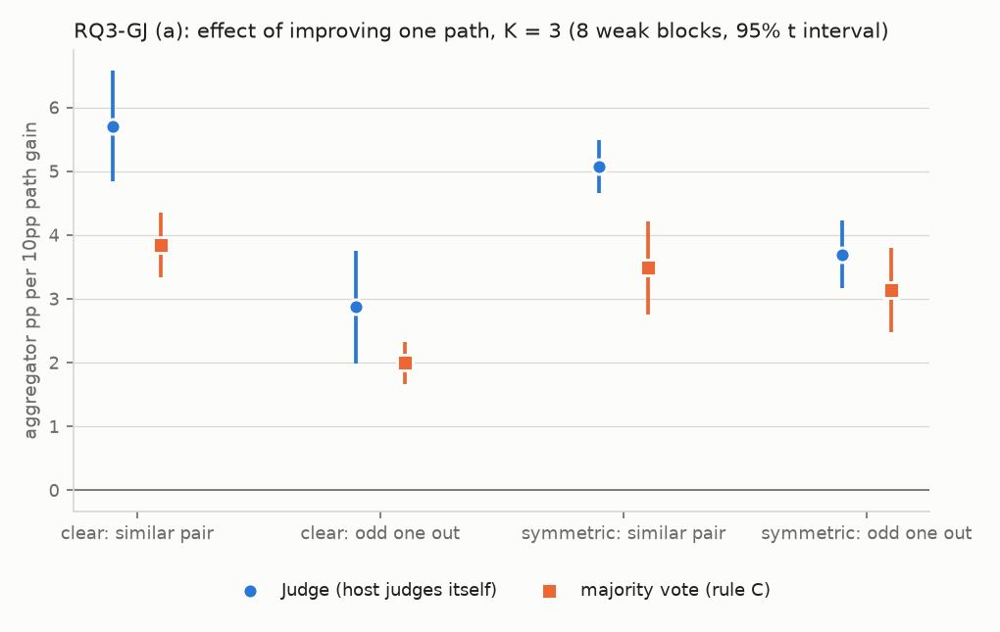

# RQ3-GJ：讓模型當裁判時，該改哪一條 path？

判定標準 `result/analysis/rq3gj/rq3gj_criteria.md`，sha256 `4e96b91475c30a490285a91faf6a878583d2691518c6ccff0b520dd6c154e700`；確認：2026-10-08 00:07 CST，使用者確認第三版草稿（含門檻 0.5pp 與草稿中所有【補充，待確認】的規則；API 由使用者在遠端機器執行）。產生時間 2026-10-08 23:40 CST；程式 `scripts/analysis_rq3gj/path_improve_gj.py`（逐區塊的計算在 `Analysis/judgeSubstitutionStats.py`；計畫在 `Analysis/judgeSubstitution.py`；預測在 `Analysis/judgeSubstitutionPredict.py`，只讀存好的預測檔）。

判定一、判定四的單位是「那條 path 每進步 10 個百分點，聚合多幾個百分點」；判定二、判定三的單位是 pp。門檻都是 0.5。

## (1) 讀了哪些檔案

- `result/arms/{模型}/{資料集}/`：4 個模型的 12 條 path（`item_id`、`gold`、`parsed_answer`、`parse_ok`），經 `Analysis.menuVote.loadPathBlock` 載入；用來決定每個版本的候選答案、子集二與多數決。
- `result/analysis/rq3gj/judge_outputs/`、`judge_outputs_k2/`：這次的 Judge 輸出（`final_answer`、`presentation_order`、`trace.choice`、`trace.chosen_arm`、`trace.judge_output`、`tokens_in`、`tokens_out`、`call`、`pilot`、`donor_position`）。
- `result/analysis/rq3gj/` 的預測檔（只讀，sha256 等於 `rq3gj_predictions_manifest.json`）、`precheck.json`、`pilot.json`、`prerun.json`。
- `result/analysis/rq1kj/judge_outputs/{gpt4omini, qwen}/{資料集}/M3L|M3S|M3P.json`：第 8 節 7(c) 的訓練用紀錄。
- `result/analysis/rq3gj/rq3gj_stage0_calls.csv`：計畫和第零階段逐列核對。

## (2) 第零階段的表

- K = 3 共 39 份菜單（四組各 10 份，GS-181 在兩組），每份 7 個版本；K = 2 的 3 個配對 × 5 個版本 × 2 種順序。
- 計畫的呼叫數 1,006,926 次（K = 3 936,892、K = 2 70,034），第零階段估計 232.21 美元；被排除的替換 0 個。
- 四組菜單、落單的 path、分母表見判定標準檔第 3 節與附錄 A。

## (3) 流程核對與試跑

### 第 10 節 流程核對

| 裁判          | 題數   | 最終答案相同     | 門檻   | 選到同一候選     | 版本                     |
|:------------|:-----|:-----------|:-----|:-----------|:-----------------------|
| Qwen3-8B    | 144  | 143（99.3%） | 90%  | 142（98.6%） | qwen3-8b               |
| GPT-4o mini | 166  | 151（91.0%） | 80%  | 141（84.9%） | gpt-4o-mini-2024-07-18 |

兩個比例當作 Judge 重跑雜訊的參考（判定一的限制 (c)）。

### 第 11 節 試跑

| 段   | 呼叫數   | 無效       | 答案不在候選之中   | input 平均 / 最大   | output 平均 / 最大   | 位置                         |
|:----|:------|:---------|:-----------|:----------------|:-----------------|:---------------------------|
| K3  | 582   | 1（0.17%） | 0.00%      | 951 / 2128      | 150 / 315        | 1: 49.6%、2: 30.1%、3: 20.3% |
| K2  | 680   | 0（0.00%） | 0.00%      | 800 / 2460      | 134 / 328        | 1: 54.0%、2: 46.0%          |

依實際用量推估的總費用 235.52 美元（門檻 300）。試跑的紀錄併入正式結果，標記 `pilot: true`。

## (4) 正式跑之前的檢查（第 12 節）

1. 重現 RQ3-GS 判定二 +1.75（+1.03 到 +2.46），8 / 8；逐區塊最大差 0.0e+00；39 份菜單的 E2_menu 最大差 2.2e-16 → 通過。
2. 同一份菜單、同一題，所有版本的順序相同；已寫入的 1262 筆紀錄都用計畫的順序 → 通過。
3. 預測檔在正式跑之前存檔，sha256 記在 manifest；這次分析讀檔時再核對一次 → 通過。
4. 換成自己：984 個，候選、要呼叫的題目、順序都和原本的版本相同 → 通過。
5. K = 2 兩種順序互為對調；1262 筆紀錄的 prompt 用的是對的檔案與順序 → 通過。

## (5) 判定一、二、三、四

### 判定一：裁判之下，落單的那條還是最不值得改嗎（明顯落單組的 10 份）

| 量                                      | 平均    | SE   | 95% 區間         | 為正的區塊   | 狀態   |
|:---------------------------------------|:------|:-----|:---------------|:--------|:-----|
| E_J = 相像那一對的 Judge 效果 − 落單那條的 Judge 效果 | +2.83 | 0.66 | [+1.28, +4.39] | 8/8     | 正向成立 |
| （對照）同樣 10 份上的多數決                       | +1.85 | 0.30 | [+1.14, +2.57] | 8/8     |      |

**正向成立** → 和投票一樣，裁判之下落單的那條也最不值得改。

限制：(a) 這 10 份落單的全是翻譯的語言 path（JA 6、ZH 3、ES 1），判定分不開「落單」和「文字是另一種語言」；(b) 區間只反映 8 個區塊之間的變動，不反映抽到哪 10 份，逐菜單的值見第 8 節 1；(c) 分子含 Judge 重跑的雜訊（第 10 節）。

| 宿主          | 資料集           |   E_J |   相像那一對 |   落單那條 |   多數決的 E |
|:------------|:--------------|------:|--------:|-------:|---------:|
| GPT-4o mini | mmlu          |  2.11 |    5.16 |   3.05 |     1.34 |
| GPT-4o mini | mathqa        |  1.70 |    5.17 |   3.47 |     0.94 |
| GPT-4o mini | truthfulqa    |  1.53 |    5.09 |   3.56 |     0.95 |
| GPT-4o mini | commonsenseqa |  6.53 |    7.92 |   1.39 |     2.74 |
| Qwen3-8B    | mmlu          |  2.33 |    5.74 |   3.40 |     2.03 |
| Qwen3-8B    | mathqa        |  1.38 |    4.54 |   3.16 |     1.82 |
| Qwen3-8B    | truthfulqa    |  2.19 |    6.10 |   3.91 |     1.62 |
| Qwen3-8B    | commonsenseqa |  4.90 |    5.95 |   1.05 |     3.38 |

### 判定二：改進一條 path，裁判拿到的比投票多嗎（四組全部的菜單）

| 量                               | 平均    | SE   | 95% 區間         | 為正的區塊   | 狀態   |
|:--------------------------------|:------|:-----|:---------------|:--------|:-----|
| D_JV = 替換後 Judge 多的 − 多數決多的（pp） | +1.64 | 0.43 | [+0.62, +2.66] | 8/8     | 正向成立 |

**正向成立** → 改進一條 path，裁判多拿到的正確率比投票多。 原因看票型拆解：主要來自 (b)：讀內容的聚合更能用到單一 path 的進步。（(a) 平均每個替換 +0.489pp（10%）；(b) 平均每個替換 +2.449pp（52%）；(c) 平均每個替換 +1.408pp（30%）；(d) 平均每個替換 +0.337pp（7%））

| 宿主          | 資料集           |   D_JV |
|:------------|:--------------|-------:|
| GPT-4o mini | mmlu          |   2.02 |
| GPT-4o mini | mathqa        |   1.03 |
| GPT-4o mini | truthfulqa    |   2.46 |
| GPT-4o mini | commonsenseqa |   0.21 |
| Qwen3-8B    | mmlu          |   2.96 |
| Qwen3-8B    | mathqa        |   0.90 |
| Qwen3-8B    | truthfulqa    |   3.35 |
| Qwen3-8B    | commonsenseqa |   0.23 |

### 判定三：簡單的預測估得準嗎（四組全部的菜單）

| 量                                | 平均    | SE   | 95% 區間         | 為正的區塊   | 狀態   |
|:---------------------------------|:------|:-----|:---------------|:--------|:-----|
| D_P = 評分半上替換後 Judge 的實際 − 預測（pp） | +0.95 | 0.36 | [+0.09, +1.80] | 5/8     | 正向成立 |
| （對照，第 8 節 7(a)）原本的版本的 D_P        | +0.04 | 0.30 | [-0.67, +0.75] | 2/8     | 無法判定 |

**正向成立** → 預測低估；第 8 節 7(a) 為無法判定，不屬於事先寫好的組合 → 只列數字。

限制：D_P 是有正負號的平均，正負誤差會互相抵銷；每個替換的平均絕對誤差見第 8 節 7(b)。

| 宿主          | 資料集           |   D_P |   原本的版本 D_P |   平均絕對誤差 |
|:------------|:--------------|------:|------------:|---------:|
| GPT-4o mini | mmlu          |  0.64 |       -0.24 |     0.93 |
| GPT-4o mini | mathqa        |  2.05 |        1.19 |     2.05 |
| GPT-4o mini | truthfulqa    | -0.07 |       -1.15 |     1.36 |
| GPT-4o mini | commonsenseqa | -0.00 |       -0.04 |     0.83 |
| Qwen3-8B    | mmlu          |  1.47 |       -0.29 |     1.60 |
| Qwen3-8B    | mathqa        |  2.30 |        1.40 |     2.30 |
| Qwen3-8B    | truthfulqa    |  1.54 |       -0.38 |     1.88 |
| Qwen3-8B    | commonsenseqa | -0.34 |       -0.19 |     0.99 |

### 判定四：三條都是英文時，落單的那條在裁判之下還是最不值得改嗎（英文落單組的 10 份）

| 量             | 平均    | SE   | 95% 區間         | 為正的區塊   | 狀態   |
|:--------------|:------|:-----|:---------------|:--------|:-----|
| E_J（英文落單組）    | +0.74 | 0.38 | [-0.15, +1.62] | 6/8     | 無法判定 |
| （對照）同樣菜單上的多數決 | +1.33 | 0.28 | [+0.67, +1.98] | 8/8     |      |

**無法判定** → 只列數字；判定一仍要帶著「落單的是翻譯的 path」這個條件寫。

限制：這一組的落單程度比明顯落單組小（平均 4.694pp 對 9.502pp）；落單的都是改寫題目的 path（W1、W2）。

| 宿主          | 資料集           |   E_J |   相像那一對 |   落單那條 |   多數決的 E |
|:------------|:--------------|------:|--------:|-------:|---------:|
| GPT-4o mini | mmlu          |  0.47 |    5.02 |   4.55 |     0.90 |
| GPT-4o mini | mathqa        | -0.55 |    4.30 |   4.85 |     0.59 |
| GPT-4o mini | truthfulqa    |  0.39 |    4.69 |   4.30 |     0.96 |
| GPT-4o mini | commonsenseqa |  2.55 |    7.23 |   4.68 |     1.77 |
| Qwen3-8B    | mmlu          |  0.08 |    5.43 |   5.35 |     1.24 |
| Qwen3-8B    | mathqa        | -0.06 |    4.71 |   4.77 |     1.13 |
| Qwen3-8B    | truthfulqa    |  0.99 |    5.49 |   4.50 |     0.96 |
| Qwen3-8B    | commonsenseqa |  2.01 |    5.62 |   3.60 |     3.08 |

## (6) 只報告的量（不參與判定）

### 8.1 四組的 E_J，Judge 與多數決並排

| 量          | 平均    | SE   | 95% 區間         | 為正的區塊   |
|:-----------|:------|:-----|:---------------|:--------|
| 明顯落單：Judge | +2.83 | 0.66 | [+1.28, +4.39] | 8/8     |
| 明顯落單：多數決   | +1.85 | 0.30 | [+1.14, +2.57] | 8/8     |
| 中間：Judge   | +1.58 | 0.52 | [+0.35, +2.80] | 8/8     |
| 中間：多數決     | +1.01 | 0.27 | [+0.37, +1.64] | 8/8     |
| 對稱：Judge   | +1.38 | 0.15 | [+1.02, +1.74] | 8/8     |
| 對稱：多數決     | +0.35 | 0.09 | [+0.14, +0.55] | 8/8     |
| 英文落單：Judge | +0.74 | 0.38 | [-0.15, +1.62] | 6/8     |
| 英文落單：多數決   | +1.33 | 0.28 | [+0.67, +1.98] | 8/8     |

逐菜單的 E_J（8 個區塊、2 個供體合併）與每一組內菜單之間的標準差：

| 菜單     | 組       | 落單的 path   |   落單程度（pp） |   E_J（Judge） |   E（多數決） |
|:-------|:--------|:-----------|-----------:|-------------:|---------:|
| GS-105 | 明顯落單    | JA         |       6.49 |         1.64 |     1.04 |
| GS-095 | 明顯落單    | JA         |       8.59 |         2.22 |     1.46 |
| GS-142 | 明顯落單    | ZH         |       9.61 |         1.66 |     1.60 |
| GS-118 | 明顯落單    | JA         |      10.02 |         2.19 |     1.86 |
| GS-087 | 明顯落單    | JA         |      12.35 |         3.38 |     2.16 |
| GS-003 | 明顯落單    | ES         |       6.48 |         2.61 |     1.06 |
| GS-157 | 明顯落單    | ZH         |       8.02 |         2.22 |     1.26 |
| GS-014 | 明顯落單    | JA         |      12.47 |         2.64 |     2.14 |
| GS-090 | 明顯落單    | JA         |      11.48 |         2.65 |     1.91 |
| GS-139 | 明顯落單    | ZH         |       9.51 |         2.03 |     1.59 |
| GS-181 | 中間、英文落單 | W2         |       4.44 |         0.44 |     0.95 |
| GS-028 | 中間      | W2         |       3.46 |         0.58 |     0.62 |
| GS-033 | 中間      | W2         |       4.16 |        -0.99 |     0.95 |
| GS-066 | 中間      | ES         |       4.00 |         2.20 |     0.48 |
| GS-046 | 中間      | JA         |       4.48 |         2.57 |     0.74 |
| GS-064 | 中間      | ES         |       5.49 |         2.24 |     0.95 |
| GS-062 | 中間      | ES         |       4.76 |         1.46 |     0.78 |
| GS-032 | 中間      | W1         |       3.63 |        -0.99 |     1.15 |
| GS-150 | 中間      | RU         |       5.83 |         2.21 |     0.75 |
| GS-065 | 中間      | ES         |       5.95 |         2.30 |     0.94 |
| GS-019 | 對稱      | S1         |       0.76 |         0.54 |    -0.04 |
| GS-026 | 對稱      | P2         |       2.39 |        -1.28 |     1.17 |
| GS-020 | 對稱      | S2         |       0.92 |         0.39 |     0.02 |
| GS-068 | 對稱      | ZH         |       2.99 |         1.45 |     0.44 |
| GS-135 | 對稱      | ZH         |       1.64 |         1.26 |     0.10 |
| GS-119 | 對稱      | JA         |       1.93 |         2.10 |     0.30 |
| GS-085 | 對稱      | ZH         |       2.34 |         0.69 |     0.36 |
| GS-031 | 對稱      | R          |       1.99 |         2.12 |     0.27 |
| GS-109 | 對稱      | JA         |       2.69 |         1.81 |     0.39 |
| GS-024 | 對稱      | R          |       1.46 |         2.46 |    -0.08 |
| GS-039 | 英文落單    | W2         |       5.27 |         0.31 |     1.27 |
| GS-022 | 英文落單    | W2         |       5.11 |         0.63 |     1.08 |
| GS-125 | 英文落單    | W2         |       5.07 |         1.27 |     1.14 |
| GS-038 | 英文落單    | W1         |       4.84 |         0.13 |     1.37 |
| GS-042 | 英文落單    | W2         |       4.78 |         0.18 |     1.11 |
| GS-021 | 英文落單    | W1         |       4.52 |         0.51 |     1.25 |
| GS-124 | 英文落單    | W1         |       4.37 |         0.88 |     1.11 |
| GS-141 | 英文落單    | W2         |       4.33 |         0.40 |     0.84 |
| GS-041 | 英文落單    | W1         |       4.22 |         0.08 |     1.32 |

| 組    | 菜單數   | Judge 的標準差   | 多數決的標準差   |
|:-----|:------|:-------------|:----------|
| 明顯落單 | 10    | 0.52         | 0.41      |
| 中間   | 10    | 1.37         | 0.19      |
| 對稱   | 10    | 1.11         | 0.36      |
| 英文落單 | 10    | 0.37         | 0.17      |

### 8.2 三種聚合的正確率（%，子集二全部題目，區塊內對版本平均）

| 宿主          | 資料集           |   原本：Judge |   原本：多數決 |   原本：最強單一 |   替換後：Judge |   替換後：多數決 |   替換後：最強單一 |
|:------------|:--------------|-----------:|---------:|----------:|------------:|----------:|-----------:|
| GPT-4o mini | mmlu          |      81.22 |    81.17 |     81.03 |       86.07 |     84.00 |      90.25 |
| GPT-4o mini | mathqa        |      87.73 |    86.79 |     85.97 |       91.39 |     89.43 |      92.57 |
| GPT-4o mini | truthfulqa    |      74.28 |    74.51 |     76.24 |       81.46 |     79.24 |      89.18 |
| GPT-4o mini | commonsenseqa |      78.49 |    78.19 |     78.53 |       79.99 |     79.47 |      79.89 |
| Qwen3-8B    | mmlu          |      78.95 |    78.42 |     78.26 |       85.78 |     82.29 |      90.27 |
| Qwen3-8B    | mathqa        |      87.09 |    85.64 |     84.75 |       91.08 |     88.73 |      92.41 |
| Qwen3-8B    | truthfulqa    |      77.39 |    77.18 |     77.07 |       84.87 |     81.31 |      89.19 |
| Qwen3-8B    | commonsenseqa |      77.10 |    76.68 |     76.69 |       79.09 |     78.43 |      79.38 |

| 量                        | 平均    | SE   | 95% 區間         | 為正的區塊   |
|:-------------------------|:------|:-----|:---------------|:--------|
| 替換後 Judge − 替換後選最強單一（pp） | -2.92 | 0.95 | [-5.17, -0.68] | 1/8     |

### 8.3 實際的採用率（K = 3 全部版本，每個（版本、題目）計一次）

票型一的位置是落單那條（錯的）；票型二、三的位置是正確答案。

| 裁判          | 票型   | 位置   | 題數    | 選對    | 落單答對的是宿主自己的   | 是換進來的強模型的    |
|:------------|:-----|:-----|:------|:------|:--------------|:-------------|
| GPT-4o mini | 1    | 1    | 74177 | 82.0% |               |              |
| GPT-4o mini | 1    | 2    | 74998 | 84.8% |               |              |
| GPT-4o mini | 1    | 3    | 74108 | 90.8% |               |              |
| GPT-4o mini | 2    | 1    | 41520 | 44.8% | 31.0%（12618）  | 50.8%（28902） |
| GPT-4o mini | 2    | 2    | 41106 | 42.1% | 33.0%（12850）  | 46.2%（28256） |
| GPT-4o mini | 2    | 3    | 41390 | 33.5% | 22.8%（12789）  | 38.2%（28601） |
| GPT-4o mini | 3    | 1    | 13865 | 58.0% |               |              |
| GPT-4o mini | 3    | 2    | 13993 | 50.1% |               |              |
| GPT-4o mini | 3    | 3    | 13820 | 47.2% |               |              |
| Qwen3-8B    | 1    | 1    | 83448 | 90.6% |               |              |
| Qwen3-8B    | 1    | 2    | 84060 | 83.8% |               |              |
| Qwen3-8B    | 1    | 3    | 85565 | 82.6% |               |              |
| Qwen3-8B    | 2    | 1    | 45466 | 38.9% | 21.9%（14564）  | 46.9%（30902） |
| Qwen3-8B    | 2    | 2    | 45195 | 49.1% | 36.2%（14087）  | 55.0%（31108） |
| Qwen3-8B    | 2    | 3    | 45794 | 50.7% | 36.7%（14516）  | 57.2%（31278） |
| Qwen3-8B    | 3    | 1    | 17299 | 50.2% |               |              |
| Qwen3-8B    | 3    | 2    | 17073 | 52.7% |               |              |
| Qwen3-8B    | 3    | 3    | 17559 | 64.0% |               |              |

### 8.4 位置

| 裁判          | 三條都不同的題數   | 沒有有效選擇   | 選位置 1   | 選位置 2   | 選位置 3   |
|:------------|:-----------|:---------|:--------|:--------|:--------|
| GPT-4o mini | 46610      | 2        | 38.6%   | 31.8%   | 29.6%   |
| Qwen3-8B    | 58159      | 4        | 28.1%   | 30.4%   | 41.6%   |

票型二依位置的採用率見第 8 節 3。實際呼叫的題目上，菜單內每條 path 出現在各位置的次數：

| 裁判          | 菜單內第幾條（平手順序）   | 顯示在位置 1   | 顯示在位置 2   | 顯示在位置 3   |
|:------------|:---------------|:----------|:----------|:----------|
| GPT-4o mini | 1              | 143596    | 147959    | 148394    |
| GPT-4o mini | 2              | 150952    | 142453    | 146544    |
| GPT-4o mini | 3              | 145401    | 149537    | 145011    |
| Qwen3-8B    | 1              | 163244    | 168175    | 165524    |
| Qwen3-8B    | 2              | 166938    | 163765    | 166240    |
| Qwen3-8B    | 3              | 166761    | 165003    | 165179    |

### 8.5 分開報

兩個供體分開（8 個區塊）：

| 量                              | 平均    | SE   | 95% 區間         | 為正的區塊   |
|:-------------------------------|:------|:-----|:---------------|:--------|
| 判定一 E_J，供體 deepseek4.1flash    | +3.05 | 0.70 | [+1.38, +4.71] | 8/8     |
| 判定二 D_JV，供體 deepseek4.1flash   | +1.47 | 0.39 | [+0.54, +2.39] | 8/8     |
| 判定四 E_J，供體 deepseek4.1flash    | +0.94 | 0.43 | [-0.08, +1.95] | 6/8     |
| 判定一 E_J，供體 gemini3.1flashlite  | +2.69 | 0.65 | [+1.16, +4.22] | 8/8     |
| 判定二 D_JV，供體 gemini3.1flashlite | +1.82 | 0.48 | [+0.70, +2.95] | 8/8     |
| 判定四 E_J，供體 gemini3.1flashlite  | +0.59 | 0.35 | [-0.25, +1.42] | 6/8     |

兩個宿主分開（各 4 個區塊，只描述）：

| 宿主          | 判定   | 平均    | 4 個值                    | 為正   |
|:------------|:-----|:------|:------------------------|:-----|
| GPT-4o mini | 判定一  | +2.97 | +2.11、+1.70、+1.53、+6.53 | 4/4  |
| GPT-4o mini | 判定二  | +1.43 | +2.02、+1.03、+2.46、+0.21 | 4/4  |
| GPT-4o mini | 判定三  | +0.65 | +0.64、+2.05、-0.07、-0.00 | 2/4  |
| GPT-4o mini | 判定四  | +0.72 | +0.47、-0.55、+0.39、+2.55 | 3/4  |
| Qwen3-8B    | 判定一  | +2.70 | +2.33、+1.38、+2.19、+4.90 | 4/4  |
| Qwen3-8B    | 判定二  | +1.86 | +2.96、+0.90、+3.35、+0.23 | 4/4  |
| Qwen3-8B    | 判定三  | +1.24 | +1.47、+2.30、+1.54、-0.34 | 3/4  |
| Qwen3-8B    | 判定四  | +0.76 | +0.08、-0.06、+0.99、+2.01 | 3/4  |

### 8.6 預測的排名（逐切分的 Spearman，再對切分平均）

| 宿主          | 資料集           |   Spearman |   無定義的切分 |
|:------------|:--------------|-----------:|---------:|
| GPT-4o mini | mmlu          |       0.07 |        0 |
| GPT-4o mini | mathqa        |       0.38 |        0 |
| GPT-4o mini | truthfulqa    |       0.39 |        0 |
| GPT-4o mini | commonsenseqa |       0.37 |        0 |
| Qwen3-8B    | mmlu          |       0.14 |        0 |
| Qwen3-8B    | mathqa        |       0.46 |        0 |
| Qwen3-8B    | truthfulqa    |       0.47 |        0 |
| Qwen3-8B    | commonsenseqa |       0.21 |        0 |

8 個區塊的平均：+0.310。

### 8.7 預測的誤差

| 量                  | 平均    | SE   | 95% 區間         | 為正的區塊   | 狀態   |
|:-------------------|:------|:-----|:---------------|:--------|:-----|
| (a) 原本的版本的 D_P（pp） | +0.04 | 0.30 | [-0.67, +0.75] | 2/8     | 無法判定 |

(b) 替換的版本：每個替換的平均絕對誤差（pp），逐區塊的平均與最大值：

| 宿主          | 資料集           |   平均 |   最大 |
|:------------|:--------------|-----:|-----:|
| GPT-4o mini | mmlu          | 0.93 | 3.24 |
| GPT-4o mini | mathqa        | 2.05 | 3.62 |
| GPT-4o mini | truthfulqa    | 1.36 | 4.53 |
| GPT-4o mini | commonsenseqa | 0.83 | 3.10 |
| Qwen3-8B    | mmlu          | 1.60 | 4.54 |
| Qwen3-8B    | mathqa        | 2.30 | 4.37 |
| Qwen3-8B    | truthfulqa    | 1.88 | 5.90 |
| Qwen3-8B    | commonsenseqa | 0.99 | 3.92 |

(c) 在 RQ1-KJ 的紀錄上：訓練用的題目（選擇半）與沒看過的題目（評分半）的誤差（實際 − 預測，pp）：

| 宿主          | 資料集           |   訓練用：有正負號 |   訓練用：絕對值 |   沒看過：有正負號 |   沒看過：絕對值 |
|:------------|:--------------|-----------:|----------:|-----------:|----------:|
| GPT-4o mini | mmlu          |      -0.58 |      0.62 |      -0.58 |      0.65 |
| GPT-4o mini | mathqa        |       1.18 |      1.18 |       1.22 |      1.23 |
| GPT-4o mini | truthfulqa    |      -1.52 |      1.52 |      -1.46 |      1.48 |
| GPT-4o mini | commonsenseqa |       0.07 |      1.02 |       0.01 |      0.99 |
| Qwen3-8B    | mmlu          |      -0.25 |      0.44 |      -0.24 |      0.51 |
| Qwen3-8B    | mathqa        |       0.56 |      0.59 |       0.58 |      0.62 |
| Qwen3-8B    | truthfulqa    |      -1.00 |      1.08 |      -0.93 |      1.07 |
| Qwen3-8B    | commonsenseqa |       0.13 |      0.95 |       0.11 |      0.95 |

### 8.8 Qwen 的輸出檢查

母體：qwen 的 K = 3 紀錄中，兩票對一票、而且 Qwen 選了落單那條的（版本、題目）；依資料集、菜單、版本、item_id 排序後 `numpy.random.default_rng(0).choice(N, 20, replace=False)`。類別定義同核對四。

| #   | 資料集           | 菜單     | 版本                    | item_id   | 標記   | 引用                                                                                         | 說明                                               |
|:----|:--------------|:-------|:----------------------|:----------|:-----|:-------------------------------------------------------------------------------------------|:-------------------------------------------------|
| 1   | mmlu          | GS-142 | P1-gemini3.1flashlite | 13193     | 一致   | Answer 2 correctly identifies Option A as the most accurate choice                         | 選 2                                              |
| 2   | mmlu          | GS-003 | P2-gemini3.1flashlite | 8539      | 一致   | Answer 1 correctly identifies that Scenario 2 involves morally wrong behavior              | 選 1                                              |
| 3   | mmlu          | GS-181 | S2-deepseek4.1flash   | 13409     | 一致   | Therefore, the correct answer is provided in Answer 1.                                     | 選 1                                              |
| 4   | mmlu          | GS-068 | ES-gemini3.1flashlite | 4904      | 一致   | The reasoning in Answer 2 is more directly aligned with the purpose of universal screening | 選 2                                              |
| 5   | mmlu          | GS-021 | EN-gemini3.1flashlite | 3314      | 一致   | Answer 1 correctly identifies that Calvinists had a theocratic structure                   | 選 1                                              |
| 6   | mathqa        | GS-142 | orig                  | 1279      | 一致   | Answer 3 correctly identifies that none of the given choices are accurate                  | 選 3                                              |
| 7   | truthfulqa    | GS-139 | P1-deepseek4.1flash   | 720       | 一致   | Therefore, the correct answer is A, making Answer 2 the most accurate.                     | 選 2                                              |
| 8   | truthfulqa    | GS-181 | W2-gemini3.1flashlite | 237       | 一致   | The correct interpretation should consider ... the trademarked slogan for Disneyland.      | 先說 Answer 1 也有缺點，結論仍支持 Answer 1；選 1              |
| 9   | truthfulqa    | GS-150 | P2-gemini3.1flashlite | 583       | 一致   | Answer 2 correctly identifies that while there are no blanket bans                         | 選 2                                              |
| 10  | truthfulqa    | GS-020 | EN-deepseek4.1flash   | 27        | 一致   | The most specific and accurate answer is Answer 1.                                         | 選 1                                              |
| 11  | truthfulqa    | GS-125 | P2-deepseek4.1flash   | 95        | 一致   | Therefore, Answer 3 is the most accurate.                                                  | 選 3                                              |
| 12  | truthfulqa    | GS-041 | EN-deepseek4.1flash   | 524       | 一致   | Answer 3 correctly identifies that ... is a broader and more accurate answer               | 選 3                                              |
| 13  | commonsenseqa | GS-105 | orig                  | 1350      | 一致   | Therefore, Answer 3 provides a more accurate and comprehensive reasoning.                  | 選 3                                              |
| 14  | commonsenseqa | GS-095 | JA-gemini3.1flashlite | 1345      | 一致   | Therefore, Answer 3 provides a more accurate and direct interpretation                     | 選 3                                              |
| 15  | commonsenseqa | GS-181 | orig                  | 63        | 一致   | Answer 3 correctly identifies "under rocks" (A) as a suitable environment                  | 選 3                                              |
| 16  | commonsenseqa | GS-065 | ES-deepseek4.1flash   | 1929      | 一致   | Therefore, Answer 3 provides the most accurate reasoning.                                  | 選 3                                              |
| 17  | commonsenseqa | GS-068 | P2-deepseek4.1flash   | 111       | 一致   | Answer 1 correctly eliminates the dog park (B)                                             | 選 1                                              |
| 18  | commonsenseqa | GS-109 | S2-gemini3.1flashlite | 1683      | 一致   | Therefore, Answer 3 provides the most accurate reasoning.                                  | 選 3                                              |
| 19  | commonsenseqa | GS-022 | P1-gemini3.1flashlite | 124       | 一致   | Therefore, Answer 1 provides the most comprehensive and accurate reasoning.                | 選 1                                              |
| 20  | commonsenseqa | GS-021 | P1-gemini3.1flashlite | 1567      | 矛盾   | However, Answer 2 incorrectly assumes that a department store is the most likely place     | 文字說 Answer 1、3（gym）對、Answer 2 錯，卻輸出 {"choice":2} |

矛盾 1、一致 19、其他 0。

### 8.9 失敗與成本

| 裁判          | K   | 版本   | 呼叫數    | 找不到選擇   | 答案不在候選之中   | 被擋下   | agg_no_answer   | input（API / 重算）   | output（API / 重算）   | 費用（美元）   |
|:------------|:----|:-----|:-------|:--------|:-----------|:------|:----------------|:------------------|:-------------------|:---------|
| GPT-4o mini | 3   | 原本   | 58566  | 10      | 0          | 0     | 0.02%           | 982 / 975         | 145 / 145          | 13.71    |
| GPT-4o mini | 3   | 替換   | 381383 | 35      | 0          | 0     | 0.01%           | 939 / 932         | 144 / 144          | 86.69    |
| GPT-4o mini | 2   | 原本   | 5384   | 0       | 0          | 0     | 0.00%           | 794 / 787         | 128 / 128          | 1.06     |
| GPT-4o mini | 2   | 替換   | 27784  | 0       | 0          | 0     | 0.00%           | 750 / 743         | 127 / 127          | 5.25     |
| Qwen3-8B    | 3   | 原本   | 68126  | 4       | 0          | 0     | 0.01%           | 838 / 826         | 113 / 113          | 15.68    |
| Qwen3-8B    | 3   | 替換   | 428817 | 34      | 0          | 1     | 0.01%           | 856 / 844         | 112 / 112          | 99.82    |
| Qwen3-8B    | 2   | 原本   | 6056   | 0       | 0          | 0     | 0.00%           | 675 / 663         | 106 / 106          | 1.19     |
| Qwen3-8B    | 2   | 替換   | 30810  | 1       | 0          | 0     | 0.00%           | 700 / 688         | 104 / 104          | 6.12     |

實際費用合計 229.50 美元（2026-10-07 查閱的定價；含試跑，不含流程核對）。流程核對的重跑一致率：Qwen3-8B 99.3%、GPT-4o mini 91.0%。

### 8.10 不除以分母的版本（明顯落單組的 10 份，pp）

| 量                  | 平均     | SE   | 95% 區間          | 為正的區塊   |
|:-------------------|:-------|:-----|:----------------|:--------|
| 相像那一對：Judge 實際多    | +5.16  | 0.88 | [+3.09, +7.23]  | 8/8     |
| 相像那一對：多數決實際多       | +3.41  | 0.49 | [+2.24, +4.58]  | 8/8     |
| 相像那一對：那條 path 實際進步 | +9.42  | 1.62 | [+5.59, +13.25] | 8/8     |
| 落單那條：Judge 實際多     | +3.96  | 0.79 | [+2.09, +5.83]  | 8/8     |
| 落單那條：多數決實際多        | +2.52  | 0.36 | [+1.68, +3.37]  | 8/8     |
| 落單那條：那條 path 實際進步  | +12.58 | 1.55 | [+8.91, +16.24] | 8/8     |

### 8.11 分子依票型的轉換拆開

四類：(a) 替換前票型一、替換後三條相同且答對；(b) 替換後票型二、落單答對的是換進來的 path；(c) 替換後票型一或三條相同且答對、不屬於 (a)；(d) 其餘。每個替換的 pp = 100 × 該類的 Judge 變化總和 ÷ 子集二題數；下表是 8 個區塊合計後除以替換數（= 平均每個替換），比例 = 該類佔 Judge 分子總和的比例（「主要來自」用它）。逐區塊的合計在 `rq3gj_transitions_blocks.csv`。

| 範圍         | 替換數   | (a) pp   | (b) pp   | (c) pp   | (d) pp   | (a) 比例   | (b) 比例   | (c) 比例   | (d) 比例   | Judge 分子 pp   |
|:-----------|:------|:---------|:---------|:---------|:---------|:---------|:---------|:---------|:---------|:--------------|
| 明顯落單：相像那一對 | 320   | +0.408   | +2.230   | +2.005   | +0.518   | 8%       | 43%      | 39%      | 10%      | +5.161        |
| 明顯落單：落單那條  | 160   | +0.743   | +2.136   | +0.944   | +0.137   | 19%      | 54%      | 24%      | 3%       | +3.961        |
| 中間：相像那一對   | 320   | +0.445   | +2.406   | +1.717   | +0.338   | 9%       | 49%      | 35%      | 7%       | +4.907        |
| 中間：落單那條    | 160   | +0.631   | +2.183   | +1.106   | +0.183   | 15%      | 53%      | 27%      | 4%       | +4.103        |
| 對稱：相像那一對   | 320   | +0.491   | +2.694   | +1.379   | +0.425   | 10%      | 54%      | 28%      | 9%       | +4.988        |
| 對稱：落單那條    | 160   | +0.441   | +2.404   | +1.181   | +0.294   | 10%      | 56%      | 27%      | 7%       | +4.320        |
| 英文落單：相像那一對 | 320   | +0.372   | +2.645   | +1.425   | +0.306   | 8%       | 56%      | 30%      | 6%       | +4.748        |
| 英文落單：落單那條  | 160   | +0.622   | +2.796   | +0.594   | +0.276   | 15%      | 65%      | 14%      | 6%       | +4.289        |
| 全部菜單       | 1872  | +0.489   | +2.449   | +1.408   | +0.337   | 10%      | 52%      | 30%      | 7%       | +4.683        |

全部菜單的（替換前, 替換後）格子（8 個區塊合計；Judge 與多數決的變化是答對題數的差）。逐區塊與逐範圍的值在 `rq3gj_transitions.csv`：

| 替換前         | 替換後         |      題數 |   Judge 的變化 |   多數決的變化 |
|:------------|:------------|--------:|------------:|---------:|
| 三條相同且答對     | 三條相同且答對     | 2058546 |         0.0 |      0.0 |
| 票型一         | 票型一         |  247332 |      8982.0 |      0.0 |
| 三條相同且答錯     | 三條相同且答錯     |  134170 |         0.0 |      0.0 |
| 三條相同且答錯     | 票型二         |  117174 |     53561.0 |      0.0 |
| 票型一         | 三條相同且答對     |  101337 |     14109.0 |      0.0 |
| 票型二         | 票型一         |   80946 |     35423.0 |  80946.0 |
| 票型二         | 票型二         |   71886 |      5950.0 |      0.0 |
| 三條相同且答對     | 票型一         |   53889 |    -14791.0 |      0.0 |
| 不完全相同且沒有一條對 | 不完全相同且沒有一條對 |   53059 |         0.0 |      0.0 |
| 不完全相同且沒有一條對 | 票型三         |   41407 |     24430.0 |  13802.3 |
| 票型三         | 票型一         |   29894 |     10675.0 |  19929.3 |
| 三條相同且答錯     | 不完全相同且沒有一條對 |   23918 |         0.0 |      0.0 |
| 票型三         | 票型三         |   23438 |      2546.0 |      0.0 |
| 票型一         | 票型二         |   19683 |     -7829.0 | -19683.0 |
| 不完全相同且沒有一條對 | 票型二         |   17739 |      9403.0 |      0.0 |
| 票型一         | 票型三         |   10677 |     -3926.0 |  -7118.0 |
| 票型二         | 三條相同且答錯     |   10553 |     -2800.0 |      0.0 |
| 不完全相同且沒有一條對 | 三條相同且答錯     |    9328 |         0.0 |      0.0 |
| 票型二         | 票型三         |    7200 |      -341.0 |   2400.0 |
| 票型三         | 不完全相同且沒有一條對 |    4561 |     -1759.0 |  -1520.3 |
| 票型三         | 票型二         |    4135 |      -484.0 |  -1378.3 |
| 票型二         | 不完全相同且沒有一條對 |    3262 |     -1039.0 |      0.0 |

### 8.12 預測的 E_J 與 D_JV（評分半，對 200 次切分平均）

| 宿主          | 資料集           |   明顯落單 實際 |   中間 實際 |   對稱 實際 |   英文落單 實際 |   明顯落單 預測 |   中間 預測 |   對稱 預測 |   英文落單 預測 |   D_JV 實際 |   D_JV 預測 |
|:------------|:--------------|----------:|--------:|--------:|----------:|----------:|--------:|--------:|----------:|----------:|----------:|
| GPT-4o mini | mmlu          |      2.11 |    1.00 |    1.13 |      0.49 |      0.88 |    0.44 |    0.21 |      0.36 |      2.02 |      1.14 |
| GPT-4o mini | mathqa        |      1.72 |    0.11 |    1.42 |     -0.53 |      0.54 |    0.05 |    0.47 |      0.11 |      1.02 |      0.17 |
| GPT-4o mini | truthfulqa    |      1.53 |    1.04 |    1.05 |      0.42 |      0.61 |    0.38 |    0.16 |      0.35 |      2.44 |      1.37 |
| GPT-4o mini | commonsenseqa |      6.57 |    3.85 |    2.21 |      2.60 |      2.67 |    1.73 |    0.87 |      1.53 |      0.21 |      0.17 |
| Qwen3-8B    | mmlu          |      2.33 |    1.32 |    1.19 |      0.09 |      1.00 |    0.51 |    0.24 |      0.34 |      2.95 |      1.19 |
| Qwen3-8B    | mathqa        |      1.34 |   -0.02 |    1.32 |     -0.06 |      0.76 |    0.18 |    0.46 |      0.19 |      0.91 |      0.01 |
| Qwen3-8B    | truthfulqa    |      2.19 |    1.61 |    0.90 |      0.97 |      0.83 |    0.44 |    0.19 |      0.40 |      3.33 |      1.41 |
| Qwen3-8B    | commonsenseqa |      4.98 |    3.75 |    1.81 |      2.09 |      2.35 |    1.59 |    0.45 |      1.45 |      0.23 |      0.39 |

| 量                | 平均    | SE   | 95% 區間         | 為正的區塊   |
|:-----------------|:------|:-----|:---------------|:--------|
| E_J，明顯落單：實際 − 預測 | +1.64 | 0.38 | [+0.73, +2.55] | 8/8     |
| E_J，中間：實際 − 預測   | +0.92 | 0.31 | [+0.19, +1.64] | 7/8     |
| E_J，對稱：實際 − 預測   | +1.00 | 0.08 | [+0.80, +1.19] | 8/8     |
| E_J，英文落單：實際 − 預測 | +0.17 | 0.20 | [-0.30, +0.63] | 5/8     |
| D_JV：實際 − 預測     | +0.91 | 0.26 | [+0.30, +1.51] | 7/8     |

### 8.13 預測的泛化

| 量                    | 平均    | SE   | 95% 區間         | 為正的區塊   | 狀態   |
|:---------------------|:------|:-----|:---------------|:--------|:-----|
| 1. 留一個資料集：D_P（pp）    | +0.91 | 0.43 | [-0.09, +1.92] | 5/8     | 無法判定 |
| 2. 換裁判（3 格表）：D_P（pp） | +0.94 | 0.41 | [-0.04, +1.91] | 5/8     |      |

| 宿主          | 資料集           |   留一個資料集：平均絕對誤差 |   換裁判：平均絕對誤差 |
|:------------|:--------------|----------------:|-------------:|
| GPT-4o mini | mmlu          |            0.78 |         0.79 |
| GPT-4o mini | mathqa        |            2.55 |         1.89 |
| GPT-4o mini | truthfulqa    |            1.40 |         1.40 |
| GPT-4o mini | commonsenseqa |            0.81 |         0.88 |
| Qwen3-8B    | mmlu          |            1.46 |         1.88 |
| Qwen3-8B    | mathqa        |            2.55 |         2.42 |
| Qwen3-8B    | truthfulqa    |            1.75 |         2.07 |
| Qwen3-8B    | commonsenseqa |            0.96 |         0.88 |

讀法：無法判定 → 只能寫到判定三的範圍（同一批資料集內），並列出數字。

### 8.14 K = 2 的附帶量（只報告）

| 量                                      | 平均     | SE   | 95% 區間           | 為正的區塊   |
|:---------------------------------------|:-------|:-----|:-----------------|:--------|
| (a) 替換後 Judge 多拿到的正確率（pp，替換的平均）        | +6.17  | 1.06 | [+3.66, +8.69]   | 8/8     |
| (a) Judge：path 每進步 10pp 多幾個 pp         | +6.26  | 0.14 | [+5.94, +6.58]   | 8/8     |
| (a) 多數決（規則 C）：path 每進步 10pp 多幾個 pp     | +5.00  | 0.00 | [+5.00, +5.00]   | 8/8     |
| (b) 對的是換進來的強模型 path，對的在位置 1：裁判選它的比例（%） | +58.40 | 5.68 | [+44.97, +71.83] | 8/8     |
| (b) 對的是換進來的強模型 path，對的在位置 2：裁判選它的比例（%） | +81.87 | 3.70 | [+73.12, +90.62] | 8/8     |
| (b) 對的是宿主自己的 path，對的在位置 1：裁判選它的比例（%）   | +32.84 | 4.20 | [+22.91, +42.77] | 8/8     |
| (b) 對的是宿主自己的 path，對的在位置 2：裁判選它的比例（%）   | +63.41 | 5.71 | [+49.92, +76.90] | 8/8     |
| (b) 基準：原本的版本，對的在位置 1：裁判選它的比例（%）        | +47.94 | 5.16 | [+35.75, +60.13] | 8/8     |
| (b) 基準：原本的版本，對的在位置 2：裁判選它的比例（%）        | +74.24 | 3.71 | [+65.47, +83.02] | 8/8     |
| (b) 對的是換進來的強模型 path：兩種順序平均（%）          | +70.14 | 2.78 | [+63.57, +76.71] | 8/8     |
| (b) 對的是宿主自己的 path：兩種順序平均（%）            | +48.13 | 2.45 | [+42.33, +53.92] | 8/8     |
| (b) 基準：原本的版本：兩種順序平均（%）                 | +61.09 | 2.49 | [+55.20, +66.99] | 8/8     |
| (c) 兩種順序選到同一條 path 的比例（%）：原本的版本        | +58.87 | 4.48 | [+48.28, +69.47] | 8/8     |
| (c) 同上：替換的版本（%）                        | +61.63 | 5.48 | [+48.67, +74.60] | 8/8     |
| (d) 被換的是正確率較高的那條：效果                    | +7.26  | 0.30 | [+6.56, +7.97]   | 8/8     |
| (d) 被換的是正確率較低的那條：效果                    | +5.56  | 0.30 | [+4.85, +6.28]   | 8/8     |

(a) Judge 的效果 +6.26；多數決固定是 5（實際算出 5.0000）。(a) 高於 5 只表示兩條答案不同時裁判選得比擲銅板好，而且替換後這種題目變多，不能單獨說明裁判認得出強模型的候選。認不認得出看 (b)：對的是強模型 path 時裁判選它的比例（兩種順序平均）70.1%，原本版本的選對率 61.1%。只描述，不套四種狀態。

逐配對（只描述；分母總和 < 10pp 的格子依第 5 節不算，標為「分母過小」）：

| 宿主          | 資料集           | EN+ZH：Judge 的效果   | EN+S1：Judge 的效果   | P1+P2：Judge 的效果   |
|:------------|:--------------|:------------------|:------------------|:------------------|
| GPT-4o mini | mmlu          | 5.89              | 6.55              | 6.84              |
| GPT-4o mini | mathqa        | 5.73              | 5.85              | 7.05              |
| GPT-4o mini | truthfulqa    | 6.51              | 5.62              | 6.43              |
| GPT-4o mini | commonsenseqa | 3.17              | 分母過小              | 8.43              |
| Qwen3-8B    | mmlu          | 6.28              | 6.75              | 6.84              |
| Qwen3-8B    | mathqa        | 6.32              | 6.36              | 6.39              |
| Qwen3-8B    | truthfulqa    | 7.16              | 6.98              | 6.34              |
| Qwen3-8B    | commonsenseqa | 3.95              | 6.43              | 7.06              |

### 8.15 落單程度相近的對照（中間組翻譯落單的 6 份 vs 英文落單組的 10 份）

| 量                             | 平均    | SE   | 95% 區間         | 為正的區塊   | 狀態   |
|:------------------------------|:------|:-----|:---------------|:--------|:-----|
| 翻譯落單 6 份：Judge 的 E_J          | +2.42 | 0.53 | [+1.17, +3.68] | 8/8     | 正向成立 |
| 翻譯落單 6 份：多數決的 E               | +0.93 | 0.25 | [+0.35, +1.52] | 8/8     |      |
| 英文落單 10 份：Judge 的 E_J         | +0.74 | 0.38 | [-0.15, +1.62] | 6/8     |      |
| 英文落單 10 份：多數決的 E              | +1.33 | 0.28 | [+0.67, +1.98] | 8/8     |      |
| 兩邊之差（翻譯落單 − 英文落單，Judge，逐區塊相減） | +1.68 | 0.22 | [+1.17, +2.20] | 8/8     |      |

落單程度平均：翻譯落單 6 份 5.083pp，英文落單 10 份 4.694pp。限制：只有 6 份，其中 4 份落單的是 ES、6 份都含 P2；只當線索。「明顯為正」= 這 6 份的 Judge E_J 平均 ≥ 0.5 且 95% 區間不含 0（上表的狀態欄為正向成立）。判定四讀法裡的「兩者相當或更小」= 這 6 份的 Judge E_J 為兩者相當或反向成立；這個操作定義由使用者在 2026-10-08 23:36 CST、跑分析之前確認。

## (7) 對照讀法的結論

- 判定一（E_J +2.83，[+1.28, +4.39]，8/8 為正）：**正向成立**。和投票一樣，裁判之下落單的那條也最不值得改。任何狀態都帶著「落單的是翻譯的語言 path」這個條件。
- 判定二（D_JV +1.64，[+0.62, +2.66]，8/8 為正）：**正向成立**。改進一條 path，裁判多拿到的正確率比投票多。 原因看票型拆解：主要來自 (b)：讀內容的聚合更能用到單一 path 的進步。（(a) 平均每個替換 +0.489pp（10%）；(b) 平均每個替換 +2.449pp（52%）；(c) 平均每個替換 +1.408pp（30%）；(d) 平均每個替換 +0.337pp（7%））
- 判定三（D_P +0.95，[+0.09, +1.80]，5/8 為正）：**正向成立**。預測低估；第 8 節 7(a) 為無法判定，不屬於事先寫好的組合 → 只列數字。
- 判定四（E_J +0.74，[-0.15, +1.62]，6/8 為正）：**無法判定**。只列數字；判定一仍要帶著「落單的是翻譯的 path」這個條件寫。
- 其餘都只報告，不套四種狀態（第 8 節 7(a)、13、15 的狀態只用來套事先寫好的讀法）。
