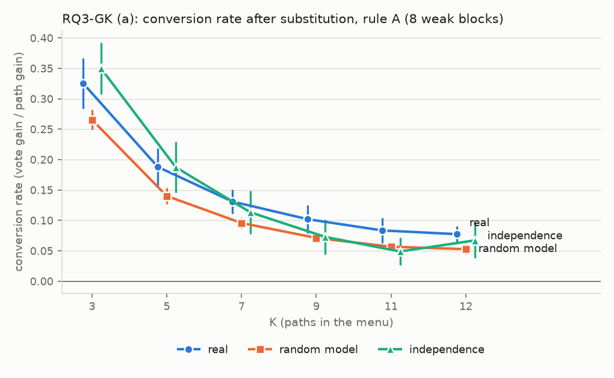
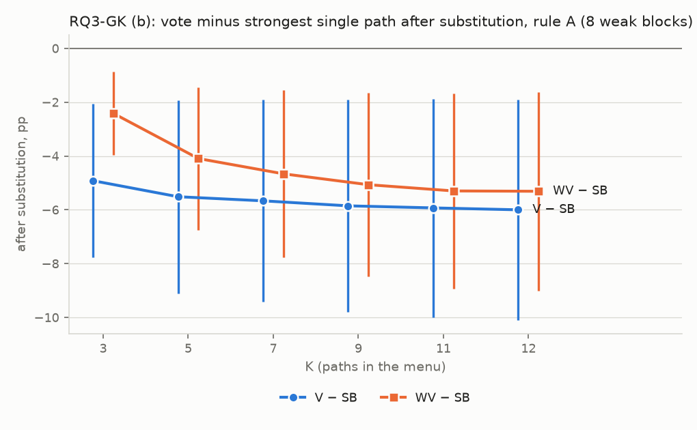
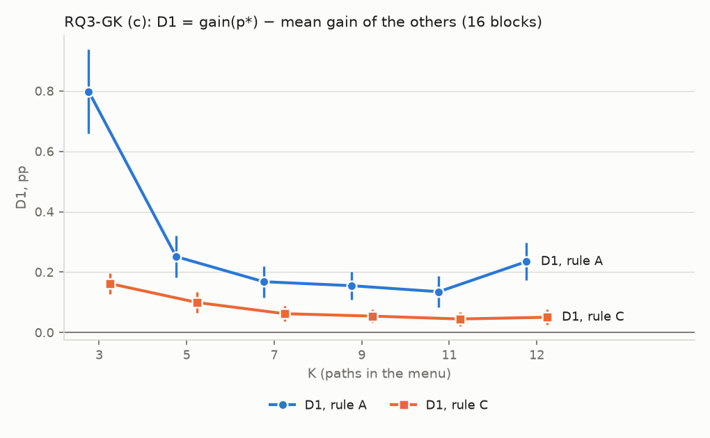

# RQ3-GK：不同的 K 下，改進一條 path 聚合會多多少？

判定標準 `result/analysis/rq3gk/rq3gk_criteria.md`，sha256 `0dfa454aeabe1d26bad6ecc0a938bfdfc6b0ce453e571153e816ba3f9fcefa7b`；確認：2026-10-06 23:05 CST，使用者確認（含門檻 0.5pp 與草稿中的補充規則）。產生時間 2026-10-06 23:31 CST；程式 `scripts/analysis_rq3gk/path_improve_k.py`（逐切分計算在 `Analysis/pathImproveK.py`，沿用 `Analysis/pathImprove.py`）。不呼叫 API，不重跑任何東西，不修改現有檔案。

## (1) 讀了哪些檔案

- `result/arms/{模型}/{資料集}/`：4 個模型 × 4 個資料集，經 `Analysis.menuVote.loadPathBlock` 載入（與 RQ3-G 相同）。欄位 `item_id`、`gold`、`parsed_answer`、`parse_ok`。`CellData` 對 `result/aggregations/` 只列出檔名，不讀內容。
- `result/analysis/rq3g/rq3g_cells.csv`：§10.1–§10.2 的核對（M12、M3L、M3S、M3P 的 `ALL` 列：`D1_pp`、`D2_pp`、`conversion_real`、`conversion_sim`）。
- `result/analysis/rq3g/rq3g_criteria.md`：沿用的定義（只引用）與四種狀態的原文。
- 載入時的核對（同 RQ3-G，不符就停）：題目 id 與 gold、`compareTwoAnswer` = 字串相等、整數編碼的對錯、整數投票 = `vote`。全部通過。

## (2) 開跑前的檢查

1–2. 重現 RQ3-G（規則 A）：逐區塊和 `rq3g_cells.csv` 的最大差 4.4e-16（門檻 1e-9）→ 通過。

| 菜單   | D1                         | D2                       | 轉換率（真實 / 隨機模型）   |
|:-----|:---------------------------|:-------------------------|:-----------------|
| M12  | +0.23（+0.17 到 +0.30），16/16 | +0.23（+0.13 到 +0.33），8/8 | 0.077 / 0.053    |
| M3L  | +0.82                      | +0.55                    | —                |
| M3S  | +0.59                      | +0.64                    | —                |
| M3P  | +0.51                      | +0.54                    | —                |

3. 規則 C：所有區塊 × 所有菜單（136 份），子集一中沒有平手的題目上規則 C 的得分 ≠ 規則 A 的題數：0 → 通過。蒙地卡羅（Qwen3-8B · truthfulqa、M3S、path S1、提高 5 個百分點、`default_rng(0)` 抽 2,000 次）：期望值 76.2223%、抽樣平均 76.2227%、標準誤 0.0005pp、差 0.0004pp（0.76 個標準誤） → 通過。
4. 菜單：K = 3、5、7、9 各 30 組（抽的次數 33、31、30、32），K = 11 有 12 組，K = 12 有 1 組；同一個 K 內沒有重複，與判定標準檔 §3 的表逐組相同 → 通過。完整清單見判定標準檔 §3。

## (3) 判定一：K = 3 時，替換後投票還輸給最強單一嗎（8 個弱模型區塊，規則 A，子集二）

| 量                           | 平均    | SE   | 95% 區間         | 為正的區塊   | 狀態   |
|:----------------------------|:------|:-----|:---------------|:--------|:-----|
| 判定一：E1 = 替換後 V − 替換後 SB（pp） | -4.92 | 1.20 | [-7.77, -2.07] | 0/8     | 反向成立 |

門檻 0.5pp。**反向成立** → （投票較低）K 小到 3，等權投票仍用不到明顯領先的 path；12 條時吃不到，不只是因為 K 太大。

| 宿主          | 資料集           |    E1 |   納入的菜單 |   沒有可用替換的菜單 |
|:------------|:--------------|------:|--------:|------------:|
| GPT-4o mini | mmlu          | -6.31 |      30 |           0 |
| Qwen3-8B    | mmlu          | -7.58 |      30 |           0 |
| GPT-4o mini | mathqa        | -3.10 |      30 |           0 |
| Qwen3-8B    | mathqa        | -3.66 |      30 |           0 |
| GPT-4o mini | truthfulqa    | -9.92 |      30 |           0 |
| Qwen3-8B    | truthfulqa    | -7.43 |      30 |           0 |
| GPT-4o mini | commonsenseqa | -0.54 |      30 |           0 |
| Qwen3-8B    | commonsenseqa | -0.81 |      30 |           0 |

K = 3 的替換：1440 個，參與判定 1425 個。

## (4) 判定二：K = 3 時挑得出比較值得改的 path 嗎（16 個區塊，規則 C，子集一）

| 量               | 平均    | SE   | 95% 區間         | 為正的區塊   | 狀態   |
|:----------------|:------|:-----|:---------------|:--------|:-----|
| 判定二：D1（規則 C，pp） | +0.16 | 0.02 | [+0.13, +0.20] | 16/16   | 兩者相當 |

門檻 0.5pp。**兩者相當** → 連 K = 3 都挑不出實質的差別。

| 模型                    | 資料集           |   D1（規則 C） |   （對照）D1（規則 A） |
|:----------------------|:--------------|-----------:|---------------:|
| GPT-4o mini           | mmlu          |       0.18 |           0.82 |
| Qwen3-8B              | mmlu          |       0.20 |           0.92 |
| DeepSeek V4.1 Flash   | mmlu          |       0.11 |           0.54 |
| Gemini 3.1 Flash-Lite | mmlu          |       0.11 |           0.43 |
| GPT-4o mini           | mathqa        |       0.11 |           1.16 |
| Qwen3-8B              | mathqa        |       0.19 |           1.11 |
| DeepSeek V4.1 Flash   | mathqa        |       0.05 |           0.32 |
| Gemini 3.1 Flash-Lite | mathqa        |       0.03 |           0.58 |
| GPT-4o mini           | truthfulqa    |       0.16 |           1.12 |
| Qwen3-8B              | truthfulqa    |       0.20 |           1.10 |
| DeepSeek V4.1 Flash   | truthfulqa    |       0.17 |           0.93 |
| Gemini 3.1 Flash-Lite | truthfulqa    |       0.26 |           0.65 |
| GPT-4o mini           | commonsenseqa |       0.19 |           0.76 |
| Qwen3-8B              | commonsenseqa |       0.26 |           1.00 |
| DeepSeek V4.1 Flash   | commonsenseqa |       0.16 |           0.67 |
| Gemini 3.1 Flash-Lite | commonsenseqa |       0.21 |           0.67 |

## (5) 只報告的量（不參與判定）

### 9.1 每個 K 的曲線

16 個區塊（子集一，沒有替換；π 為 %，其餘 pp；V、SB 為 %）：

| 量             | K   | 平均    | 95% 區間         | 為正的區塊   |
|:--------------|:----|:------|:---------------|:--------|
| π 的平均（%，規則 A） | 3   | 24.74 | [21.93, 27.55] | —       |
| π 的平均（%，規則 A） | 5   | 13.18 | [11.52, 14.84] | —       |
| π 的平均（%，規則 A） | 7   | 9.24  | [8.01, 10.46]  | —       |
| π 的平均（%，規則 A） | 9   | 6.92  | [5.94, 7.90]   | —       |
| π 的平均（%，規則 A） | 11  | 5.60  | [4.79, 6.41]   | —       |
| π 的平均（%，規則 A） | 12  | 5.26  | [4.34, 6.19]   | —       |
| π 的平均（%，規則 C） | 3   | 24.56 | [21.79, 27.32] | —       |
| π 的平均（%，規則 C） | 5   | 13.12 | [11.46, 14.78] | —       |
| π 的平均（%，規則 C） | 7   | 9.22  | [7.99, 10.45]  | —       |
| π 的平均（%，規則 C） | 9   | 6.95  | [5.97, 7.92]   | —       |
| π 的平均（%，規則 C） | 11  | 5.67  | [4.87, 6.47]   | —       |
| π 的平均（%，規則 C） | 12  | 5.29  | [4.56, 6.02]   | —       |

| 量              | K   | 平均    | 95% 區間         | 為正的區塊   |
|:---------------|:----|:------|:---------------|:--------|
| gain 的平均（規則 A） | 3   | +1.23 | [+1.09, +1.37] | 16/16   |
| gain 的平均（規則 A） | 5   | +0.66 | [+0.57, +0.74] | 16/16   |
| gain 的平均（規則 A） | 7   | +0.46 | [+0.40, +0.52] | 16/16   |
| gain 的平均（規則 A） | 9   | +0.34 | [+0.30, +0.39] | 16/16   |
| gain 的平均（規則 A） | 11  | +0.28 | [+0.24, +0.32] | 16/16   |
| gain 的平均（規則 A） | 12  | +0.26 | [+0.22, +0.31] | 16/16   |
| gain 的平均（規則 C） | 3   | +1.22 | [+1.09, +1.36] | 16/16   |
| gain 的平均（規則 C） | 5   | +0.65 | [+0.57, +0.74] | 16/16   |
| gain 的平均（規則 C） | 7   | +0.46 | [+0.40, +0.52] | 16/16   |
| gain 的平均（規則 C） | 9   | +0.35 | [+0.30, +0.39] | 16/16   |
| gain 的平均（規則 C） | 11  | +0.28 | [+0.24, +0.32] | 16/16   |
| gain 的平均（規則 C） | 12  | +0.26 | [+0.23, +0.30] | 16/16   |
| D1（規則 A）       | 3   | +0.80 | [+0.66, +0.94] | 16/16   |
| D1（規則 A）       | 5   | +0.25 | [+0.18, +0.32] | 16/16   |
| D1（規則 A）       | 7   | +0.17 | [+0.12, +0.22] | 16/16   |
| D1（規則 A）       | 9   | +0.16 | [+0.11, +0.20] | 16/16   |
| D1（規則 A）       | 11  | +0.14 | [+0.08, +0.19] | 16/16   |
| D1（規則 A）       | 12  | +0.23 | [+0.17, +0.30] | 16/16   |
| D1（規則 C）       | 3   | +0.16 | [+0.13, +0.20] | 16/16   |
| D1（規則 C）       | 5   | +0.10 | [+0.07, +0.13] | 15/16   |
| D1（規則 C）       | 7   | +0.06 | [+0.04, +0.09] | 15/16   |
| D1（規則 C）       | 9   | +0.05 | [+0.03, +0.08] | 15/16   |
| D1（規則 C）       | 11  | +0.04 | [+0.02, +0.07] | 14/16   |
| D1（規則 C）       | 12  | +0.05 | [+0.03, +0.08] | 14/16   |
| V − SB（規則 A）   | 3   | +0.22 | [-0.11, +0.55] | 10/16   |
| V − SB（規則 A）   | 5   | +0.51 | [+0.05, +0.98] | 14/16   |
| V − SB（規則 A）   | 7   | +0.37 | [-0.36, +1.10] | 13/16   |
| V − SB（規則 A）   | 9   | +0.45 | [-0.34, +1.23] | 13/16   |
| V − SB（規則 A）   | 11  | +0.37 | [-0.52, +1.27] | 13/16   |
| V − SB（規則 A）   | 12  | +0.30 | [-0.63, +1.23] | 12/16   |
| V − SB（規則 C）   | 3   | +0.19 | [-0.15, +0.53] | 10/16   |
| V − SB（規則 C）   | 5   | +0.54 | [+0.09, +1.00] | 14/16   |
| V − SB（規則 C）   | 7   | +0.40 | [-0.32, +1.12] | 13/16   |
| V − SB（規則 C）   | 9   | +0.48 | [-0.29, +1.26] | 13/16   |
| V − SB（規則 C）   | 11  | +0.41 | [-0.48, +1.30] | 13/16   |
| V − SB（規則 C）   | 12  | +0.35 | [-0.59, +1.30] | 13/16   |

| 量       | K   | 平均    | 95% 區間         | 為正的區塊   |
|:--------|:----|:------|:---------------|:--------|
| V（規則 A） | 3   | 83.66 | [80.11, 87.20] | —       |
| V（規則 A） | 5   | 84.20 | [80.76, 87.64] | —       |
| V（規則 A） | 7   | 84.53 | [81.16, 87.90] | —       |
| V（規則 A） | 9   | 84.63 | [81.26, 88.01] | —       |
| V（規則 A） | 11  | 84.68 | [81.32, 88.05] | —       |
| V（規則 A） | 12  | 84.67 | [81.32, 88.03] | —       |
| V（規則 C） | 3   | 83.63 | [80.06, 87.19] | —       |
| V（規則 C） | 5   | 84.23 | [80.80, 87.67] | —       |
| V（規則 C） | 7   | 84.56 | [81.19, 87.92] | —       |
| V（規則 C） | 9   | 84.67 | [81.31, 88.03] | —       |
| V（規則 C） | 11  | 84.72 | [81.37, 88.07] | —       |
| V（規則 C） | 12  | 84.73 | [81.36, 88.09] | —       |
| SB      | 3   | 83.44 | [79.93, 86.95] | —       |
| SB      | 5   | 83.69 | [80.24, 87.14] | —       |
| SB      | 7   | 84.16 | [80.75, 87.56] | —       |
| SB      | 9   | 84.19 | [80.78, 87.59] | —       |
| SB      | 11  | 84.31 | [80.90, 87.73] | —       |
| SB      | 12  | 84.37 | [80.95, 87.79] | —       |

8 個弱模型區塊（子集二，替換；pp 或比值）：

| 量                 | K   | 平均     | 95% 區間          | 為正的區塊   |
|:------------------|:----|:-------|:----------------|:--------|
| 那條 path 增加的正確率    | 3   | +10.34 | [+6.64, +14.05] | 8/8     |
| 那條 path 增加的正確率    | 5   | +10.36 | [+6.59, +14.14] | 8/8     |
| 那條 path 增加的正確率    | 7   | +10.38 | [+6.66, +14.10] | 8/8     |
| 那條 path 增加的正確率    | 9   | +10.36 | [+6.62, +14.11] | 8/8     |
| 那條 path 增加的正確率    | 11  | +10.39 | [+6.65, +14.13] | 8/8     |
| 那條 path 增加的正確率    | 12  | +10.39 | [+6.65, +14.13] | 8/8     |
| V 增加的正確率（規則 A）    | 3   | +3.21  | [+2.23, +4.19]  | 8/8     |
| V 增加的正確率（規則 A）    | 5   | +1.84  | [+1.27, +2.41]  | 8/8     |
| V 增加的正確率（規則 A）    | 7   | +1.29  | [+0.90, +1.69]  | 8/8     |
| V 增加的正確率（規則 A）    | 9   | +0.98  | [+0.69, +1.27]  | 8/8     |
| V 增加的正確率（規則 A）    | 11  | +0.80  | [+0.57, +1.02]  | 8/8     |
| V 增加的正確率（規則 A）    | 12  | +0.78  | [+0.49, +1.07]  | 8/8     |
| V 增加的正確率（規則 C）    | 3   | +3.21  | [+2.22, +4.19]  | 8/8     |
| V 增加的正確率（規則 C）    | 5   | +1.83  | [+1.27, +2.40]  | 8/8     |
| V 增加的正確率（規則 C）    | 7   | +1.29  | [+0.90, +1.67]  | 8/8     |
| V 增加的正確率（規則 C）    | 9   | +0.98  | [+0.69, +1.26]  | 8/8     |
| V 增加的正確率（規則 C）    | 11  | +0.81  | [+0.57, +1.05]  | 8/8     |
| V 增加的正確率（規則 C）    | 12  | +0.79  | [+0.54, +1.04]  | 8/8     |
| D2（規則 A）          | 3   | +0.47  | [+0.39, +0.56]  | 8/8     |
| D2（規則 A）          | 5   | +0.39  | [+0.29, +0.49]  | 8/8     |
| D2（規則 A）          | 7   | +0.30  | [+0.24, +0.36]  | 8/8     |
| D2（規則 A）          | 9   | +0.25  | [+0.17, +0.32]  | 8/8     |
| D2（規則 A）          | 11  | +0.22  | [+0.14, +0.29]  | 8/8     |
| D2（規則 A）          | 12  | +0.23  | [+0.13, +0.33]  | 8/8     |
| D2（規則 C）          | 3   | +0.48  | [+0.40, +0.55]  | 8/8     |
| D2（規則 C）          | 5   | +0.40  | [+0.30, +0.49]  | 8/8     |
| D2（規則 C）          | 7   | +0.30  | [+0.23, +0.36]  | 8/8     |
| D2（規則 C）          | 9   | +0.24  | [+0.17, +0.32]  | 8/8     |
| D2（規則 C）          | 11  | +0.21  | [+0.14, +0.29]  | 8/8     |
| D2（規則 C）          | 12  | +0.23  | [+0.12, +0.33]  | 8/8     |
| 替換後 V − SB（規則 A）  | 3   | -4.92  | [-7.77, -2.07]  | 0/8     |
| 替換後 V − SB（規則 A）  | 5   | -5.51  | [-9.10, -1.92]  | 0/8     |
| 替換後 V − SB（規則 A）  | 7   | -5.67  | [-9.42, -1.91]  | 0/8     |
| 替換後 V − SB（規則 A）  | 9   | -5.85  | [-9.79, -1.91]  | 0/8     |
| 替換後 V − SB（規則 A）  | 11  | -5.93  | [-9.99, -1.87]  | 1/8     |
| 替換後 V − SB（規則 A）  | 12  | -6.00  | [-10.09, -1.91] | 1/8     |
| 替換後 V − SB（規則 C）  | 3   | -4.97  | [-7.80, -2.14]  | 0/8     |
| 替換後 V − SB（規則 C）  | 5   | -5.48  | [-9.06, -1.91]  | 0/8     |
| 替換後 V − SB（規則 C）  | 7   | -5.63  | [-9.37, -1.89]  | 0/8     |
| 替換後 V − SB（規則 C）  | 9   | -5.80  | [-9.72, -1.89]  | 0/8     |
| 替換後 V − SB（規則 C）  | 11  | -5.86  | [-9.91, -1.82]  | 1/8     |
| 替換後 V − SB（規則 C）  | 12  | -5.91  | [-9.97, -1.85]  | 1/8     |
| 替換後 WV − SB（規則 A） | 3   | -2.42  | [-3.95, -0.88]  | 1/8     |
| 替換後 WV − SB（規則 A） | 5   | -4.09  | [-6.75, -1.44]  | 2/8     |
| 替換後 WV − SB（規則 A） | 7   | -4.66  | [-7.77, -1.56]  | 2/8     |
| 替換後 WV − SB（規則 A） | 9   | -5.07  | [-8.48, -1.65]  | 2/8     |
| 替換後 WV − SB（規則 A） | 11  | -5.30  | [-8.93, -1.67]  | 2/8     |
| 替換後 WV − SB（規則 A） | 12  | -5.31  | [-9.00, -1.62]  | 2/8     |
| 替換後 WV − SB（規則 C） | 3   | -2.42  | [-3.95, -0.88]  | 1/8     |
| 替換後 WV − SB（規則 C） | 5   | -4.09  | [-6.75, -1.44]  | 2/8     |
| 替換後 WV − SB（規則 C） | 7   | -4.66  | [-7.77, -1.56]  | 2/8     |
| 替換後 WV − SB（規則 C） | 9   | -5.07  | [-8.48, -1.65]  | 2/8     |
| 替換後 WV − SB（規則 C） | 11  | -5.30  | [-8.93, -1.67]  | 2/8     |
| 替換後 WV − SB（規則 C） | 12  | -5.31  | [-9.00, -1.62]  | 2/8     |

| 量              | K   | 平均    | 95% 區間         | 為正的區塊   |
|:---------------|:----|:------|:---------------|:--------|
| 轉換率，真實（規則 A）   | 3   | 0.326 | [0.284, 0.367] | 8/8     |
| 轉換率，真實（規則 A）   | 5   | 0.188 | [0.157, 0.219] | 8/8     |
| 轉換率，真實（規則 A）   | 7   | 0.131 | [0.112, 0.150] | 8/8     |
| 轉換率，真實（規則 A）   | 9   | 0.102 | [0.079, 0.125] | 8/8     |
| 轉換率，真實（規則 A）   | 11  | 0.084 | [0.063, 0.104] | 8/8     |
| 轉換率，真實（規則 A）   | 12  | 0.077 | [0.065, 0.090] | 8/8     |
| 轉換率，真實（規則 C）   | 3   | 0.324 | [0.285, 0.364] | 8/8     |
| 轉換率，真實（規則 C）   | 5   | 0.187 | [0.157, 0.218] | 8/8     |
| 轉換率，真實（規則 C）   | 7   | 0.131 | [0.111, 0.152] | 8/8     |
| 轉換率，真實（規則 C）   | 9   | 0.101 | [0.079, 0.123] | 8/8     |
| 轉換率，真實（規則 C）   | 11  | 0.084 | [0.065, 0.103] | 8/8     |
| 轉換率，真實（規則 C）   | 12  | 0.083 | [0.057, 0.110] | 8/8     |
| 轉換率，隨機模型（規則 A） | 3   | 0.265 | [0.249, 0.282] | 8/8     |
| 轉換率，隨機模型（規則 A） | 5   | 0.140 | [0.127, 0.153] | 8/8     |
| 轉換率，隨機模型（規則 A） | 7   | 0.096 | [0.087, 0.105] | 8/8     |
| 轉換率，隨機模型（規則 A） | 9   | 0.071 | [0.063, 0.079] | 8/8     |
| 轉換率，隨機模型（規則 A） | 11  | 0.057 | [0.050, 0.064] | 8/8     |
| 轉換率，隨機模型（規則 A） | 12  | 0.053 | [0.044, 0.062] | 8/8     |
| 轉換率，隨機模型（規則 C） | 3   | 0.265 | [0.249, 0.281] | 8/8     |
| 轉換率，隨機模型（規則 C） | 5   | 0.139 | [0.126, 0.152] | 8/8     |
| 轉換率，隨機模型（規則 C） | 7   | 0.096 | [0.087, 0.104] | 8/8     |
| 轉換率，隨機模型（規則 C） | 9   | 0.071 | [0.064, 0.079] | 8/8     |
| 轉換率，隨機模型（規則 C） | 11  | 0.058 | [0.051, 0.064] | 8/8     |
| 轉換率，隨機模型（規則 C） | 12  | 0.055 | [0.049, 0.061] | 8/8     |

### 9.2 獨立假設下的對照（8 個弱模型區塊，子集二，評分半；%）

| 量              | K   | 平均    | 95% 區間         | 為正的區塊   |
|:---------------|:----|:------|:---------------|:--------|
| 獨立假設，替換前       | 3   | 86.31 | [82.52, 90.09] | —       |
| 獨立假設，替換前       | 5   | 91.14 | [87.88, 94.41] | —       |
| 獨立假設，替換前       | 7   | 94.07 | [91.46, 96.68] | —       |
| 獨立假設，替換前       | 9   | 95.89 | [93.81, 97.97] | —       |
| 獨立假設，替換前       | 11  | 97.08 | [95.44, 98.72] | —       |
| 獨立假設，替換前       | 12  | 95.40 | [92.89, 97.91] | —       |
| 獨立假設，替換後       | 3   | 89.96 | [86.50, 93.42] | —       |
| 獨立假設，替換後       | 5   | 93.13 | [90.31, 95.95] | —       |
| 獨立假設，替換後       | 7   | 95.27 | [93.02, 97.52] | —       |
| 獨立假設，替換後       | 9   | 96.67 | [94.90, 98.45] | —       |
| 獨立假設，替換後       | 11  | 97.61 | [96.21, 99.00] | —       |
| 獨立假設，替換後       | 12  | 96.12 | [93.93, 98.31] | —       |
| 實際 V，替換前（規則 A） | 3   | 79.45 | [75.63, 83.28] | —       |
| 實際 V，替換前（規則 A） | 5   | 80.22 | [76.25, 84.19] | —       |
| 實際 V，替換前（規則 A） | 7   | 80.66 | [76.69, 84.62] | —       |
| 實際 V，替換前（規則 A） | 9   | 80.78 | [76.73, 84.83] | —       |
| 實際 V，替換前（規則 A） | 11  | 80.86 | [76.78, 84.95] | —       |
| 實際 V，替換前（規則 A） | 12  | 80.81 | [76.78, 84.84] | —       |
| 實際 V，替換前（規則 C） | 3   | 79.40 | [75.55, 83.26] | —       |
| 實際 V，替換前（規則 C） | 5   | 80.26 | [76.29, 84.23] | —       |
| 實際 V，替換前（規則 C） | 7   | 80.70 | [76.74, 84.66] | —       |
| 實際 V，替換前（規則 C） | 9   | 80.83 | [76.79, 84.88] | —       |
| 實際 V，替換前（規則 C） | 11  | 80.92 | [76.84, 85.00] | —       |
| 實際 V，替換前（規則 C） | 12  | 80.89 | [76.78, 85.01] | —       |
| 實際 V，替換後（規則 A） | 3   | 82.66 | [78.98, 86.35] | —       |
| 實際 V，替換後（規則 A） | 5   | 82.06 | [78.20, 85.91] | —       |
| 實際 V，替換後（規則 A） | 7   | 81.95 | [78.07, 85.82] | —       |
| 實際 V，替換後（規則 A） | 9   | 81.76 | [77.76, 85.75] | —       |
| 實際 V，替換後（規則 A） | 11  | 81.66 | [77.62, 85.70] | —       |
| 實際 V，替換後（規則 A） | 12  | 81.59 | [77.62, 85.56] | —       |
| 實際 V，替換後（規則 C） | 3   | 82.61 | [78.89, 86.33] | —       |
| 實際 V，替換後（規則 C） | 5   | 82.09 | [78.24, 85.94] | —       |
| 實際 V，替換後（規則 C） | 7   | 81.99 | [78.12, 85.86] | —       |
| 實際 V，替換後（規則 C） | 9   | 81.81 | [77.82, 85.79] | —       |
| 實際 V，替換後（規則 C） | 11  | 81.73 | [77.70, 85.76] | —       |
| 實際 V，替換後（規則 C） | 12  | 81.68 | [77.66, 85.71] | —       |

| 量        | K   | 平均    | 95% 區間         | 為正的區塊   |
|:---------|:----|:------|:---------------|:--------|
| 轉換率，獨立假設 | 3   | 0.350 | [0.308, 0.392] | 8/8     |
| 轉換率，獨立假設 | 5   | 0.187 | [0.145, 0.230] | 8/8     |
| 轉換率，獨立假設 | 7   | 0.113 | [0.078, 0.149] | 8/8     |
| 轉換率，獨立假設 | 9   | 0.073 | [0.044, 0.101] | 8/8     |
| 轉換率，獨立假設 | 11  | 0.049 | [0.027, 0.071] | 8/8     |
| 轉換率，獨立假設 | 12  | 0.067 | [0.038, 0.096] | 8/8     |

### 9.3 最高票平手的題目比例（16 個區塊，子集一，評分半，%）

| 量    | K   | 平均   | 95% 區間       | 為正的區塊   |
|:-----|:----|:-----|:-------------|:--------|
| 平手比例 | 3   | 1.95 | [1.29, 2.60] | —       |
| 平手比例 | 5   | 1.89 | [1.30, 2.47] | —       |
| 平手比例 | 7   | 1.20 | [0.83, 1.58] | —       |
| 平手比例 | 9   | 1.02 | [0.70, 1.34] | —       |
| 平手比例 | 11  | 0.94 | [0.66, 1.23] | —       |
| 平手比例 | 12  | 1.45 | [1.10, 1.81] | —       |

### 9.4 平手規則的核對（事後分析，16 個區塊的平均）

| 菜單   | 規則   | 量        | EN   | ES   | JA   | P1   | P2   | R    | RU   | S1   | S2   | W1   | W2   | ZH   |
|:-----|:-----|:---------|:-----|:-----|:-----|:-----|:-----|:-----|:-----|:-----|:-----|:-----|:-----|:-----|
| M12  | A    | π（%）     | 10.2 | 4.5  | 3.7  | 5.7  | 4.8  | 5.4  | 4.2  | 6.1  | 5.6  | 4.3  | 4.6  | 4.3  |
| M12  | A    | p* 比例（%） | 87.6 | 0.0  | 0.4  | 3.7  | 0.9  | 1.1  | 0.2  | 4.8  | 0.3  | 0.3  | 0.2  | 0.4  |
| M12  | B    | π（%）     | 5.7  | 4.8  | 3.5  | 5.6  | 5.0  | 5.4  | 4.2  | 5.3  | 5.1  | 4.5  | 4.8  | 7.5  |
| M12  | B    | p* 比例（%） | 11.8 | 1.9  | 0.0  | 5.9  | 9.5  | 8.2  | 0.8  | 5.1  | 4.5  | 1.3  | 2.8  | 48.3 |
| M12  | C    | π（%）     | 6.1  | 5.0  | 3.9  | 6.2  | 5.6  | 5.8  | 4.7  | 6.2  | 5.8  | 4.9  | 5.0  | 4.5  |
| M12  | C    | p* 比例（%） | 17.3 | 2.3  | 0.2  | 22.9 | 14.3 | 12.8 | 1.5  | 17.8 | 4.6  | 2.7  | 2.2  | 1.6  |
| M3S  | A    | π（%）     | 26.3 |      |      |      |      |      |      | 14.5 | 14.0 |      |      |      |
| M3S  | A    | p* 比例（%） | 98.8 |      |      |      |      |      |      | 0.7  | 0.4  |      |      |      |
| M3S  | B    | π（%）     | 14.6 |      |      |      |      |      |      | 14.2 | 24.1 |      |      |      |
| M3S  | B    | p* 比例（%） | 1.3  |      |      |      |      |      |      | 0.9  | 97.8 |      |      |      |
| M3S  | C    | π（%）     | 18.6 |      |      |      |      |      |      | 18.0 | 17.4 |      |      |      |
| M3S  | C    | p* 比例（%） | 46.2 |      |      |      |      |      |      | 36.1 | 17.7 |      |      |      |

EN 的 π ÷ (S1 的 π + S2 的 π) / 2（16 個區塊平均後相除）：

| 菜單   | 規則 A   | 規則 B   | 規則 C   |
|:-----|:-------|:-------|:-------|
| M12  | 1.75   | 1.09   | 1.02   |
| M3S  | 1.84   | 0.76   | 1.05   |

事先寫下的讀法（看規則 C）：兩份菜單的比值都在 0.8 到 1.25 之間 → EN 的高影響力來自平手規則。

每個 K：菜單內平手順序第一的 path 的 π ÷ 其餘 path 的 π 的平均（分子、分母各自對 16 個區塊與菜單平均後相除）：

| K   | 規則 A   | 規則 C   |
|:----|:-------|:-------|
| 3   | 1.83   | 1.05   |
| 5   | 1.43   | 1.02   |
| 7   | 1.43   | 1.06   |
| 9   | 1.58   | 1.13   |
| 11  | 1.64   | 1.15   |
| 12  | 2.12   | 1.17   |

### 9.5 和簡單做法比（規則 C，子集一，pp）

| K   | 量           | 平均    | SE   | 95% 區間         | 為正的區塊   |
|:----|:------------|:------|:-----|:---------------|:--------|
| 3   | D1：判定二的 p*  | +0.16 | 0.02 | [+0.13, +0.20] | 16/16   |
| 3   | D1：選擇半正確率最高 | +0.05 | 0.02 | [+0.01, +0.10] | 12/16   |
| 3   | D1：選擇半正確率最低 | -0.16 | 0.03 | [-0.23, -0.09] | 1/16    |
| 3   | D1：平手順序第一   | +0.06 | 0.01 | [+0.04, +0.08] | 15/16   |
| 12  | D1：判定二的 p*  | +0.05 | 0.01 | [+0.03, +0.08] | 14/16   |
| 12  | D1：選擇半正確率最高 | +0.00 | 0.02 | [-0.03, +0.04] | 11/16   |
| 12  | D1：選擇半正確率最低 | -0.05 | 0.01 | [-0.08, -0.02] | 2/16    |
| 12  | D1：平手順序第一   | +0.04 | 0.01 | [+0.02, +0.07] | 13/16   |

| K   | p* = 正確率最高（%）   | p* = 正確率最低（%）   | p* = 平手順序第一（%）   | 選擇半出現相同 gain（%）   |
|:----|:----------------|:----------------|:-----------------|:------------------|
| 3   | 32.9            | 20.9            | 41.3             | 0.3               |
| 12  | 7.2             | 2.2             | 17.3             | 1.2               |

### 9.6 預測增加量（選擇半）與實際增加量（評分半）的 Spearman 相關（規則 A）

| K   | GPT-4o mini · mmlu   | Qwen3-8B · mmlu   | GPT-4o mini · mathqa   | Qwen3-8B · mathqa   | GPT-4o mini · truthfulqa   | Qwen3-8B · truthfulqa   | GPT-4o mini · commonsenseqa   | Qwen3-8B · commonsenseqa   | 平均    | 無定義的切分   |
|:----|:---------------------|:------------------|:-----------------------|:--------------------|:---------------------------|:------------------------|:------------------------------|:---------------------------|:------|:---------|
| 3   | 0.720                | 0.840             | 0.769                  | 0.764               | 0.725                      | 0.730                   | 0.418                         | 0.634                      | 0.700 | 0        |
| 5   | 0.402                | 0.628             | 0.560                  | 0.584               | 0.412                      | 0.500                   | 0.129                         | 0.261                      | 0.434 | 0        |
| 7   | 0.341                | 0.410             | 0.370                  | 0.530               | 0.256                      | 0.304                   | 0.092                         | 0.075                      | 0.297 | 0        |
| 9   | 0.360                | 0.354             | 0.306                  | 0.517               | 0.234                      | 0.305                   | 0.027                         | 0.092                      | 0.274 | 0        |
| 11  | 0.218                | 0.265             | 0.242                  | 0.524               | 0.186                      | 0.094                   | 0.010                         | 0.051                      | 0.199 | 0        |
| 12  | 0.515                | 0.274             | 0.247                  | 0.643               | 0.161                      | 0.223                   | 0.042                         | -0.157                     | 0.244 | 0        |

### 9.7 其他 K 的判定量

| 量              | K   | 平均    | 95% 區間          | 為正的區塊   |
|:---------------|:----|:------|:----------------|:--------|
| 判定一的量：E1（規則 A） | 3   | -4.92 | [-7.77, -2.07]  | 0/8     |
| 判定一的量：E1（規則 A） | 5   | -5.51 | [-9.10, -1.92]  | 0/8     |
| 判定一的量：E1（規則 A） | 7   | -5.67 | [-9.42, -1.91]  | 0/8     |
| 判定一的量：E1（規則 A） | 9   | -5.85 | [-9.79, -1.91]  | 0/8     |
| 判定一的量：E1（規則 A） | 11  | -5.93 | [-9.99, -1.87]  | 1/8     |
| 判定一的量：E1（規則 A） | 12  | -6.00 | [-10.09, -1.91] | 1/8     |

| 量                     | K   | 平均    | 95% 區間         | 為正的區塊   |
|:----------------------|:----|:------|:---------------|:--------|
| 判定二的量：D1（規則 C）        | 3   | +0.16 | [+0.13, +0.20] | 16/16   |
| 判定二的量：D1（規則 C）        | 5   | +0.10 | [+0.07, +0.13] | 15/16   |
| 判定二的量：D1（規則 C）        | 7   | +0.06 | [+0.04, +0.09] | 15/16   |
| 判定二的量：D1（規則 C）        | 9   | +0.05 | [+0.03, +0.08] | 15/16   |
| 判定二的量：D1（規則 C）        | 11  | +0.04 | [+0.02, +0.07] | 14/16   |
| 判定二的量：D1（規則 C）        | 12  | +0.05 | [+0.03, +0.08] | 14/16   |
| 判定二的量在規則 A 下：D1（規則 A） | 3   | +0.80 | [+0.66, +0.94] | 16/16   |
| 判定二的量在規則 A 下：D1（規則 A） | 5   | +0.25 | [+0.18, +0.32] | 16/16   |
| 判定二的量在規則 A 下：D1（規則 A） | 7   | +0.17 | [+0.12, +0.22] | 16/16   |
| 判定二的量在規則 A 下：D1（規則 A） | 9   | +0.16 | [+0.11, +0.20] | 16/16   |
| 判定二的量在規則 A 下：D1（規則 A） | 11  | +0.14 | [+0.08, +0.19] | 16/16   |
| 判定二的量在規則 A 下：D1（規則 A） | 12  | +0.23 | [+0.17, +0.30] | 16/16   |

### 9.8 領先幅度（8 個弱模型區塊，子集二，規則 A）

| K   | 領先幅度的區塊平均（pp）   | 95% 區間          | 領先幅度 > 0 的替換     | Spearman（領先 vs 替換後 V − SB）   | 無定義的切分   |
|:----|:----------------|:----------------|:-----------------|:-----------------------------|:---------|
| 3   | +8.61           | [+4.42, +12.79] | 1291/1425（90.6%） | -0.467                       | 0        |
| 5   | +7.63           | [+3.37, +11.88] | 2119/2371（89.4%） | -0.544                       | 0        |
| 7   | +7.06           | [+3.11, +11.01] | 2964/3328（89.1%） | -0.597                       | 0        |
| 9   | +6.88           | [+2.96, +10.79] | 3804/4275（89.0%） | -0.610                       | 0        |
| 11  | +6.70           | [+2.84, +10.55] | 1851/2090（88.6%） | -0.635                       | 0        |
| 12  | +6.62           | [+2.80, +10.44] | 168/190（88.4%）   | -0.639                       | 0        |

逐替換的值在 `rq3gk_substitutions.csv`（`lead_H1_pp`、`VmSB_after_A_pp`）；Spearman 每次切分對該 K 所有菜單中參與判定、且該次有效的替換算一次，對有定義的切分平均，再對 8 個區塊平均。

## (6) 對照讀法的結論

- 判定一（E1 -4.92pp，[-7.77, -2.07]，0/8 為正）：**反向成立**。（投票較低）K 小到 3，等權投票仍用不到明顯領先的 path；12 條時吃不到，不只是因為 K 太大。
- 判定二（D1，規則 C，+0.16pp，[+0.13, +0.20]，16/16 為正）：**兩者相當**。連 K = 3 都挑不出實質的差別。
- 第 9 節 4 的事先讀法（規則 C）：兩份菜單的比值都在 0.8 到 1.25 之間 → EN 的高影響力來自平手規則。
- 其餘都只報告，不套四種狀態。
