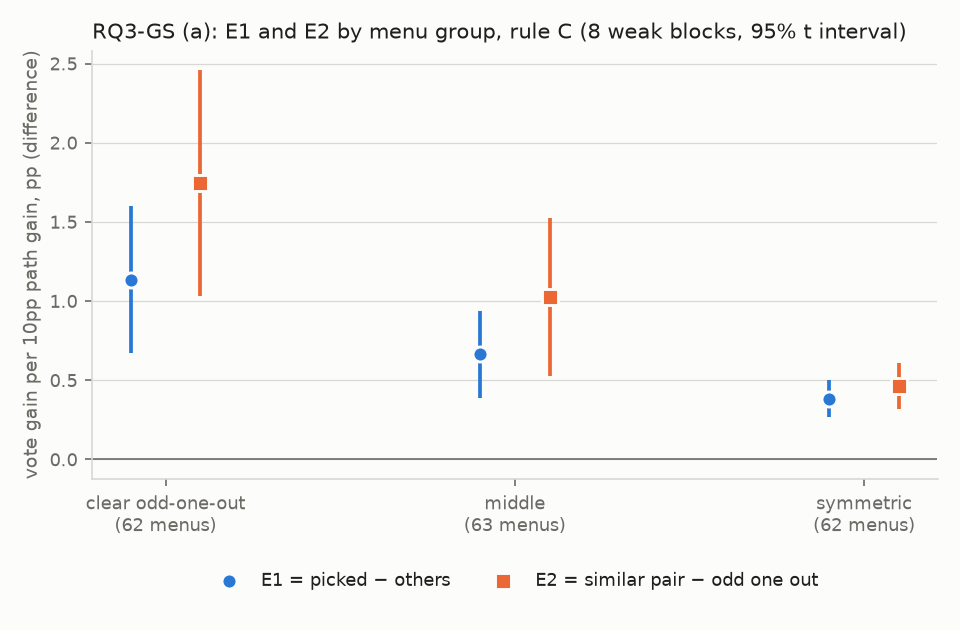
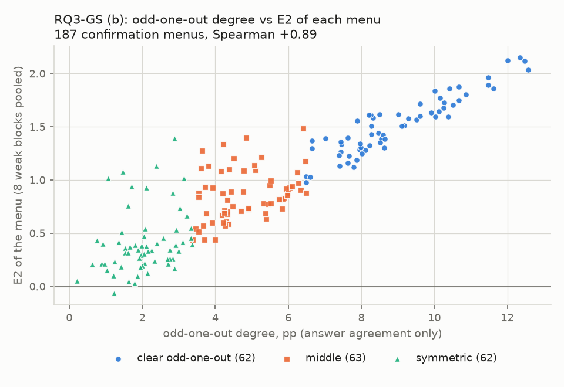

# RQ3-GS：在沒看過的三條組合上，確認挑法有沒有挑對

判定標準 `result/analysis/rq3gs/rq3gs_criteria.md`，sha256 `effe33f74f8a88e002ef50b0d6686d9840b714b8bf4d9233aac9f880bb93a701`；確認：2026-10-07 14:00 CST，使用者確認（含門檻 0.5 與草稿中的補充規則）。產生時間 2026-10-07 14:10 CST；程式 `scripts/analysis_rq3gs/path_improve_gs.py`（逐切分計算在 `Analysis/pathImproveGS.py`，沿用 `Analysis/pathImprove.py` 與 `Analysis/pathImproveK.py`）。不呼叫 API，不重跑任何東西，不修改現有檔案。

效果的單位：那條 path 每進步 10 個百分點，投票多幾個百分點（第 5 節）。E1、E2 是兩群效果的差，門檻 0.5 用同樣的單位。

## (1) 讀了哪些檔案

- `result/arms/{模型}/{資料集}/`：4 個模型 × 4 個資料集，經 `Analysis.menuVote.loadPathBlock` 載入（與 RQ3-G 相同）；欄位 `item_id`、`gold`、`parsed_answer`、`parse_ok`。`CellData` 對 `result/aggregations/` 只列出檔名。
- `result/analysis/rq3gk/rq3gk_k_blocks.csv`：§10.1 的核對（K = 3 的 `D1_C`、`E1_pp`）。
- `result/analysis/rq3gs/rq3gs_criteria.md` 第 4 節的表：§10.2 的核對。`rq3g_criteria.md`、`rq3gk_criteria.md`：只引用定義。
- §10.4 的手算另外用 `Analysis.menuVote.loadPathBlock` 的字串答案、純迴圈重算（不用 `pathImproveK` / `pathImproveGS`）。

## (2) 開跑前的檢查

1. 重現 RQ3-GK：K = 3 的 D1（規則 C）+0.16pp（+0.13 到 +0.20），16 / 16；K = 3 的判定一 -4.92pp（-7.77 到 -2.07），0 / 8。逐區塊和 `rq3gk_k_blocks.csv` 的最大差 4.4e-16（門檻 1e-9）→ 通過。
2. 確認用的菜單 187 份，和 K3-01 到 K3-30、M3L、M3S、M3P 沒有重複；重算的分組（相像的一對、落單的 path、落單程度、組別）與判定標準檔第 4 節的表逐份相同 → 通過。
3. 換成自己：4488 個替換（8 個區塊 × 187 份 × 3 條），分子、分母每次切分都是 0，而且都不是有效切分 → 通過。
4. 手算（GPT-4o mini · mmlu、GS-001：EN ES JA，兩個供體）：最大差 1.8e-14（門檻 1e-9）→ 通過。挑出的效果：程式 4.366854、手算 4.366854；其他的效果：程式 3.398194、手算 3.398194。

| 供體                    | path   | 程式 Σ分子        | 手算 Σ分子        | 程式 Σ分母        | 手算 Σ分母        |
|:----------------------|:-------|:--------------|:--------------|:--------------|:--------------|
| DeepSeek V4.1 Flash   | EN     | 6.7875453616  | 6.7875453616  | 18.1551744777 | 18.1551744777 |
| DeepSeek V4.1 Flash   | ES     | 9.5483238799  | 9.5483238799  | 22.1364018728 | 22.1364018728 |
| DeepSeek V4.1 Flash   | JA     | 7.7993333355  | 7.7993333355  | 23.9893767107 | 23.9893767107 |
| DeepSeek V4.1 Flash   | 被排除的切分 | 0             | 0             |               |               |
| Gemini 3.1 Flash-Lite | EN     | 7.5631071282  | 7.5631071282  | 20.2770410018 | 20.2770410018 |
| Gemini 3.1 Flash-Lite | ES     | 11.4077647891 | 11.4077647891 | 25.6632153053 | 25.6632153053 |
| Gemini 3.1 Flash-Lite | JA     | 8.5131993454  | 8.5131993454  | 28.1318737398 | 28.1318737398 |
| Gemini 3.1 Flash-Lite | 被排除的切分 | 0             | 0             |               |               |

## (3) 判定一：挑出來的那條，真的改進時比較有效嗎（8 個弱模型區塊，187 份，規則 C）

| 量                      | 平均    | SE   | 95% 區間         | 為正的區塊   | 狀態   |
|:-----------------------|:------|:-----|:---------------|:--------|:-----|
| 判定一：E1 = 挑出的效果 − 其他的效果 | +0.73 | 0.11 | [+0.47, +0.99] | 8/8     | 正向成立 |

門檻 0.5。**正向成立** → 在沒看過的組合上，挑法挑出的 path 真的改進時比其他條有效；K = 3 時挑法有效。

| 宿主          | 資料集           |   E1 |   挑出的效果 |   其他的效果 |   被排除的（菜單、供體、切分）% |
|:------------|:--------------|-----:|--------:|--------:|------------------:|
| GPT-4o mini | mmlu          | 0.54 |    3.01 |    2.47 |              0.00 |
| GPT-4o mini | mathqa        | 0.46 |    3.48 |    3.03 |              0.00 |
| GPT-4o mini | truthfulqa    | 0.50 |    3.36 |    2.86 |              0.00 |
| GPT-4o mini | commonsenseqa | 1.20 |    5.08 |    3.87 |             11.26 |
| Qwen3-8B    | mmlu          | 0.62 |    3.37 |    2.76 |              0.00 |
| Qwen3-8B    | mathqa        | 0.74 |    3.87 |    3.13 |              0.00 |
| Qwen3-8B    | truthfulqa    | 0.55 |    3.35 |    2.80 |              0.00 |
| Qwen3-8B    | commonsenseqa | 1.23 |    4.31 |    3.08 |              0.06 |

被排除的（菜單、供體、切分）比例：8 個區塊平均 1.4%。

## (4) 判定二：最不像的那一條，真的改進時最沒效嗎（8 個弱模型區塊，「明顯落單」組 62 份，規則 C）

限制（判定標準檔第 7 節）：「明顯落單」組的落單 path 全部是翻譯的語言 path（JA、RU、ZH、ES），這項判定分不開「和其他條不像」「是翻譯的」「正確率較低」三種原因。

| 量                           | 平均    | SE   | 95% 區間         | 為正的區塊   | 狀態   |
|:----------------------------|:------|:-----|:---------------|:--------|:-----|
| 判定二：E2 = 相像那一對的效果 − 落單那條的效果 | +1.75 | 0.30 | [+1.03, +2.46] | 8/8     | 正向成立 |

門檻 0.5。**正向成立** → 最不像的那條最不值得改，在沒看過的組合上成立。（依第 7 節的限制，論文只能寫「和兩條相像的 path 放在一起時，那條翻譯的 path 最不值得改」；要寫成「最不像的那條最不值得改」，還要看第 9 節 5 與 11。）

| 宿主          | 資料集           |   E2 |   相像那一對的效果 |   落單那條的效果 |
|:------------|:--------------|-----:|-----------:|----------:|
| GPT-4o mini | mmlu          | 1.12 |       3.03 |      1.91 |
| GPT-4o mini | mathqa        | 0.83 |       3.45 |      2.62 |
| GPT-4o mini | truthfulqa    | 0.92 |       3.31 |      2.38 |
| GPT-4o mini | commonsenseqa | 2.75 |       4.90 |      2.14 |
| Qwen3-8B    | mmlu          | 1.96 |       3.64 |      1.68 |
| Qwen3-8B    | mathqa        | 1.57 |       3.99 |      2.41 |
| Qwen3-8B    | truthfulqa    | 1.64 |       3.54 |      1.91 |
| Qwen3-8B    | commonsenseqa | 3.18 |       4.57 |      1.39 |

## (5) 只報告的量（不參與判定）

### 9.1 分組

| 量           | 平均    | SE   | 95% 區間         | 為正的區塊   |
|:------------|:------|:-----|:---------------|:--------|
| E1，明顯落單     | +1.13 | 0.20 | [+0.67, +1.60] | 8/8     |
| E1，中間       | +0.66 | 0.12 | [+0.39, +0.94] | 8/8     |
| E1，對稱       | +0.38 | 0.05 | [+0.27, +0.50] | 8/8     |
| E2，中間       | +1.03 | 0.21 | [+0.53, +1.53] | 8/8     |
| E2，對稱       | +0.47 | 0.06 | [+0.32, +0.61] | 8/8     |
| E2，全部 187 份 | +1.10 | 0.19 | [+0.65, +1.55] | 8/8     |

### 9.2 命中率（逐切分）

p\* 剛好是評分半真實效果最高（最低）那條的比例，%；亂挑是 33.3%。註：逐切分的真實效果雜訊較大，這個命中率不能和事後分析的 53% 直接比；可比的是第 4 項。

| 宿主          | 資料集           |   最高 |   最低 |
|:------------|:--------------|-----:|-----:|
| GPT-4o mini | mmlu          | 62.4 |  6.5 |
| GPT-4o mini | mathqa        | 53.6 | 12.0 |
| GPT-4o mini | truthfulqa    | 59.2 | 10.0 |
| GPT-4o mini | commonsenseqa | 45.6 | 16.1 |
| Qwen3-8B    | mmlu          | 50.6 |  4.5 |
| Qwen3-8B    | mathqa        | 58.6 |  4.8 |
| Qwen3-8B    | truthfulqa    | 49.8 | 10.3 |
| Qwen3-8B    | commonsenseqa | 45.7 |  9.7 |

8 個區塊的平均：最高 53.2%、最低 9.2%。

### 9.3 換一種挑法的 E1

| 量                    | 平均    | SE   | 95% 區間         | 為正的區塊   |
|:---------------------|:------|:-----|:---------------|:--------|
| 判定一的 p*（規則 C 的 gain） | +0.73 | 0.11 | [+0.47, +0.99] | 8/8     |
| 選擇半正確率最高             | +0.47 | 0.14 | [+0.15, +0.79] | 7/8     |
| 選擇半正確率最低             | -0.87 | 0.22 | [-1.39, -0.36] | 0/8     |
| 落單的 path             | -1.10 | 0.19 | [-1.55, -0.65] | 0/8     |
| 相像那一對中平手順序在前的        | +0.65 | 0.11 | [+0.39, +0.92] | 8/8     |

### 9.4 用其他 15 個區塊的 π 平均來挑

| 量             | 平均    | SE   | 95% 區間         | 為正的區塊   |
|:--------------|:------|:-----|:---------------|:--------|
| E1（其他區塊的 π 挑） | +0.66 | 0.13 | [+0.35, +0.97] | 8/8     |

命中率在（區塊、菜單）層級：真實效果最高 49.1%、最低 7.3%（8 個區塊的平均；每個區塊用 187 份菜單；亂挑 33.3%）。逐區塊：

| 宿主          | 資料集           |   最高 |   最低 |
|:------------|:--------------|-----:|-----:|
| GPT-4o mini | mmlu          | 57.8 |  1.6 |
| GPT-4o mini | mathqa        | 44.9 | 18.2 |
| GPT-4o mini | truthfulqa    | 59.4 |  4.8 |
| GPT-4o mini | commonsenseqa | 44.9 |  8.0 |
| Qwen3-8B    | mmlu          | 47.1 |  3.2 |
| Qwen3-8B    | mathqa        | 42.2 | 14.4 |
| Qwen3-8B    | truthfulqa    | 49.2 |  4.3 |
| Qwen3-8B    | commonsenseqa | 47.1 |  3.7 |

### 9.5 分開「不像」和「比較弱」（「明顯落單」組）

(a) 與 (b) 用的是同一個條件（落單的 path ≠ 選擇半正確率最低的那條），所以用到的（菜單、供體、切分）相同。有 2 個區塊完全沒有這種情況（落單的 path 每次都是正確率最低的），這些區塊的值無定義；下面的摘要只用有資料的區塊，而且有些區塊只有很少的情況，數字要看逐區塊的表。

| 量                                    | 平均    | SE   | 95% 區間         | 為正的區塊   |
|:-------------------------------------|:------|:-----|:---------------|:--------|
| (a) 落單的不是正確率最低那條時的 E2（6 個區塊）         | +1.42 | 0.49 | [+0.17, +2.67] | 6/6     |
| (b) 正確率最低的不是落單那條時：其他兩條 − 最低那條（6 個區塊） | -0.80 | 0.56 | [-2.24, +0.65] | 2/6     |

| 宿主          | 資料集           |   用到的比例（%） |   用到的（菜單、供體、切分） |   (a) E2 |   (b) 其他兩條 − 最低那條 |
|:------------|:--------------|-----------:|----------------:|---------:|------------------:|
| GPT-4o mini | mmlu          |       0.02 |               6 |     0.65 |              0.34 |
| GPT-4o mini | mathqa        |       8.77 |            2176 |     0.29 |              0.17 |
| GPT-4o mini | truthfulqa    |      19.52 |            4842 |     1.05 |             -0.73 |
| GPT-4o mini | commonsenseqa |       0.11 |              25 |     3.64 |             -3.38 |
| Qwen3-8B    | mmlu          |       0.00 |               0 |   nan    |            nan    |
| Qwen3-8B    | mathqa        |      25.53 |            6332 |     1.22 |             -0.11 |
| Qwen3-8B    | truthfulqa    |      21.16 |            5248 |     1.68 |             -1.07 |
| Qwen3-8B    | commonsenseqa |       0.00 |               0 |   nan    |            nan    |

### 9.6 模擬這一側（16 個區塊，子集一，規則 C）

| 量               | 平均    | SE   | 95% 區間         | 為正的區塊   |
|:----------------|:------|:-----|:---------------|:--------|
| 確認用的菜單上的 D1（pp） | +0.18 | 0.02 | [+0.14, +0.22] | 16/16   |

- 落單的 path 的 π ÷ 相像那一對的 π 平均：全部 187 份 0.783（20.63% ÷ 26.36%）；「明顯落單」組 0.645（17.82% ÷ 27.62%）。

### 9.7 落單程度對上菜單的 E2

187 份菜單（8 個區塊、2 個供體合併成一個值）的 Spearman 相關：+0.887。逐菜單的值在 `rq3gs_menu_blocks.csv` 的 `E2_menu`。

### 9.8 規則 A 下的值

| 量            | 平均    | SE   | 95% 區間         | 為正的區塊   |
|:-------------|:------|:-----|:---------------|:--------|
| 判定一（規則 A）：E1 | +1.73 | 0.09 | [+1.52, +1.94] | 8/8     |
| 判定二（規則 A）：E2 | +1.57 | 0.31 | [+0.84, +2.29] | 8/8     |

### 9.9 舊的 30 份菜單（K3-01 到 K3-30）

依同樣的門檻分組：明顯落單 9 份、中間 4 份、對稱 17 份。

| 量            | 平均    | SE   | 95% 區間         | 為正的區塊   |
|:-------------|:------|:-----|:---------------|:--------|
| E1（30 份）     | +0.65 | 0.11 | [+0.40, +0.90] | 8/8     |
| E2，明顯落單（9 份） | +1.65 | 0.34 | [+0.84, +2.45] | 8/8     |
| E2，中間（4 份）   | +1.17 | 0.31 | [+0.43, +1.90] | 8/8     |
| E2，對稱（17 份）  | +0.41 | 0.05 | [+0.30, +0.53] | 8/8     |

### 9.10 不除以分母的版本（判定一的兩群，pp）

| 量                     | 平均     | SE   | 95% 區間          | 為正的區塊   |
|:----------------------|:-------|:-----|:----------------|:--------|
| 挑出的：投票實際多幾個百分點        | +3.43  | 0.48 | [+2.29, +4.56]  | 8/8     |
| 挑出的：那條 path 實際進步幾個百分點 | +9.77  | 1.62 | [+5.93, +13.61] | 8/8     |
| 其他的：投票實際多幾個百分點        | +3.09  | 0.40 | [+2.14, +4.04]  | 8/8     |
| 其他的：那條 path 實際進步幾個百分點 | +10.71 | 1.57 | [+6.98, +14.43] | 8/8     |

### 9.11 落單的 path 不是翻譯的語言 path 的菜單

| 量                               | 平均    | SE   | 95% 區間         | 為正的區塊   |
|:--------------------------------|:------|:-----|:---------------|:--------|
| E2，落單 path 不是 ES、JA、RU、ZH（45 份） | +0.99 | 0.17 | [+0.59, +1.40] | 8/8     |
| E2，其中落單 path 是 W1 或 W2（25 份）    | +1.21 | 0.23 | [+0.66, +1.75] | 8/8     |

落單程度的範圍：45 份 0.206–5.266pp；25 份 1.431–5.266pp（「明顯落單」組 ≥ 6.484pp）。

## (6) 對照讀法的結論

- 判定一（E1 +0.73，[+0.47, +0.99]，8/8 為正）：**正向成立**。在沒看過的組合上，挑法挑出的 path 真的改進時比其他條有效；K = 3 時挑法有效。
- 判定二（E2 +1.75，[+1.03, +2.46]，8/8 為正）：**正向成立**。最不像的那條最不值得改，在沒看過的組合上成立。（依第 7 節的限制，論文只能寫「和兩條相像的 path 放在一起時，那條翻譯的 path 最不值得改」；要寫成「最不像的那條最不值得改」，還要看第 9 節 5 與 11。）
- 其餘都只報告，不套四種狀態。
