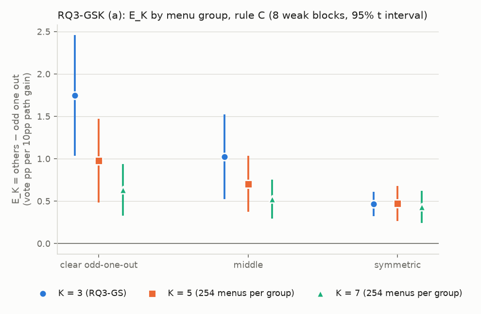
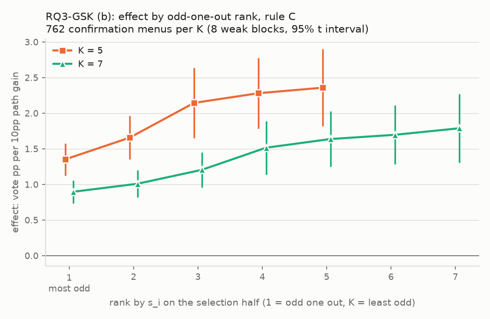

# RQ3-GSK：K = 5、7 時，和其他條最不像的那條還是最不值得改嗎？

判定標準 `result/analysis/rq3gsk/rq3gsk_criteria.md`，sha256 `6b36382febd44d6d641845cecf80ff7311307a7a3977ec943428c5d0022f05c9`；確認：2026-10-07 23:55 CST，使用者確認（含門檻 0.30 / 0.20 與草稿中的補充規則：第 3 節的平手規則、M5L 不扣、第 8 節 2 的範圍、第 9 節 2 的 1e-12）。產生時間 2026-10-08 00:27 CST；程式 `scripts/analysis_rq3gsk/path_improve_gsk.py`（逐切分計算在 `Analysis/pathImproveGSK.py`，沿用 `Analysis/pathImprove.py`、`pathImproveK.py`、`pathImproveGS.py`）。不呼叫 API，不重跑任何東西，不修改現有檔案。

效果的單位：那條 path 每進步 10 個百分點，投票多幾個百分點（第 5 節）。E_K = 其他 K − 1 條的效果 − 落單那條的效果；門檻 K = 5 用 0.30、K = 7 用 0.20，單位相同。

## (1) 讀了哪些檔案

- `result/arms/{模型}/{資料集}/`：4 個模型 × 4 個資料集的 12 條 path，經 `Analysis.menuVote.loadPathBlock` 載入；欄位 `item_id`、`gold`、`parsed_answer`、`parse_ok`。`CellData` 對 `result/aggregations/` 只列出檔名。
- `result/analysis/rq3gsk/rq3gsk_menus_K5.csv`、`rq3gsk_menus_K7.csv`：確認前寫好的菜單表，只核對（§9.4），不覆寫。
- `result/analysis/rq3gs/rq3gs_blocks.csv`：§9.1 的核對（`E2`）、第 8 節 11 的 K = 3 對照（`E2_lone_effect`、`E2_pair_effect`）、圖 (a) 的 K = 3（`E2_明顯落單`、`E2_中間`、`E2_對稱`）。
- `result/analysis/rq3gs/rq3gs_menu_blocks.csv`：§9.2 的核對（`lone_table`、`degree_pp`）。
- `result/analysis/rq3gk/rq3gk_k_blocks.csv`：§9.3 的核對（K = 5、7 的 `D1_A`、`D1_C`、`conversion_real_A/C`、`conversion_sim_A/C`）。
- RQ3-GK 的菜單由 `Analysis.pathImproveK.drawMenus` 重抽（與 `rq3gk_criteria.md` §3 的表相同）。
- §9.6 的手算另外用 `Analysis.menuVote.loadPathBlock` 的字串答案、純迴圈與分數重算（不用 `pathImproveK`、`pathImproveGS`、`pathImproveGSK`）。

## (2) 第零階段的表

菜單：K = 5、7 各 792 種，扣掉 RQ3-GK 的 30 種，各 762 份確認用的菜單，每組 254 份（判定標準檔第 4 節與附錄 A）。

| K   | 組別   | 份數   | 落單程度範圍（pp）     | 落單的 path                                    |
|:----|:-----|:-----|:---------------|:--------------------------------------------|
| 5   | 明顯落單 | 254  | 6.544 – 11.936 | JA 125、ZH 64、RU 54、ES 11                    |
| 5   | 中間   | 254  | 4.643 – 6.540  | JA 114、ZH 60、ES 49、RU 30、W2 1               |
| 5   | 對稱   | 254  | 0.918 – 4.636  | JA 82、ZH 76、RU 35、W2 32、W1 15、ES 7、R 6、P2 1 |
| 7   | 明顯落單 | 254  | 6.491 – 10.968 | JA 187、ZH 37、RU 29、ES 1                     |
| 7   | 中間   | 254  | 5.274 – 6.491  | JA 129、ZH 71、RU 32、ES 22                    |
| 7   | 對稱   | 254  | 2.214 – 5.273  | JA 131、ZH 92、RU 19、W2 7、ES 4、W1 1           |

各區塊被有效切分的規則排除的比例（確認用的菜單，兩個供體合計；第 5 節）：

| 宿主          | 資料集           |     5 |     7 |
|:------------|:--------------|------:|------:|
| GPT-4o mini | commonsenseqa | 16.90 | 21.70 |
| GPT-4o mini | mathqa        |  0.00 |  0.00 |
| GPT-4o mini | mmlu          |  0.00 |  0.00 |
| GPT-4o mini | truthfulqa    |  0.00 |  0.00 |
| Qwen3-8B    | commonsenseqa |  0.10 |  0.15 |
| Qwen3-8B    | mathqa        |  0.00 |  0.00 |
| Qwen3-8B    | mmlu          |  0.00 |  0.00 |
| Qwen3-8B    | truthfulqa    |  0.00 |  0.00 |

## (3) 開跑前的檢查

1. K = 3 重現 RQ3-GS 判定二（s_i 與第 3 節的平手規則）：+1.75（+1.03 到 +2.46），8 / 8；逐區塊和 `rq3gs_blocks.csv` 的 `E2` 最大差 0.0e+00（門檻 1e-9）→ 通過。
2. K = 3 的菜單表（187 份）：落單的 path 全部相同；落單程度最大差 1.8e-15pp（門檻 1e-12）→ 通過。
3. 重現 RQ3-GK 在 K = 5、7 的 `D1_A`、`D1_C`（16 個區塊）與 `conversion_real_A/C`、`conversion_sim_A/C`（8 個區塊）：最大差 1.1e-16（門檻 1e-9）→ 通過。
4. 確認用的菜單和 RQ3-GK 的 K5、K7 菜單沒有重複，各 762 份；重算的菜單表與兩個 CSV 逐位元組相同，sha256 等於判定標準檔第 4 節的值 → 通過。
5. 換成自己：73152 個替換（K = 5、7 × 8 個區塊 × 762 份 × 每條 path），分子、分母每次切分都是 0，而且都不是有效切分 → 通過。
6. 手算（GPT-4o mini · mmlu、GS5-001：EN ES JA P1 P2，兩個供體）：最大差 1.8e-14（門檻 1e-9）→ 通過。其他條的效果：程式 1.751935、手算 1.751935；落單那條的效果：程式 0.928156、手算 0.928156。

| 供體                    | path   | 程式 Σ分子       | 手算 Σ分子       | 程式 Σ分母        | 手算 Σ分母        |
|:----------------------|:-------|:-------------|:-------------|:--------------|:--------------|
| DeepSeek V4.1 Flash   | EN     | 3.7480108566 | 3.7480108566 | 18.1551744777 | 18.1551744777 |
| DeepSeek V4.1 Flash   | ES     | 3.7483064880 | 3.7483064880 | 22.1364018728 | 22.1364018728 |
| DeepSeek V4.1 Flash   | JA     | 2.2698301902 | 2.2698301902 | 23.9893767107 | 23.9893767107 |
| DeepSeek V4.1 Flash   | P1     | 2.9903057119 | 2.9903057119 | 19.2020409458 | 19.2020409458 |
| DeepSeek V4.1 Flash   | P2     | 3.3655901286 | 3.3655901286 | 17.7580903840 | 17.7580903840 |
| DeepSeek V4.1 Flash   | 被排除的切分 | 0            | 0            |               |               |
| Gemini 3.1 Flash-Lite | EN     | 4.3900112689 | 4.3900112689 | 20.2770410018 | 20.2770410018 |
| Gemini 3.1 Flash-Lite | ES     | 3.4804408625 | 3.4804408625 | 25.6632153053 | 25.6632153053 |
| Gemini 3.1 Flash-Lite | JA     | 2.5678349588 | 2.5678349588 | 28.1318737398 | 28.1318737398 |
| Gemini 3.1 Flash-Lite | P1     | 3.4633872075 | 3.4633872075 | 19.7137472436 | 19.7137472436 |
| Gemini 3.1 Flash-Lite | P2     | 3.3285703581 | 3.3285703581 | 19.8549939746 | 19.8549939746 |
| Gemini 3.1 Flash-Lite | 被排除的切分 | 0            | 0            |               |               |

## (4) 兩項判定（8 個弱模型區塊，各自的「明顯落單」組 254 份，規則 C）

限制（判定標準檔第 6 節）：(a) 明顯落單組裡落單的 path 全是翻譯的語言 path，判定分不開「不像」「是翻譯的」「比較弱」；(b) 菜單只由 12 條 path 排出來，彼此不獨立；(c) 兩項判定用同一批題目與 path，不是兩次獨立的確認。

### 判定一：K = 5（門檻 0.30）

| 量                         | 平均    | SE   | 95% 區間         | 為正的區塊   | 狀態   |
|:--------------------------|:------|:-----|:---------------|:--------|:-----|
| E_5 = 其他 4 條的效果 − 落單那條的效果 | +0.98 | 0.21 | [+0.48, +1.47] | 8/8     | 正向成立 |

**正向成立** → K 條 path 投票時，和其他條最不像的那條仍然最不值得改。（依第 6 節的限制 (a)，論文只能寫「K 條 path 投票時，和其他條最不像的那條翻譯的 path 最不值得改」；要去掉「翻譯的」，還要看第 8 節 4。）

| 宿主          | 資料集           |   E_5 |   其他 4 條的效果 |   落單那條的效果 |   被排除的（菜單、供體、切分）% |
|:------------|:--------------|------:|------------:|----------:|------------------:|
| GPT-4o mini | mmlu          |  0.49 |        1.49 |      1.00 |              0.00 |
| GPT-4o mini | mathqa        |  0.55 |        1.99 |      1.44 |              0.00 |
| GPT-4o mini | truthfulqa    |  0.37 |        1.79 |      1.42 |              0.00 |
| GPT-4o mini | commonsenseqa |  1.88 |        3.16 |      1.28 |             16.90 |
| Qwen3-8B    | mmlu          |  0.86 |        1.73 |      0.86 |              0.00 |
| Qwen3-8B    | mathqa        |  0.90 |        2.26 |      1.35 |              0.00 |
| Qwen3-8B    | truthfulqa    |  0.87 |        1.83 |      0.96 |              0.00 |
| Qwen3-8B    | commonsenseqa |  1.90 |        2.59 |      0.70 |              0.10 |

### 判定二：K = 7（門檻 0.20）

| 量                         | 平均    | SE   | 95% 區間         | 為正的區塊   | 狀態   |
|:--------------------------|:------|:-----|:---------------|:--------|:-----|
| E_7 = 其他 6 條的效果 − 落單那條的效果 | +0.63 | 0.13 | [+0.33, +0.94] | 8/8     | 正向成立 |

**正向成立** → K 條 path 投票時，和其他條最不像的那條仍然最不值得改。（依第 6 節的限制 (a)，論文只能寫「K 條 path 投票時，和其他條最不像的那條翻譯的 path 最不值得改」；要去掉「翻譯的」，還要看第 8 節 4。）

| 宿主          | 資料集           |   E_7 |   其他 6 條的效果 |   落單那條的效果 |   被排除的（菜單、供體、切分）% |
|:------------|:--------------|------:|------------:|----------:|------------------:|
| GPT-4o mini | mmlu          |  0.33 |        0.99 |      0.66 |              0.00 |
| GPT-4o mini | mathqa        |  0.43 |        1.35 |      0.91 |              0.00 |
| GPT-4o mini | truthfulqa    |  0.20 |        1.19 |      0.99 |              0.00 |
| GPT-4o mini | commonsenseqa |  1.24 |        2.29 |      1.05 |             21.70 |
| Qwen3-8B    | mmlu          |  0.49 |        1.12 |      0.63 |              0.00 |
| Qwen3-8B    | mathqa        |  0.72 |        1.62 |      0.89 |              0.00 |
| Qwen3-8B    | truthfulqa    |  0.57 |        1.22 |      0.65 |              0.00 |
| Qwen3-8B    | commonsenseqa |  1.09 |        1.56 |      0.47 |              0.15 |

## (5) 只報告的量（不參與判定）

### 8.1 E_K 在中間組、對稱組、全部 762 份

| 量              | 平均    | SE   | 95% 區間         | 為正的區塊   |
|:---------------|:------|:-----|:---------------|:--------|
| K = 5，明顯落單（判定） | +0.98 | 0.21 | [+0.48, +1.47] | 8/8     |
| K = 5，中間       | +0.70 | 0.14 | [+0.37, +1.03] | 8/8     |
| K = 5，對稱       | +0.47 | 0.09 | [+0.26, +0.68] | 8/8     |
| K = 5，全部 762 份 | +0.72 | 0.14 | [+0.38, +1.06] | 8/8     |
| K = 7，明顯落單（判定） | +0.63 | 0.13 | [+0.33, +0.94] | 8/8     |
| K = 7，中間       | +0.52 | 0.10 | [+0.30, +0.75] | 8/8     |
| K = 7，對稱       | +0.43 | 0.08 | [+0.24, +0.62] | 8/8     |
| K = 7，全部 762 份 | +0.53 | 0.10 | [+0.30, +0.76] | 8/8     |

### 8.2 依名次的效果

名次每次切分在選擇半依第 3 節決定（1 = 最落單）。

| 量                               | 平均    | SE   | 95% 區間         | 為正的區塊   |
|:--------------------------------|:------|:-----|:---------------|:--------|
| K = 5，全部 762 份，第 1 名（最落單）的效果    | +1.35 | 0.10 | [+1.13, +1.58] | 8/8     |
| K = 5，全部 762 份，第 2 名的效果         | +1.66 | 0.13 | [+1.35, +1.96] | 8/8     |
| K = 5，全部 762 份，第 3 名的效果         | +2.14 | 0.21 | [+1.65, +2.64] | 8/8     |
| K = 5，全部 762 份，第 4 名的效果         | +2.28 | 0.21 | [+1.78, +2.78] | 8/8     |
| K = 5，全部 762 份，第 5 名（最不落單）的效果   | +2.36 | 0.23 | [+1.82, +2.90] | 8/8     |
| K = 5，全部 762 份：最不落單的效果 − 最落單的效果 | +1.01 | 0.21 | [+0.50, +1.51] | 8/8     |
| K = 5，明顯落單組，第 1 名（最落單）的效果       | +1.13 | 0.10 | [+0.89, +1.36] | 8/8     |
| K = 5，明顯落單組，第 2 名的效果            | +1.62 | 0.14 | [+1.29, +1.96] | 8/8     |
| K = 5，明顯落單組，第 3 名的效果            | +2.19 | 0.21 | [+1.68, +2.69] | 8/8     |
| K = 5，明顯落單組，第 4 名的效果            | +2.31 | 0.23 | [+1.76, +2.86] | 8/8     |
| K = 5，明顯落單組，第 5 名（最不落單）的效果      | +2.41 | 0.26 | [+1.79, +3.03] | 8/8     |
| K = 5，明顯落單組：最不落單的效果 − 最落單的效果    | +1.28 | 0.28 | [+0.61, +1.95] | 8/8     |
| K = 7，全部 762 份，第 1 名（最落單）的效果    | +0.90 | 0.07 | [+0.74, +1.06] | 8/8     |
| K = 7，全部 762 份，第 2 名的效果         | +1.01 | 0.08 | [+0.82, +1.20] | 8/8     |
| K = 7，全部 762 份，第 3 名的效果         | +1.20 | 0.10 | [+0.96, +1.45] | 8/8     |
| K = 7，全部 762 份，第 4 名的效果         | +1.52 | 0.16 | [+1.14, +1.89] | 8/8     |
| K = 7，全部 762 份，第 5 名的效果         | +1.64 | 0.16 | [+1.25, +2.03] | 8/8     |
| K = 7，全部 762 份，第 6 名的效果         | +1.70 | 0.17 | [+1.28, +2.11] | 8/8     |
| K = 7，全部 762 份，第 7 名（最不落單）的效果   | +1.79 | 0.20 | [+1.31, +2.27] | 8/8     |
| K = 7，全部 762 份：最不落單的效果 − 最落單的效果 | +0.89 | 0.20 | [+0.43, +1.35] | 8/8     |
| K = 7，明顯落單組，第 1 名（最落單）的效果       | +0.78 | 0.07 | [+0.61, +0.96] | 8/8     |
| K = 7，明顯落單組，第 2 名的效果            | +0.93 | 0.09 | [+0.71, +1.15] | 8/8     |
| K = 7，明顯落單組，第 3 名的效果            | +1.23 | 0.15 | [+0.88, +1.58] | 8/8     |
| K = 7，明顯落單組，第 4 名的效果            | +1.52 | 0.18 | [+1.09, +1.95] | 8/8     |
| K = 7，明顯落單組，第 5 名的效果            | +1.63 | 0.19 | [+1.18, +2.07] | 8/8     |
| K = 7，明顯落單組，第 6 名的效果            | +1.67 | 0.19 | [+1.22, +2.13] | 8/8     |
| K = 7，明顯落單組，第 7 名（最不落單）的效果      | +1.78 | 0.25 | [+1.20, +2.37] | 8/8     |
| K = 7，明顯落單組：最不落單的效果 − 最落單的效果    | +1.00 | 0.24 | [+0.44, +1.56] | 8/8     |

### 8.3 落單程度對上菜單的 E_K

菜單的 E_K = 8 個區塊、2 個供體、所有可用切分合併成一個值。菜單只由 12 條 path 排出來，彼此不獨立，相關係數看起來會比實際的證據強。

| K   | 菜單數   | Spearman   |
|:----|:------|:-----------|
| 5   | 762   | +0.853     |
| 7   | 762   | +0.686     |

逐菜單的值在 `rq3gsk_menu_blocks.csv` 的 `E_menu`。

### 8.4 分開原因

(b) 與 (c) 用的是同一個條件（落單的 path ≠ 選擇半正確率最低的那條），範圍是明顯落單組，所以用到的（菜單、供體、切分）相同。沒有這種情況的區塊值無定義，摘要只用有資料的區塊。

| 量                                                                | 平均    | SE   | 95% 區間         | 為正的區塊   |
|:-----------------------------------------------------------------|:------|:-----|:---------------|:--------|
| K = 5 (a) 落單的 path 不是翻譯的語言 path 的菜單（55 份，落單程度 0.918–4.688pp）：E_K | +0.66 | 0.16 | [+0.27, +1.05] | 8/8     |
| K = 5 (b) 落單的不是正確率最低那條時的 E_K                                     | +0.75 | 0.14 | [+0.42, +1.08] | 8/8     |
| K = 5 (c) 正確率最低的不是落單那條時：其他條 − 最低那條                               | +0.46 | 0.22 | [-0.05, +0.98] | 6/8     |
| K = 7 (a) 落單的 path 不是翻譯的語言 path 的菜單（8 份，落單程度 2.214–3.957pp）：E_K  | +0.57 | 0.23 | [+0.04, +1.11] | 8/8     |
| K = 7 (b) 落單的不是正確率最低那條時的 E_K                                     | +0.55 | 0.10 | [+0.30, +0.79] | 8/8     |
| K = 7 (c) 正確率最低的不是落單那條時：其他條 − 最低那條                               | +0.43 | 0.16 | [+0.04, +0.82] | 6/8     |

|   K | 宿主          | 資料集           |   (b)(c) 用到的比例（%） |   用到的（菜單、供體、切分） |   (b) E_K |   (c) 其他條 − 最低那條 |
|----:|:------------|:--------------|------------------:|----------------:|----------:|-----------------:|
|   5 | GPT-4o mini | mmlu          |              3.94 |            4004 |      0.40 |             0.41 |
|   5 | GPT-4o mini | mathqa        |             10.04 |           10196 |      0.44 |             0.29 |
|   5 | GPT-4o mini | truthfulqa    |             30.56 |           31054 |      0.43 |            -0.25 |
|   5 | GPT-4o mini | commonsenseqa |              2.04 |            1702 |      0.62 |             1.04 |
|   5 | Qwen3-8B    | mmlu          |              1.31 |            1332 |      0.90 |             0.61 |
|   5 | Qwen3-8B    | mathqa        |             35.21 |           35776 |      0.88 |             0.38 |
|   5 | Qwen3-8B    | truthfulqa    |             27.36 |           27796 |      0.71 |            -0.31 |
|   5 | Qwen3-8B    | commonsenseqa |              4.54 |            4612 |      1.59 |             1.54 |
|   7 | GPT-4o mini | mmlu          |             15.60 |           15846 |      0.26 |             0.33 |
|   7 | GPT-4o mini | mathqa        |             15.15 |           15392 |      0.40 |             0.29 |
|   7 | GPT-4o mini | truthfulqa    |             34.11 |           34654 |      0.23 |            -0.05 |
|   7 | GPT-4o mini | commonsenseqa |              8.47 |            6613 |      0.86 |             1.16 |
|   7 | Qwen3-8B    | mmlu          |              4.00 |            4062 |      0.48 |             0.31 |
|   7 | Qwen3-8B    | mathqa        |             54.39 |           55260 |      0.76 |             0.40 |
|   7 | Qwen3-8B    | truthfulqa    |             15.73 |           15978 |      0.36 |            -0.10 |
|   7 | Qwen3-8B    | commonsenseqa |             14.54 |           14755 |      1.02 |             1.08 |

### 8.5 模擬這一側（16 個區塊，子集一，規則 C）

落單的 path 的 π ÷ 其他 K − 1 條 π 的平均（分子、分母各自先對切分、菜單、16 個區塊平均，再相除）：

- K = 5：全部 762 份 0.791（10.92% ÷ 13.80%）；明顯落單組 0.711（9.51% ÷ 13.39%）。
- K = 7：全部 762 份 0.780（7.38% ÷ 9.46%）；明顯落單組 0.726（6.61% ÷ 9.12%）。

### 8.6 規則 A 下的值

| 量               | 平均    | SE   | 95% 區間         | 為正的區塊   |
|:----------------|:------|:-----|:---------------|:--------|
| K = 5（規則 A）：E_K | +0.98 | 0.21 | [+0.49, +1.48] | 8/8     |
| K = 7（規則 A）：E_K | +0.62 | 0.13 | [+0.32, +0.92] | 8/8     |

### 8.7 RQ3-GK 既有的菜單（K5-01 到 K5-30、K7-01 到 K7-30）

用第 4 節的門檻分組。

| 量                | 平均    | SE   | 95% 區間         | 為正的區塊   |
|:-----------------|:------|:-----|:---------------|:--------|
| K = 5，明顯落單（11 份） | +0.97 | 0.21 | [+0.48, +1.46] | 8/8     |
| K = 5，中間（10 份）   | +0.70 | 0.16 | [+0.32, +1.09] | 8/8     |
| K = 5，對稱（9 份）    | +0.52 | 0.11 | [+0.25, +0.78] | 8/8     |
| K = 5，全部 30 份    | +0.75 | 0.16 | [+0.36, +1.13] | 8/8     |
| K = 7，明顯落單（9 份）  | +0.60 | 0.14 | [+0.27, +0.93] | 8/8     |
| K = 7，中間（12 份）   | +0.53 | 0.09 | [+0.32, +0.74] | 8/8     |
| K = 7，對稱（9 份）    | +0.43 | 0.07 | [+0.27, +0.60] | 8/8     |
| K = 7，全部 30 份    | +0.52 | 0.10 | [+0.29, +0.75] | 8/8     |

### 8.8 不除以分母的版本（明顯落單組，pp）

| 量                            | 平均     | SE   | 95% 區間          | 為正的區塊   |
|:-----------------------------|:-------|:-----|:----------------|:--------|
| K = 5，其他條：投票實際多幾個百分點         | +1.84  | 0.24 | [+1.26, +2.42]  | 8/8     |
| K = 5，其他條：那條 path 實際進步幾個百分點  | +9.61  | 1.62 | [+5.77, +13.44] | 8/8     |
| K = 5，落單那條：投票實際多幾個百分點        | +1.42  | 0.22 | [+0.91, +1.94]  | 8/8     |
| K = 5，落單那條：那條 path 實際進步幾個百分點 | +12.65 | 1.51 | [+9.08, +16.22] | 8/8     |
| K = 7，其他條：投票實際多幾個百分點         | +1.26  | 0.16 | [+0.88, +1.63]  | 8/8     |
| K = 7，其他條：那條 path 實際進步幾個百分點  | +9.77  | 1.61 | [+5.97, +13.58] | 8/8     |
| K = 7，落單那條：投票實際多幾個百分點        | +1.00  | 0.15 | [+0.65, +1.35]  | 8/8     |
| K = 7，落單那條：那條 path 實際進步幾個百分點 | +12.94 | 1.56 | [+9.25, +16.63] | 8/8     |

### 8.9 各區塊自己算出的落單 path 和菜單表相同的比例（%）

每個區塊用自己子集一的全部題目算 s_i；K = 3 用 RQ3-GS 的 187 份，K = 5、7 用各自的 762 份。

| 宿主          | 資料集           |   K = 3 |   K = 5 |   K = 7 |
|:------------|:--------------|--------:|--------:|--------:|
| GPT-4o mini | mmlu          |    92.0 |    96.2 |    99.2 |
| GPT-4o mini | mathqa        |    71.1 |    66.3 |    65.7 |
| GPT-4o mini | truthfulqa    |    85.6 |    80.2 |    67.8 |
| GPT-4o mini | commonsenseqa |    90.9 |    89.1 |    77.3 |
| Qwen3-8B    | mmlu          |    97.3 |    97.9 |    98.4 |
| Qwen3-8B    | mathqa        |    83.4 |    75.2 |    74.1 |
| Qwen3-8B    | truthfulqa    |    91.4 |    86.4 |    83.9 |
| Qwen3-8B    | commonsenseqa |    90.9 |    86.6 |    82.7 |

8 個區塊的平均：K = 3 87.8%、K = 5 84.7%、K = 7 81.2%。

### 8.10 門檻改用 0.5 時的狀態（對照）

| 量                 | 平均    | SE   | 95% 區間         | 為正的區塊   | 狀態   |
|:------------------|:------|:-----|:---------------|:--------|:-----|
| K = 5：E_K（門檻 0.5） | +0.98 | 0.21 | [+0.48, +1.47] | 8/8     | 正向成立 |
| K = 7：E_K（門檻 0.5） | +0.63 | 0.13 | [+0.33, +0.94] | 8/8     | 正向成立 |

### 8.11 落單那條的效果 ÷ 其他條的效果（逐區塊）

K = 3 用 RQ3-GS 明顯落單組的 `E2_lone_effect` ÷ `E2_pair_effect`。8 個值的順序：GPT-4o mini 的 mmlu、mathqa、truthfulqa、commonsenseqa，再來 Qwen 的同樣四個。

| K   | 8 個值                                            | 中位數   | 範圍            |
|:----|:------------------------------------------------|:------|:--------------|
| 3   | 0.630、0.760、0.721、0.438、0.462、0.606、0.538、0.304 | 0.572 | 0.304 – 0.760 |
| 5   | 0.668、0.723、0.791、0.406、0.499、0.600、0.526、0.268 | 0.563 | 0.268 – 0.791 |
| 7   | 0.670、0.679、0.834、0.459、0.563、0.553、0.531、0.301 | 0.558 | 0.301 – 0.834 |

## (6) 對照讀法的結論

- 判定一（K = 5，E_5 +0.98，[+0.48, +1.47]，8/8 為正，門檻 0.30）：**正向成立**。K 條 path 投票時，和其他條最不像的那條仍然最不值得改。（依第 6 節的限制 (a)，論文只能寫「K 條 path 投票時，和其他條最不像的那條翻譯的 path 最不值得改」；要去掉「翻譯的」，還要看第 8 節 4。）
- 判定二（K = 7，E_7 +0.63，[+0.33, +0.94]，8/8 為正，門檻 0.20）：**正向成立**。K 條 path 投票時，和其他條最不像的那條仍然最不值得改。（依第 6 節的限制 (a)，論文只能寫「K 條 path 投票時，和其他條最不像的那條翻譯的 path 最不值得改」；要去掉「翻譯的」，還要看第 8 節 4。）
- 其餘都只報告，不套四種狀態（第 8 節 10 只是門檻 0.5 的對照）。
