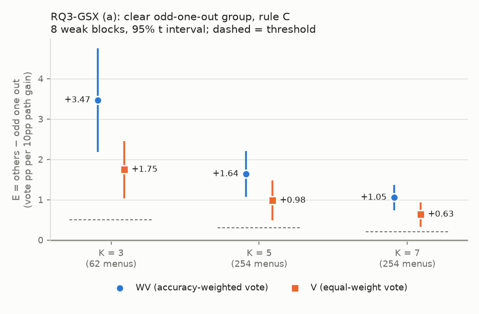
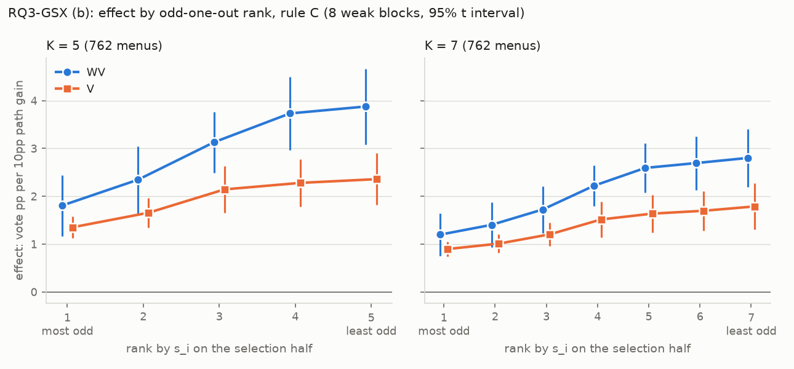

# RQ3-GSX：依正確率加權的投票下，和其他條最不像的那條還是最不值得改嗎？

判定標準 `result/analysis/rq3gsx/rq3gsx_criteria.md`，sha256 `e293710f1b0a667ab198850ccea327b1f38893f5ce485be3e9dd6d7396f49002`；確認：2026-10-09 17:38 CST，使用者確認（含草稿中的補充規則與 2026-10-09 17:30 的兩處修改；使用者沒有另外指定，所以第 7 節 5 的「相差超過 0.10」與第 5 節的「8 個區塊合計」照確認前回覆的讀法：WV、V 任一組相差超過 0.10 就不寫該 K 的那一句；合計 = 8 個區塊的分子加總後比較）。
產生時間 2026-10-09 17:57 CST；程式 `scripts/analysis_rq3gsx/path_improve_gsx.py`（逐切分計算在 `Analysis/pathImproveGSX.py`）；平行行程 80 個（結果依工作順序合併，與行程數無關）。不呼叫 API，不重跑任何東西，不修改現有檔案。

## (1) 讀了哪些檔案

- `result/arms/{模型}/{資料集}/`：4 個模型 × 4 個資料集，經 `Analysis.menuVote.loadPathBlock` 載入（同 RQ3-G）。欄位 `item_id`、`gold`、`parsed_answer`、`parse_ok`。載入時的核對（題目 id 與 gold、`compareTwoAnswer` = 字串相等、整數投票 = `vote`）全部通過。
- `result/analysis/rq3gs/rq3gs_blocks.csv`（`E2`）、`result/analysis/rq3gsk/rq3gsk_blocks.csv`（`E`）：§8.1 的核對。
- `result/analysis/rq3g/rq3g_substitutions.csv`（M12 的 `WV_before`、`WV_after`、`WV_sim`、`A_sim_V`）、`result/analysis/rq3gk/rq3gk_k_blocks.csv`（K = 3 的 `WVmSB_after_A_pp`、`WVmSB_after_C_pp`）：§8.2 的核對。
- `result/analysis/rq3gs/rq3gs_menu_blocks.csv`（`menu_set`、`group`、`lone_table`、`degree_pp`）、`result/analysis/rq3gsk/rq3gsk_menus_K5.csv`、`rq3gsk_menus_K7.csv`：§8.3 的核對。
- 沿用的程式：`Analysis.pathImprove`（編碼、`logOdds`、`fraction`）、`Analysis.pathImproveK`（`Ans.scores`、`HostDonorK`、`drawMenus`）、`Analysis.pathImproveGS`（菜單、一致率、分組、`GroupSums`）、`Analysis.pathImproveGSK`（`menuTableFrame`、`hostSide` 的落單名次）、`Analysis.blockStats`。

## (2) 第零階段

確認前做的第零階段寫在判定標準檔的附錄 A（菜單表與兩個 CSV 的 sha256、排除比例、計時）。這次開跑時：
- 菜單表與分組重算後和既有的相同（§8.3）。組別門檻：K = 3 明顯落單 ≥ 6.4838385099pp、對稱 ≤ 3.3715477608pp；K = 5 明顯落單 ≥ 6.5443207641pp、對稱 ≤ 4.6360147239pp；K = 7 明顯落單 ≥ 6.4906595947pp、對稱 ≤ 5.2728768937pp。
- 各區塊被排除的（菜單、供體、切分）比例（全部確認用菜單，兩個供體合計；應和附錄 A.2 的「全部」欄相同）：

| 區塊                          | K = 3   | K = 5   | K = 7   |
|:----------------------------|:--------|:--------|:--------|
| GPT-4o mini · mmlu          | 0.00%   | 0.00%   | 0.00%   |
| GPT-4o mini · mathqa        | 0.00%   | 0.00%   | 0.00%   |
| GPT-4o mini · truthfulqa    | 0.00%   | 0.00%   | 0.00%   |
| GPT-4o mini · commonsenseqa | 11.26%  | 16.90%  | 21.70%  |
| Qwen3-8B · mmlu             | 0.00%   | 0.00%   | 0.00%   |
| Qwen3-8B · mathqa           | 0.00%   | 0.00%   | 0.00%   |
| Qwen3-8B · truthfulqa       | 0.00%   | 0.00%   | 0.00%   |
| Qwen3-8B · commonsenseqa    | 0.06%   | 0.10%   | 0.15%   |

## (3) 開跑前的檢查（第 8 節）

1. 等權投票的路徑重現 RQ3-GS 判定二與 RQ3-GSK 判定一、二 → 通過。

| K   | 重算                       | 既有                       | 逐區塊最大差   |
|:----|:-------------------------|:-------------------------|:---------|
| 3   | +1.75（+1.03 到 +2.46），8/8 | +1.75（+1.03 到 +2.46），8/8 | 4.0e-15  |
| 5   | +0.98（+0.48 到 +1.47），8/8 | +0.98（+0.48 到 +1.47），8/8 | 6.4e-15  |
| 7   | +0.63（+0.33 到 +0.94），8/8 | +0.63（+0.33 到 +0.94），8/8 | 3.7e-15  |

2. RQ3-G 的 12 條 WV：192 個替換（M12，含 2 個不參與判定的），每個替換在自己的有效切分上平均（規則 A），和 `rq3g_substitutions.csv` 的最大差：WV_before 0.0e+00、WV_after 1.1e-16、WV_sim 4.4e-16、A_sim_V 2.2e-16。RQ3-GK K = 3 的替換後 WV − SB（規則 A）：-2.42（-3.95 到 -0.88），逐區塊和 `rq3gk_k_blocks.csv`（規則 A、C）最大差 5.6e-17 → 通過。
3. 菜單表：K = 3 的 187 份和 `rq3gs_menu_blocks.csv` 的組別、落單 path 相同，落單程度最大差 1.8e-15pp；K = 5、7 重算的表和兩個 CSV 的 bytes 相同，sha256 be942517…、a6026ad9…（= 第 3 節）→ 通過。
4. 權重都設成 1 或 0.5 時，WV 的逐題得分（規則 C、A）和等權投票相同：比較 1,219,320,128 題次，不相等 0 → 通過。
5. 換成自己：77,640 個替換 × 200 次切分，WV 與 V 的分子（C、A）、模擬的分子、分子_固定、分母都是 0，且沒有有效切分 → 通過。
6. 手算（gpt4omini × mmlu，GS-001 與 GS5-001，兩個供體；純迴圈、`Fraction` 的規則 C 得分）：最大差 1.8e-14 → 通過。

手算的兩群效果與被排除的切分數（逐 path 的分子、分母總和也都比過，最大差同上）：

| 菜單      | 供體   | path   | 量                                         | 手算       | 程式       | 差       |
|:--------|:-----|:-------|:------------------------------------------|:---------|:---------|:--------|
| GS-001  | 合計   | 被排除的切分 | deepseek4.1flash: 0；gemini3.1flashlite: 0 |          |          | 0.0e+00 |
| GS-001  | 合計   | 效果     | others_W                                  | 5.677905 | 5.677905 | 7.1e-15 |
| GS-001  | 合計   | 效果     | others_V                                  | 4.094398 | 4.094398 | 0.0e+00 |
| GS-001  | 合計   | 效果     | lone_W                                    | 3.463046 | 3.463046 | 5.3e-15 |
| GS-001  | 合計   | 效果     | lone_V                                    | 3.129728 | 3.129728 | 1.3e-15 |
| GS5-001 | 合計   | 被排除的切分 | deepseek4.1flash: 0；gemini3.1flashlite: 0 |          |          | 0.0e+00 |
| GS5-001 | 合計   | 效果     | others_W                                  | 2.381535 | 2.381535 | 5.8e-15 |
| GS5-001 | 合計   | 效果     | others_V                                  | 1.751935 | 1.751935 | 7.5e-15 |
| GS5-001 | 合計   | 效果     | lone_W                                    | 1.137296 | 1.137296 | 2.4e-15 |
| GS5-001 | 合計   | 效果     | lone_V                                    | 0.928156 | 0.928156 | 4.4e-16 |

## (4) 三項判定（8 個弱模型區塊，各 K 的明顯落單組，規則 C）

E_W = 其他 K − 1 條的效果 − 落單那條的效果（WV；單位：那條 path 每進步 10pp，加權投票多幾個 pp）。同一批資料上 V 的 E 並排（不參與判定）。

| 判定         | 菜單   | 其他條（WV）   | 落單那條（WV）   | E_W   | SE   | 95% 區間         | 為正的區塊   | 門檻   | 狀態   | （對照）V 的 E                |
|:-----------|:-----|:----------|:-----------|:------|:-----|:---------------|:--------|:-----|:-----|:-------------------------|
| 判定一（K = 3） | 62   | 6.26      | 2.80       | +3.47 | 0.55 | [+2.18, +4.76] | 8/8     | 0.50 | 正向成立 | +1.75（+1.03 到 +2.46），8/8 |
| 判定二（K = 5） | 254  | 3.20      | 1.56       | +1.64 | 0.24 | [+1.06, +2.21] | 8/8     | 0.30 | 正向成立 | +0.98（+0.48 到 +1.47），8/8 |
| 判定三（K = 7） | 254  | 2.12      | 1.07       | +1.05 | 0.13 | [+0.74, +1.37] | 8/8     | 0.20 | 正向成立 | +0.63（+0.33 到 +0.94），8/8 |

K = 3 逐區塊：

| 區塊                          | 其他條（WV）   | 落單那條（WV）   | E_W   | 其他條（V）   | 落單那條（V）   | E（V）   |
|:----------------------------|:----------|:-----------|:------|:---------|:----------|:-------|
| GPT-4o mini · mmlu          | +4.07     | +2.24      | +1.83 | +3.03    | +1.91     | +1.12  |
| GPT-4o mini · mathqa        | +4.85     | +3.35      | +1.51 | +3.45    | +2.62     | +0.83  |
| GPT-4o mini · truthfulqa    | +8.63     | +5.13      | +3.49 | +3.31    | +2.38     | +0.92  |
| GPT-4o mini · commonsenseqa | +5.66     | +1.85      | +3.81 | +4.90    | +2.14     | +2.75  |
| Qwen3-8B · mmlu             | +7.68     | +2.12      | +5.56 | +3.64    | +1.68     | +1.96  |
| Qwen3-8B · mathqa           | +5.16     | +3.11      | +2.05 | +3.99    | +2.41     | +1.57  |
| Qwen3-8B · truthfulqa       | +7.75     | +3.43      | +4.32 | +3.54    | +1.91     | +1.64  |
| Qwen3-8B · commonsenseqa    | +6.33     | +1.16      | +5.17 | +4.57    | +1.39     | +3.18  |

K = 5 逐區塊：

| 區塊                          | 其他條（WV）   | 落單那條（WV）   | E_W   | 其他條（V）   | 落單那條（V）   | E（V）   |
|:----------------------------|:----------|:-----------|:------|:---------|:----------|:-------|
| GPT-4o mini · mmlu          | +1.91     | +1.13      | +0.78 | +1.49    | +1.00     | +0.49  |
| GPT-4o mini · mathqa        | +2.74     | +1.86      | +0.88 | +1.99    | +1.44     | +0.55  |
| GPT-4o mini · truthfulqa    | +4.45     | +2.97      | +1.48 | +1.79    | +1.42     | +0.37  |
| GPT-4o mini · commonsenseqa | +3.48     | +1.11      | +2.37 | +3.16    | +1.28     | +1.88  |
| Qwen3-8B · mmlu             | +3.04     | +1.16      | +1.88 | +1.73    | +0.86     | +0.86  |
| Qwen3-8B · mathqa           | +2.92     | +1.77      | +1.15 | +2.26    | +1.35     | +0.90  |
| Qwen3-8B · truthfulqa       | +3.76     | +1.86      | +1.90 | +1.83    | +0.96     | +0.87  |
| Qwen3-8B · commonsenseqa    | +3.29     | +0.64      | +2.65 | +2.59    | +0.70     | +1.90  |

K = 7 逐區塊：

| 區塊                          | 其他條（WV）   | 落單那條（WV）   | E_W   | 其他條（V）   | 落單那條（V）   | E（V）   |
|:----------------------------|:----------|:-----------|:------|:---------|:----------|:-------|
| GPT-4o mini · mmlu          | +1.27     | +0.69      | +0.58 | +0.99    | +0.66     | +0.33  |
| GPT-4o mini · mathqa        | +1.87     | +1.18      | +0.69 | +1.35    | +0.91     | +0.43  |
| GPT-4o mini · truthfulqa    | +2.93     | +2.09      | +0.83 | +1.19    | +0.99     | +0.20  |
| GPT-4o mini · commonsenseqa | +2.61     | +0.99      | +1.62 | +2.29    | +1.05     | +1.24  |
| Qwen3-8B · mmlu             | +1.91     | +0.86      | +1.05 | +1.12    | +0.63     | +0.49  |
| Qwen3-8B · mathqa           | +2.09     | +1.20      | +0.89 | +1.62    | +0.89     | +0.72  |
| Qwen3-8B · truthfulqa       | +2.36     | +1.10      | +1.26 | +1.22    | +0.65     | +0.57  |
| Qwen3-8B · commonsenseqa    | +1.94     | +0.45      | +1.50 | +1.56    | +0.47     | +1.09  |

## (5) 只報告的量（不參與判定）

### 7.1 各組的 E（WV 與 V 並排）

| K   | 組    | E_W                      | E（V）                     |
|:----|:-----|:-------------------------|:-------------------------|
| 3   | 明顯落單 | +3.47（+2.18 到 +4.76），8/8 | +1.75（+1.03 到 +2.46），8/8 |
| 3   | 中間   | +2.06（+1.24 到 +2.88），8/8 | +1.03（+0.53 到 +1.53），8/8 |
| 3   | 對稱   | +1.22（+0.60 到 +1.84），7/8 | +0.47（+0.32 到 +0.61），8/8 |
| 3   | 全部   | +2.27（+1.44 到 +3.10），8/8 | +1.10（+0.65 到 +1.55），8/8 |
| 5   | 明顯落單 | +1.64（+1.06 到 +2.21），8/8 | +0.98（+0.48 到 +1.47），8/8 |
| 5   | 中間   | +1.41（+0.93 到 +1.90），8/8 | +0.70（+0.37 到 +1.03），8/8 |
| 5   | 對稱   | +1.10（+0.71 到 +1.48），8/8 | +0.47（+0.26 到 +0.68），8/8 |
| 5   | 全部   | +1.38（+0.91 到 +1.86），8/8 | +0.72（+0.38 到 +1.06），8/8 |
| 7   | 明顯落單 | +1.05（+0.74 到 +1.37），8/8 | +0.63（+0.33 到 +0.94），8/8 |
| 7   | 中間   | +0.94（+0.64 到 +1.24），8/8 | +0.52（+0.30 到 +0.75），8/8 |
| 7   | 對稱   | +0.86（+0.58 到 +1.15），8/8 | +0.43（+0.24 到 +0.62），8/8 |
| 7   | 全部   | +0.95（+0.66 到 +1.25），8/8 | +0.53（+0.30 到 +0.76），8/8 |

### 7.2 落單那條的效果 ÷ 其他條的效果（明顯落單組，逐區塊）

| K   | 聚合   | 8 個值                                    | 中位數   | 範圍          |
|:----|:-----|:----------------------------------------|:------|:------------|
| 3   | WV   | 0.55、0.69、0.59、0.33、0.28、0.60、0.44、0.18 | 0.496 | 0.18 到 0.69 |
| 3   | V    | 0.63、0.76、0.72、0.44、0.46、0.61、0.54、0.30 | 0.572 | 0.30 到 0.76 |
| 5   | WV   | 0.59、0.68、0.67、0.32、0.38、0.61、0.49、0.19 | 0.543 | 0.19 到 0.68 |
| 5   | V    | 0.67、0.72、0.79、0.41、0.50、0.60、0.53、0.27 | 0.563 | 0.27 到 0.79 |
| 7   | WV   | 0.54、0.63、0.72、0.38、0.45、0.57、0.47、0.23 | 0.506 | 0.23 到 0.72 |
| 7   | V    | 0.67、0.68、0.83、0.46、0.56、0.55、0.53、0.30 | 0.558 | 0.30 到 0.83 |

### 7.3 依落單名次的效果（全部確認用菜單；1 = 最落單）

| K   | 聚合   | 名次 1   | 名次 2   | 名次 3   | 名次 4   | 名次 5   | 名次 6   | 名次 7   | 最不落單 − 最落單               |
|:----|:-----|:-------|:-------|:-------|:-------|:-------|:-------|:-------|:-------------------------|
| 5   | WV   | 1.81   | 2.35   | 3.13   | 3.73   | 3.88   | —      | —      | +2.07（+1.16 到 +2.98），8/8 |
| 5   | V    | 1.35   | 1.66   | 2.14   | 2.28   | 2.36   | —      | —      | +1.01（+0.50 到 +1.51），8/8 |
| 7   | WV   | 1.20   | 1.40   | 1.72   | 2.22   | 2.59   | 2.69   | 2.80   | +1.60（+0.88 到 +2.32），8/8 |
| 7   | V    | 0.90   | 1.01   | 1.20   | 1.52   | 1.64   | 1.70   | 1.79   | +0.89（+0.43 到 +1.35），8/8 |

（各名次是 8 個區塊的平均；區間在圖 (b)。）

### 7.4 分開原因（WV）

| K   | (a) 落單的不是翻譯 path：E_W                                | (b) 落單的不是正確率最低：E_W                   | (c) 其他條 − 正確率最低那條                    | (b)(c) 用到的比例         |
|:----|:----------------------------------------------------|:-------------------------------------|:-------------------------------------|:---------------------|
| 3   | +1.06（+0.30 到 +1.82），7/8（45 份，落單程度 0.206 到 5.266pp） | +1.78（+0.80 到 +2.75），6/6（有資料的 6 個區塊） | -0.18（-1.64 到 +1.28），4/6（有資料的 6 個區塊） | 0.094（0.000 到 0.255） |
| 5   | +0.80（+0.27 到 +1.34），8/8（55 份，落單程度 0.918 到 4.688pp） | +1.34（+0.87 到 +1.81），8/8             | +1.08（+0.49 到 +1.67），8/8             | 0.144（0.013 到 0.352） |
| 7   | +0.71（+0.13 到 +1.29），8/8（8 份，落單程度 2.214 到 3.957pp）  | +0.95（+0.66 到 +1.25），8/8             | +0.82（+0.39 到 +1.25），8/8             | 0.202（0.040 到 0.544） |

K = 3 的 (b)(c)：有 2 個區塊沒有可用的（菜單、供體、切分），只對有資料的區塊統計（同 RQ3-GS 第 9 節 5 的報法）。各區塊用到的（菜單、供體、切分）個數：GPT-4o mini · mmlu 6、GPT-4o mini · mathqa 2176、GPT-4o mini · truthfulqa 4842、GPT-4o mini · commonsenseqa 25、Qwen3-8B · mmlu 0、Qwen3-8B · mathqa 6332、Qwen3-8B · truthfulqa 5248、Qwen3-8B · commonsenseqa 0。

（這張表在 2026-10-09 依修正後的顯示規則從 `rq3gsx_blocks.csv` 重寫；原本的版本把沒有資料的區塊算成 NaN，整列顯示為「—」。CSV 沒有改。）

### 7.5 模擬（隨機改進模型）

轉換率 = 該區塊所有可用的（菜單、供體、切分）× K 條 path 的分子總和 ÷ 分母總和（全部確認用菜單）。

| K   | 聚合   | 轉換率，真實   | 轉換率，隨機   | (i) 真實 − 隨機                    | (ii) 1 − 隨機 ÷ 真實：8 個值                           | (ii) 中位數（範圍）         | (iii) 合在一起   | 無定義的區塊   |
|:----|:-----|:---------|:---------|:-------------------------------|:------------------------------------------------|:---------------------|:-------------|:---------|
| 3   | WV   | 0.4946   | 0.4442   | +0.0504（+0.0055 到 +0.0954），8/8 | 0.069、0.123、0.019、0.399、0.025、0.102、0.020、0.169 | 0.085（0.019 到 0.399） | 0.060        | 無        |
| 3   | V    | 0.3220   | 0.2637   | +0.0582（+0.0196 到 +0.0969），8/8 | 0.126、0.162、0.136、0.401、0.110、0.158、0.092、0.169 | 0.147（0.092 到 0.401） | 0.144        | 無        |
| 5   | WV   | 0.2830   | 0.2197   | +0.0634（+0.0318 到 +0.0950），8/8 | 0.177、0.212、0.136、0.523、0.144、0.213、0.127、0.309 | 0.194（0.127 到 0.523） | 0.176        | 無        |
| 5   | V    | 0.1881   | 0.1409   | +0.0471（+0.0174 到 +0.0768），8/8 | 0.176、0.201、0.209、0.498、0.156、0.219、0.156、0.248 | 0.205（0.156 到 0.498） | 0.207        | 無        |
| 7   | WV   | 0.1967   | 0.1455   | +0.0512（+0.0272 到 +0.0752），8/8 | 0.190、0.219、0.187、0.584、0.169、0.240、0.190、0.319 | 0.205（0.169 到 0.584） | 0.214        | 無        |
| 7   | V    | 0.1321   | 0.0958   | +0.0363（+0.0141 到 +0.0585），8/8 | 0.191、0.211、0.219、0.535、0.176、0.245、0.198、0.269 | 0.215（0.176 到 0.535） | 0.228        | 無        |

（轉換率兩欄是 8 個區塊的平均，只描述。）

明顯落單組：模擬算出的「落單那條的效果 ÷ 其他條的效果」和真實的並排（逐區塊，報中位數與範圍）：

| K   | 聚合   | 模擬：8 個值                                 | 模擬：中位數（範圍）         | 真實：中位數（範圍）         |
|:----|:-----|:----------------------------------------|:-------------------|:-------------------|
| 3   | WV   | 0.54、0.75、0.60、0.37、0.29、0.66、0.46、0.30 | 0.501（0.29 到 0.75） | 0.496（0.18 到 0.69） |
| 3   | V    | 0.62、0.83、0.76、0.56、0.51、0.67、0.58、0.48 | 0.599（0.48 到 0.83） | 0.572（0.30 到 0.76） |
| 5   | WV   | 0.62、0.78、0.68、0.57、0.45、0.70、0.55、0.43 | 0.597（0.43 到 0.78） | 0.543（0.19 到 0.68） |
| 5   | V    | 0.71、0.83、0.84、0.69、0.59、0.69、0.59、0.58 | 0.691（0.58 到 0.84） | 0.563（0.27 到 0.79） |
| 7   | WV   | 0.60、0.76、0.75、0.62、0.53、0.69、0.56、0.53 | 0.608（0.53 到 0.76） | 0.506（0.23 到 0.72） |
| 7   | V    | 0.72、0.81、0.88、0.75、0.66、0.64、0.62、0.66 | 0.693（0.62 到 0.88） | 0.558（0.30 到 0.83） |

### 7.6 替換後 WV − SB 與 V − SB（全部確認用菜單，規則 C；pp）

| K   | WV − SB                  | V − SB                   | 沒有可用切分而不納入的菜單（8 個區塊合計）   |
|:----|:-------------------------|:-------------------------|:-------------------------|
| 3   | -2.37（-3.89 到 -0.86），0/8 | -4.94（-7.84 到 -2.04），0/8 | 0                        |
| 5   | -4.06（-6.65 到 -1.47），2/8 | -5.47（-8.96 到 -1.98），0/8 | 0                        |
| 7   | -4.70（-7.83 到 -1.57），2/8 | -5.66（-9.42 到 -1.89），0/8 | 0                        |

區塊值：每個替換在可用切分上平均 → 菜單內的替換平均 → 菜單平均（RQ3-GK 第 5 節的三段平均，排除用第 4 節的規則）。

### 7.7 不除以分母的版本（WV，明顯落單組；pp）

| K   | 其他條：投票多              | 其他條：path 進步           | 落單那條：投票多             | 落單那條：path 進步           |
|:----|:---------------------|:----------------------|:---------------------|:-----------------------|
| 3   | +6.31（+2.66 到 +9.97） | +9.47（+5.61 到 +13.32） | +3.78（+1.55 到 +6.00） | +12.42（+8.78 到 +16.06） |
| 5   | +3.16（+1.42 到 +4.90） | +9.61（+5.77 到 +13.44） | +2.15（+0.86 到 +3.43） | +12.65（+9.08 到 +16.22） |
| 7   | +2.11（+1.00 到 +3.22） | +9.77（+5.97 到 +13.58） | +1.48（+0.60 到 +2.36） | +12.94（+9.25 到 +16.63） |

### 7.8 加權分數平手的題目比例、權重為 0 的 path 比例（逐區塊）

| K   | 區塊                          | 平手：替換前   | 平手：替換後   | 權重 0：替換前   | 權重 0：替換後   |
|:----|:----------------------------|:---------|:---------|:-----------|:-----------|
| 3   | GPT-4o mini · mmlu          | 0.035%   | 0.000%   | 0.000%     | 0.000%     |
| 3   | GPT-4o mini · mathqa        | 0.072%   | 0.000%   | 0.000%     | 0.000%     |
| 3   | GPT-4o mini · truthfulqa    | 0.086%   | 0.000%   | 0.000%     | 0.000%     |
| 3   | GPT-4o mini · commonsenseqa | 0.032%   | 0.029%   | 0.000%     | 0.000%     |
| 3   | Qwen3-8B · mmlu             | 0.061%   | 0.000%   | 0.000%     | 0.000%     |
| 3   | Qwen3-8B · mathqa           | 0.087%   | 0.000%   | 0.000%     | 0.000%     |
| 3   | Qwen3-8B · truthfulqa       | 0.117%   | 0.000%   | 0.000%     | 0.000%     |
| 3   | Qwen3-8B · commonsenseqa    | 0.076%   | 0.045%   | 0.000%     | 0.000%     |
| 5   | GPT-4o mini · mmlu          | 0.001%   | 0.000%   | 0.000%     | 0.000%     |
| 5   | GPT-4o mini · mathqa        | 0.002%   | 0.000%   | 0.000%     | 0.000%     |
| 5   | GPT-4o mini · truthfulqa    | 0.003%   | 0.000%   | 0.000%     | 0.000%     |
| 5   | GPT-4o mini · commonsenseqa | 0.000%   | 0.000%   | 0.000%     | 0.000%     |
| 5   | Qwen3-8B · mmlu             | 0.001%   | 0.000%   | 0.000%     | 0.000%     |
| 5   | Qwen3-8B · mathqa           | 0.003%   | 0.000%   | 0.000%     | 0.000%     |
| 5   | Qwen3-8B · truthfulqa       | 0.005%   | 0.001%   | 0.000%     | 0.000%     |
| 5   | Qwen3-8B · commonsenseqa    | 0.003%   | 0.001%   | 0.000%     | 0.000%     |
| 7   | GPT-4o mini · mmlu          | 0.000%   | 0.000%   | 0.000%     | 0.000%     |
| 7   | GPT-4o mini · mathqa        | 0.000%   | 0.000%   | 0.000%     | 0.000%     |
| 7   | GPT-4o mini · truthfulqa    | 0.000%   | 0.000%   | 0.000%     | 0.000%     |
| 7   | GPT-4o mini · commonsenseqa | 0.000%   | 0.000%   | 0.000%     | 0.000%     |
| 7   | Qwen3-8B · mmlu             | 0.000%   | 0.000%   | 0.000%     | 0.000%     |
| 7   | Qwen3-8B · mathqa           | 0.001%   | 0.000%   | 0.000%     | 0.000%     |
| 7   | Qwen3-8B · truthfulqa       | 0.001%   | 0.000%   | 0.000%     | 0.000%     |
| 7   | Qwen3-8B · commonsenseqa    | 0.001%   | 0.000%   | 0.000%     | 0.000%     |

### 7.9 規則 A 的值；K = 5、7 門檻改用 0.5 的狀態

| K   | E_W（規則 A）                | （對照）E（V，規則 A）            | 門檻 0.5 時的狀態（規則 C）   |
|:----|:-------------------------|:-------------------------|:--------------------|
| 3   | +3.47（+2.18 到 +4.75），8/8 | +1.57（+0.84 到 +2.29），8/8 | —                   |
| 5   | +1.64（+1.06 到 +2.21），8/8 | +0.98（+0.49 到 +1.48），8/8 | 正向成立                |
| 7   | +1.05（+0.74 到 +1.37），8/8 | +0.62（+0.32 到 +0.92），8/8 | 正向成立                |

### 7.10 圖

圖 (a)、(b) 在上面（PNG 與 PDF 都在 `result/analysis/rq3gsx/`）。

### 7.11 權重固定的版本：分開「答案」與「權重」

分子_固定 = p 換成供體的答案、權重沿用替換前；答案的部分 = 10 × Σ分子_固定 ÷ Σ分母；權重的部分 = 10 × Σ(完整的分子 − 分子_固定) ÷ Σ分母（兩部分相加 = 完整的效果）。

| K   | 範圍   | E_W_固定                   | 其他條：答案               | 其他條：權重               | 落單：答案                | 落單：權重                |
|:----|:-----|:-------------------------|:---------------------|:---------------------|:---------------------|:---------------------|
| 3   | 明顯落單 | +2.48（+1.73 到 +3.23），8/8 | +4.14（+3.50 到 +4.78） | +2.12（+0.64 到 +3.61） | +1.66（+1.41 到 +1.90） | +1.14（+0.23 到 +2.05） |
| 3   | 全部   | +1.67（+1.18 到 +2.16），8/8 | +3.86（+3.26 到 +4.46） | +1.98（+0.63 到 +3.33） | +2.19（+1.91 到 +2.47） | +1.38（+0.24 到 +2.53） |
| 5   | 明顯落單 | +1.31（+0.80 到 +1.82），8/8 | +2.17（+1.68 到 +2.66） | +1.03（+0.33 到 +1.72） | +0.86（+0.66 到 +1.06） | +0.70（+0.25 到 +1.15） |
| 5   | 全部   | +1.10（+0.69 到 +1.51），8/8 | +2.12（+1.70 到 +2.54） | +1.07（+0.39 到 +1.75） | +1.02（+0.79 到 +1.25） | +0.79（+0.28 到 +1.29） |
| 7   | 明顯落單 | +0.81（+0.48 到 +1.13），8/8 | +1.42（+1.06 到 +1.78） | +0.70（+0.29 到 +1.12） | +0.61（+0.43 到 +0.79） | +0.46（+0.16 到 +0.75） |
| 7   | 全部   | +0.73（+0.45 到 +1.00），8/8 | +1.42（+1.15 到 +1.68） | +0.74（+0.30 到 +1.17） | +0.69（+0.53 到 +0.85） | +0.51（+0.16 到 +0.85） |

落單那條（明顯落單組）8 個區塊的分子合計（第 5 節反向成立的讀法用）：K = 3 權重的部分 3434.3653、答案的部分 4038.1709；K = 5 權重的部分 8470.1034、答案的部分 8870.4029；K = 7 權重的部分 5615.1554、答案的部分 6295.8614。

## (6) 對照讀法的結論

- 判定一（K = 3，E_W +3.47，[+2.18, +4.76]，8/8，門檻 0.50）：**正向成立**。依正確率加權的投票下，和其他條最不像的那條仍然最不值得改。
- 判定二（K = 5，E_W +1.64，[+1.06, +2.21]，8/8，門檻 0.30）：**正向成立**。依正確率加權的投票下，和其他條最不像的那條仍然最不值得改。
- 判定三（K = 7，E_W +1.05，[+0.74, +1.37]，8/8，門檻 0.20）：**正向成立**。依正確率加權的投票下，和其他條最不像的那條仍然最不值得改。
- 三項合起來：三項都正向成立 → 可以寫「K = 3、5、7 的加權投票下都成立」。
- 事先寫下的限制（論文要照寫）：
  - (a) 明顯落單組裡落單的 path 全是翻譯的語言 path，分不開「不像」「是翻譯的」「比較弱」。
  - (b) 菜單只由 12 條 path 排出來，彼此不獨立；三項判定用同一批題目與 path。
  - (c) 這些菜單上等權投票的結果已經看過，而加權投票和等權投票高度相關，所以這不是獨立的確認。
  - (d) 加權投票的權重要用標準答案（選擇半）；落單分數不用。
  - (e) 替換同時改變那條 path 的答案與它的權重，兩者沒有分開。第 7 節 11 把兩者拆開，只報告。

第 7 節 5 事先寫好的讀法（只描述）：

- K = 3：「加權投票下，隨機改進的模擬低估真實替換約 0.9 成（等權投票是 1.5 成）；8 個區塊合在一起是 0.060（等權投票 0.144）。」
  - 「模擬算出的比例是 0.50，真實的是 0.50」（WV，明顯落單組，8 個區塊的中位數）；V 是 0.60 對 0.57。
- K = 5：「加權投票下，隨機改進的模擬低估真實替換約 1.9 成（等權投票是 2.0 成）；8 個區塊合在一起是 0.176（等權投票 0.207）。」
  - 「模擬算出的比例是 0.60，真實的是 0.54」（WV，明顯落單組，8 個區塊的中位數）；V 是 0.69 對 0.56。
- K = 7：「加權投票下，隨機改進的模擬低估真實替換約 2.0 成（等權投票是 2.2 成）；8 個區塊合在一起是 0.214（等權投票 0.228）。」
  - 「模擬算出的比例是 0.61，真實的是 0.51」（WV，明顯落單組，8 個區塊的中位數）；V 是 0.69 對 0.56。

- 不寫「模擬可用」或「模擬準」。其餘都只報告，不套四種狀態。
